# Catena

> A category theory-inspired functional programming language for the BEAM VM

## Rewrite in progress

Catena is being rebuilt from a clean foundation. This history intentionally
starts without the proof-of-concept implementation so the compiler,
architecture, and development workflow can be reconsidered without carrying
forward accidental constraints.

## Historical implementation

The complete proof-of-concept implementation and its history remain available
in Git:

- Branch: `archive/poc-v1`
- Final annotated tag: `poc-v1-final`

To inspect or build that implementation locally:

```bash
git switch archive/poc-v1
```

To return to the rewrite:

```bash
git switch rewrite
```

## Current status

The clean rewrite now contains executable normative type-system,
data-and-pattern, clause-condition, trait/categorical-operation,
effect-handler, and 0.6 specification-and-governance slices. The
bootstrap toolchain is written in Elixir 1.20.2 on Erlang/OTP 29.0.4 and
targets only the BEAM VM. It does not reuse the
historical proof-of-concept's compiler or language design.

The normative language definition belongs to the separate
[Catena research specification](https://github.com/pcharbon70/catena-research/tree/main/60-specification).
This repository provides the executable model and conformance evidence for
that specification. The research repository's
[Specification Authority](https://github.com/pcharbon70/catena-research/blob/main/SPECIFICATION-AUTHORITY.md)
defines document status, content labels, rule citations, and conflict handling.

To explore the language as a programmer, begin with the
[Catena Language Tour](LANGUAGE-TOUR.md). It introduces the language model,
shows how to run the current JSON-AST prototype, and routes into the
authoritative `catena-research` documents.

The [Catena Guides](guides/README.md) provide a detailed source-first learning
path, task guides for each implemented language slice, governance operations,
and compiler developer documentation. Contributors should also read
[CONTRIBUTING.md](CONTRIBUTING.md).

## Compiler path

```mermaid
flowchart LR
    JSON[Versioned JSON AST 0.1 through 0.6] --> D[Nominal data elaboration]
    D --> W[Principal and annotation-directed inference]
    W --> C[Condition safety and fact normalization]
    C --> T[Kinded traits and coherent evidence]
    T --> FX[Lexical effects and named handlers]
    FX --> G[Pattern coverage and ordered guard tree]
    G --> S[Typed rules and bounded examples]
    S --> TC[Typed core]
    TC --> V[Independent core verifier]
    V --> CPS[Effect-directed CPS or pure direct path]
    CPS --> EAF[Erlang Abstract Format]
    EAF --> OTP[OTP 29 compile:noenv_forms/2]
    OTP --> BEAM[Runtime-only module .beam]
    I[Digest-bound 0.2 through 0.6 interfaces] --> L[Manifest-directed specialization]
    L --> OTP
    OTP --> CB[Companion .beam with direct calls]
    BEAM --> A[Artifact digests]
    CB --> A
    A --> GOV[Offline trust, lifecycle, and additive policy]
    GOV --> SIDE[Canonical assurance sidecar and signing payload]
```



The JSON AST is a temporary versioned toolchain input, not a proposed Catena
surface syntax. A later parser will feed the same typed pipeline. The backend
does not emit Core Erlang, BEAM assembly, or `.beam` files directly; OTP's
supported compiler interface is the sole binary-generation boundary.

The implementation preserves the C001 through C005 evidence and adds the
normative C006 assurance slice. Together they include:

- Algorithm W for literals, variables, lambdas, application, polymorphic
  `let`, tuples, and signatures;
- occurs-checked unification, export-signature enforcement, and skolemized
  signature checking;
- executable unique value-row and duplicate effect-row contracts;
- an open, owned, non-overlapping trait registry with functional-dependency
  metadata and associated-type lookup;
- GADT/existential scope checks and a runtime one-shot resumption token;
- an independently structured typed-core verifier and bounded declarative
  typing oracle;
- deterministic OTP 29 compile, load, and execution tests;
- closed nominal datatype declarations, atomic mutual recursion, transparent
  or abstract constructor interfaces, and origin-based nominal identity;
- positional and named construction, typed constructor, literal, tuple,
  binder, wildcard, `as`, and `or` patterns;
- exhaustive and redundancy checking with concrete witnesses, empty-type and
  GADT refinement, guarded fallthrough, and deterministic complexity limits;
- annotation-directed GADT branches and rigid existential escape checks;
- explicit constructor-complete `fold` generation checked by the typed-core
  verifier;
- deterministic, SHA-256-protected `.cati.json` interfaces with no runtime
  layout details;
- uniform reference and compact BEAM representations checked against a pure
  semantic evaluator; and
- independently rejected corrupted constructor and decision-tree metadata;
- AST 0.3 multi-clause definitions and a closed, first-order `condition`
  declaration form with explicit `Int`/`Bool` signatures;
- lazy Boolean operations, exact equality, integer order, negation, addition,
  subtraction, and multiplication, with ordinary calls, recursion, effects,
  higher-order values, and partial operations excluded from conditions;
- ordered guard trees in which each condition is evaluated once after a
  structural match, false falls through, and body failure never reopens clause
  selection;
- conservative, deterministic coverage facts for Boolean formulas over integer
  difference constraints, including rechecked typed-core evidence;
- explicit condition imports backed by canonical normalized bodies,
  dependencies, and SHA-256 evidence in version 0.3 `.cati.json` interfaces;
- selectable `auto`, `native`, and `ordinary` lowering for differential tests,
  with native conditions emitted as Erlang guards; and
- a typed selective-receive lowering harness that requires one closed message
  type and portable native conditions;
- rigid `Type`, `Type -> Type`, and `Type -> Type -> Type` kinds plus a
  terminating, parent-aware trait solver;
- all seventeen behavior-first standard capabilities in a compiled canonical
  SHA-256-bound ordinary-library interface;
- trait-or-type ownership, global non-overlap, decreasing contexts, functional
  dependencies, associated types, and coherent parent evidence;
- exact minimal method ABI with promised, tested, and compiler-derived law
  evidence and no law-directed rewrites;
- explicit-target structural derivation for `Equatable`, `Orderable`,
  `Mapper`, `TwoSlotMapper`, `Reducible`, and `CollectingMapper`, including
  type-qualified operations and independent verifier checks;
- version 0.4 module interfaces carrying traits, instances, derivation
  provenance, verified templates, helper closure, and the standard digest
  while retaining 0.2 and 0.3 decoding;
- an explicit package build manifest and deterministic 20,000-step
  specialization boundary that emits one companion BEAM containing direct
  calls and no runtime dictionaries; and
- tested standard `List` mapping and reduction whose ordinary-library
  implementations remain stack safe on inputs of at least 250,000 elements;
- nominal generic effect families with first-order operations, behavior-first
  `uses` rows, and static selection of named or uniquely inferred lexical
  capabilities;
- named module-level deep handlers with mandatory return and complete
  operation clauses, strict outer-scope handler arguments, abort, forwarding,
  and exact capability-identity subtraction;
- affine clause-scoped resumptions with static escape and duplicate-use checks
  plus a runtime consumed token that traps before duplicate continuation entry;
- identity-aware open effect rows, effect signatures in version 0.5 module
  interfaces, and independent typed-core effect-row verification;
- effect-directed CPS workers that pass lexical handler state across effectful
  calls while leaving proven-pure C001-C004 definitions on the direct calling
  convention, with reference/BEAM trace-agreement tests;
- AST 0.6 typed parameterized rules attached to resolved language subjects,
  exact executable examples, stable claim IDs, and formatting-insensitive
  semantic digests;
- verification-only definitions checked by the ordinary type-and-effect
  system, evaluated under a deterministic 20,000-step budget, rejected when
  reachable from runtime code, and removed before Abstract Format lowering;
- module interfaces carrying claim summaries without exporting verification
  checkers as callable values;
- strict RFC 8785 canonical JSON with safe integers, SHA-256 digests, RFC 8032
  Ed25519 verification, domain-separated payloads, and independent vectors;
- offline normal and recovery roots, distinct-key thresholds, scoped
  delegation, logical sequence windows, revocation, old-plus-new rotation,
  and predeclared recovery;
- an immutable Draft-to-Superseded lifecycle, exact approval and evidence
  binding, and a closed additive policy algebra with an independent oracle;
- transactional 0.6 package staging, path and symlink containment, failed-gate
  no-output behavior, exact BEAM/interface binding, and canonical assurance
  sidecars; and
- an external-signer workflow: the compiler emits canonical payload bytes and
  their digest, verifies supplied signatures, and never handles private keys.

This is not yet a Catena source parser or a complete implementation of resource
scopes, exception boundaries, top-level host effects, scoped or multi-shot
control, structural variants, programmable patterns, runtime assurance
monitors, stronger proof methods, long-term governance migration, package
distribution, or foreign-term validation. The JSON AST remains the bootstrap
boundary.

## Build and test

[asdf](https://asdf-vm.com/) reads the pinned versions from `.tool-versions`:

```bash
asdf install
asdf exec mix test
asdf exec mix escript.build
```

The CLI accepts five commands:

```bash
./catena check-ir program.json
./catena elaborate-ir --interface dependency.cati.json program.json
./catena compile-ir --layout compact program.json
./catena compile-ir --layout uniform program.json
./catena compile-ir --condition-lowering native program.json
./catena compile-ir --condition-lowering ordinary program.json
./catena compile-package-ir --action build package.catena-package.json
./catena compile-package-ir --action publish --trust-root trust-root.json package.catena-package.json
./catena verify-assurance --trust-root trust-root.json assurance.json
```

`compile-ir` writes an OTP-generated `.beam` and a deterministic `.cati.json`
interface beside the input. `--interface` is repeatable. AST 0.1 programs are
normalized into the AST 0.2 compiler representation; new datatype programs
use AST 0.2 and supply a canonical package/build origin. AST 0.3 adds clause
conditions, explicit condition imports, and multi-clause definitions. Every
exported value still requires a signature, and every condition declaration
requires a monomorphic first-order signature ending in `Bool`. AST 0.4 adds
kinded traits, coherent instances, law status, explicit structural derivation,
and verified specialization templates. `compile-package-ir` consumes only the
modules, interfaces, roots, and outputs explicitly named by its toolchain
manifest; it is not a package manager. AST 0.5 adds nominal effect families,
`uses` rows, requests, named handlers, and affine resumptions while retaining
the 0.4 categorical interface payload. AST 0.6 adds semantic specification
forms and verification-only definitions. A 0.6 package manifest names its
profile and assurance output and may name a canonical governance bundle.
Governed builds require an explicit action. Publication and activation require
an external normal-root signature over the exact emitted assurance payload;
the compiler reports that payload and digest for an external signer and
verifies supplied signatures on the next invocation.

## Intended evolution

Elixir is the bootstrap implementation language, not part of Catena's target
semantics. Once Catena can express and validate the compiler, the toolchain is
intended to self-host while preserving the verified typed-core and OTP 29
Abstract Format boundary.
