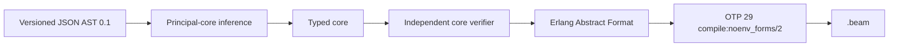

# Catena

> A category theory-inspired functional programming language for the BEAM VM

## Rewrite in progress

Catena is being rebuilt from a clean foundation. This history intentionally
starts without the proof-of-concept implementation so the compiler,
architecture, and development workflow can be reconsidered without carrying
forward accidental constraints.

## Historical implementation

The complete proof-of-concept implementation and its history remain available
in Git:

- Branch: `archive/poc-v1`
- Final annotated tag: `poc-v1-final`

To inspect or build that implementation locally:

```bash
git switch archive/poc-v1
```

To return to the rewrite:

```bash
git switch rewrite
```

## Current status

The clean rewrite now contains the first executable type-system slice. The
bootstrap toolchain is written in Elixir 1.20.2 on Erlang/OTP 29.0.4 and targets
only the BEAM VM. It does not reuse the historical proof-of-concept's compiler
or language design.

The normative language definition belongs to the separate
[Catena research specification](https://github.com/pcharbon70/catena-research/tree/main/60-specification/type-system).
This repository provides the executable model and conformance evidence for
that specification.

## Compiler path



The JSON AST is a temporary versioned toolchain input, not a proposed Catena
surface syntax. A later parser will feed the same typed pipeline. The backend
does not emit Core Erlang, BEAM assembly, or `.beam` files directly; OTP's
supported compiler interface is the sole binary-generation boundary.

The implemented C001 evidence includes:

- Algorithm W for literals, variables, lambdas, application, polymorphic
  `let`, tuples, and signatures;
- occurs-checked unification, export-signature enforcement, and skolemized
  signature checking;
- executable unique value-row and duplicate effect-row contracts;
- an open, owned, non-overlapping trait registry with functional-dependency
  metadata and associated-type lookup;
- GADT/existential scope checks and a runtime one-shot resumption token;
- an independently structured typed-core verifier and bounded declarative
  typing oracle; and
- deterministic OTP 29 compile, load, and execution tests.

This is not yet a Catena source compiler or a complete implementation of ADTs,
traits, effects, handlers, or GADTs. Those features have normative boundaries
in the research corpus, while their full integrations remain subsequent
compiler slices.

## Build and test

[asdf](https://asdf-vm.com/) reads the pinned versions from `.tool-versions`:

```bash
asdf install
asdf exec mix test
asdf exec mix escript.build
```

The CLI accepts three commands:

```bash
./catena check-ir program.json
./catena elaborate-ir program.json
./catena compile-ir program.json
```

`compile-ir` writes an OTP-generated `.beam` beside the input. The program's
module and exported values must follow the version 0.1 JSON AST contract in
`Catena.AST.Decoder`; every export requires a signature.

## Intended evolution

Elixir is the bootstrap implementation language, not part of Catena's target
semantics. Once Catena can express and validate the compiler, the toolchain is
intended to self-host while preserving the verified typed-core and OTP 29
Abstract Format boundary.
