# Catena

> A category theory-inspired functional programming language for the BEAM VM

## Rewrite in progress

Catena is being rebuilt from a clean foundation. This history intentionally
starts without the proof-of-concept implementation so the compiler,
architecture, and development workflow can be reconsidered without carrying
forward accidental constraints.

## Historical implementation

The complete proof-of-concept implementation and its history remain available
in Git:

- Branch: `archive/poc-v1`
- Final annotated tag: `poc-v1-final`

To inspect or build that implementation locally:

```bash
git switch archive/poc-v1
```

To return to the rewrite:

```bash
git switch rewrite
```

## Current status

The clean rewrite contains executable normative type-system,
data-and-pattern, clause-condition, trait/categorical-operation,
effect-handler, and 0.1.6 specification-and-governance slices. It also
contains the executable normative 0.1.7 editions-and-feature-lifecycle slice,
whose immutable promotion evidence is recorded in the research archive. The
normative 0.1.8 formal semantic kernel is also implemented: it adds an exact
S-expression conformance input, structural rows, a unified independently
verified core, a small-step reference machine, and typed local actors. Its
immutable promotion evidence is recorded in the research archive. The C012
implementation-limits governance milestone is also complete: the compiler
enforces and reports portable source and artifact floors from one executable
registry. Normative C013 revision `0.1.9` adds strict UTF-8 source-text
decoding, logical-newline handling, and original-byte scalar spans without yet
claiming an ergonomic lexer or parser. Normative C014 revision `0.1.10` adds
pinned Unicode 17 identifiers, NFC spelling, qualification, reserved words,
security profiles, and confusable warnings through a standalone name API. The
compiler release remains `0.1.0`.
The bootstrap toolchain is written in
Elixir 1.20.2 on Erlang/OTP 29.0.4 and targets only the BEAM VM. It does not
reuse the historical proof-of-concept's compiler or language design.

The normative language definition belongs to the separate
[Catena research specification](https://github.com/pcharbon70/catena-research/tree/main/60-specification).
This repository provides the executable model and conformance evidence for
that specification. The research repository's
[Specification Authority](https://github.com/pcharbon70/catena-research/blob/main/SPECIFICATION-AUTHORITY.md)
defines document status, content labels, rule citations, and conflict handling.
The repository's [Conformance Vocabulary](https://github.com/pcharbon70/catena-research/blob/main/CONFORMANCE-VOCABULARY.md)
defines requirement words and behavior classes. This compiler's versioned
[conformance profile](CONFORMANCE.md) publishes its supported revisions,
permitted choices, recommendation dispositions, and finite limits.
Run `catena conformance-info` for the deterministic machine-readable form.

To explore the language as a programmer, begin with the
[Catena Language Tour](LANGUAGE-TOUR.md). It introduces the language model,
shows how to validate source text and 0.1.10 names, run the retained JSON-AST
and exact kernel paths, and find the authoritative `catena-research` documents.

The [Catena Guides](guides/README.md) provide a detailed source-first learning
path, task guides for each implemented language slice, governance operations,
and compiler developer documentation. The
[semantic-kernel developer series](docs/guides/developer/README.md) explains
the kernel, S-expression reader, parser, type checker, reference machine,
stepper/explorer, OTP lowering, and compiler as separate cooperating
boundaries. Contributors should also read
[CONTRIBUTING.md](CONTRIBUTING.md).

## Prototype language versions

Catena's current language line is `0.1`. Completed semantic slices increment
its patch component: C001 through C006 are therefore `0.1.1` through `0.1.6`.
Normative C008 is implemented at `0.1.7`, normative C010 uses `0.1.8`, and
normative C013 uses `0.1.9` for the source-text envelope. Normative C014 uses
`0.1.10` for standalone identifier syntax and security.
`Catena.LanguageVersion` is the
executable exact-revision registry, while edition `0.1` names the surrounding
compatibility track. The Mix application version remains `0.1.0`; it
identifies the compiler package, not the language accepted by a particular
input.

C007 specification authority, C009 conformance vocabulary, and C012
implementation-limits policy are repository-governance milestones, not
semantic language slices. None consumes a language revision.

The former two-component prototype identifiers are retired and are not input
aliases. Update unsigned JSON AST inputs mechanically, then rebuild interfaces
and BEAM artifacts. Governance roots, bundles, transitions, approvals, and
assurance manifests must be regenerated and re-signed because `0.1.6` is part
of their canonical signature domains.

## Compiler path

```mermaid
flowchart LR
    SEL[Package or standalone language selection] --> JSON[Versioned JSON AST 0.1.1 through 0.1.7]
    SEL --> KSEXPR[Exact kernel S-expression 0.1.8]
    SEL --> ST[Strict source-text envelope 0.1.9]
    ST --> ID[Standalone identifiers and qualified names 0.1.10]
    ID --> STOP[Logical name results and diagnostics]
    JSON --> D[Nominal data elaboration]
    D --> W[Principal and annotation-directed inference]
    W --> C[Condition safety and fact normalization]
    C --> T[Kinded traits and coherent evidence]
    T --> FX[Lexical effects and named handlers]
    FX --> G[Pattern coverage and ordered guard tree]
    G --> S[Typed rules and bounded examples]
    S --> TC[Typed core]
    TC --> V[Independent core verifier]
    KSEXPR --> KTC[Unified kernel typed core]
    KTC --> KV[Independent kernel verifier]
    KV --> KREF[Small-step machine and schedule explorer]
    KV --> CPS
    V --> CPS[Effect-directed CPS or pure direct path]
    CPS --> EAF[Erlang Abstract Format]
    EAF --> OTP[OTP 29 compile:noenv_forms/2]
    OTP --> BEAM[Runtime-only module .beam]
    I[Digest-bound 0.1.2 through 0.1.7 interfaces] --> L[Manifest-directed specialization]
    L --> OTP
    OTP --> CB[Companion .beam with direct calls]
    BEAM --> A[Artifact digests]
    CB --> A
    A --> GOV[Offline trust, lifecycle, and additive policy]
    SEL --> I
    SEL --> L
    GOV --> SIDE[Selection-bound assurance sidecar and signing payload]
```



The JSON AST is a retained versioned toolchain input, not proposed Catena
surface syntax. Revision 0.1.8 adds a normative S-expression kernel input.
Revision 0.1.9 defines only the bytes-to-logical-text boundary for future
ergonomic syntax. Revision 0.1.10 defines names without scanning complete
files; neither revision tokenizes or parses programs. The backend does not emit
Core Erlang, BEAM assembly, or `.beam` files directly; OTP's
supported compiler interface is the sole binary-generation boundary.

The implementation preserves the C001 through C005 evidence and adds the
normative C006 assurance and C008 edition-lifecycle slices. Together they
include:

- Algorithm W for literals, variables, lambdas, application, polymorphic
  `let`, tuples, and signatures;
- occurs-checked unification, export-signature enforcement, and skolemized
  signature checking;
- executable unique value-row and duplicate effect-row contracts;
- an open, owned, non-overlapping trait registry with functional-dependency
  metadata and associated-type lookup;
- GADT/existential scope checks and a runtime one-shot resumption token;
- an independently structured typed-core verifier and bounded declarative
  typing oracle;
- deterministic OTP 29 compile, load, and execution tests;
- closed nominal datatype declarations, atomic mutual recursion, transparent
  or abstract constructor interfaces, and origin-based nominal identity;
- positional and named construction, typed constructor, literal, tuple,
  binder, wildcard, `as`, and `or` patterns;
- exhaustive and redundancy checking with concrete witnesses, empty-type and
  GADT refinement, guarded fallthrough, and deterministic complexity limits;
- annotation-directed GADT branches and rigid existential escape checks;
- explicit constructor-complete `fold` generation checked by the typed-core
  verifier;
- deterministic, SHA-256-protected `.cati.json` interfaces with no runtime
  layout details;
- uniform reference and compact BEAM representations checked against a pure
  semantic evaluator; and
- independently rejected corrupted constructor and decision-tree metadata;
- AST 0.1.3 multi-clause definitions and a closed, first-order `condition`
  declaration form with explicit `Int`/`Bool` signatures;
- lazy Boolean operations, exact equality, integer order, negation, addition,
  subtraction, and multiplication, with ordinary calls, recursion, effects,
  higher-order values, and partial operations excluded from conditions;
- ordered guard trees in which each condition is evaluated once after a
  structural match, false falls through, and body failure never reopens clause
  selection;
- conservative, deterministic coverage facts for Boolean formulas over integer
  difference constraints, including rechecked typed-core evidence;
- explicit condition imports backed by canonical normalized bodies,
  dependencies, and SHA-256 evidence in version 0.1.3 `.cati.json` interfaces;
- selectable `auto`, `native`, and `ordinary` lowering for differential tests,
  with native conditions emitted as Erlang guards; and
- a typed selective-receive lowering harness that requires one closed message
  type and portable native conditions;
- rigid `Type`, `Type -> Type`, and `Type -> Type -> Type` kinds plus a
  terminating, parent-aware trait solver;
- all seventeen behavior-first standard capabilities in a compiled canonical
  SHA-256-bound ordinary-library interface;
- trait-or-type ownership, global non-overlap, decreasing contexts, functional
  dependencies, associated types, and coherent parent evidence;
- exact minimal method ABI with promised, tested, and compiler-derived law
  evidence and no law-directed rewrites;
- explicit-target structural derivation for `Equatable`, `Orderable`,
  `Mapper`, `TwoSlotMapper`, `Reducible`, and `CollectingMapper`, including
  type-qualified operations and independent verifier checks;
- version 0.1.4 module interfaces carrying traits, instances, derivation
  provenance, verified templates, helper closure, and the standard digest
  while retaining 0.1.2 and 0.1.3 decoding;
- an explicit package build manifest and deterministic 20,000-step
  specialization boundary that emits one companion BEAM containing direct
  calls and no runtime dictionaries; and
- tested standard `List` mapping and reduction whose ordinary-library
  implementations remain stack safe on inputs of at least 250,000 elements;
- nominal generic effect families with first-order operations, behavior-first
  `uses` rows, and static selection of named or uniquely inferred lexical
  capabilities;
- named module-level deep handlers with mandatory return and complete
  operation clauses, strict outer-scope handler arguments, abort, forwarding,
  and exact capability-identity subtraction;
- affine clause-scoped resumptions with static escape and duplicate-use checks
  plus a runtime consumed token that traps before duplicate continuation entry;
- identity-aware open effect rows, effect signatures in version 0.1.5 module
  interfaces, and independent typed-core effect-row verification;
- effect-directed CPS workers that pass lexical handler state across effectful
  calls while leaving proven-pure C001-C004 definitions on the direct calling
  convention, with reference/BEAM trace-agreement tests;
- AST 0.1.6 typed parameterized rules attached to resolved language subjects,
  exact executable examples, stable claim IDs, and formatting-insensitive
  semantic digests;
- verification-only definitions checked by the ordinary type-and-effect
  system, evaluated under a deterministic 20,000-step budget, rejected when
  reachable from runtime code, and removed before Abstract Format lowering;
- module interfaces carrying claim summaries without exporting verification
  checkers as callable values;
- strict RFC 8785 canonical JSON with safe integers, SHA-256 digests, RFC 8032
  Ed25519 verification, domain-separated payloads, and independent vectors;
- offline normal and recovery roots, distinct-key thresholds, scoped
  delegation, logical sequence windows, revocation, old-plus-new rotation,
  and predeclared recovery;
- an immutable Draft-to-Superseded lifecycle, exact approval and evidence
  binding, and a closed additive policy algebra with an independent oracle;
- transactional 0.1.6 and 0.1.7 package staging, path and symlink containment,
  failed-gate no-output behavior, exact BEAM/interface binding, and canonical
  assurance sidecars; and
- an external-signer workflow: the compiler emits canonical payload bytes and
  their digest, verifies supplied signatures, and never handles private keys;
- edition `0.1`, exact retained revisions `0.1.1` through `0.1.7`, explicit
  package selection, structured standalone reporting, and legacy `EDN002`
  migration advisories;
- a closed preview/stable/withdrawn/deprecated/removed feature registry,
  immutable feature IDs, compatibility change records, structured safe edits,
  and no actual preview enabled in 0.1.7;
- selection-bearing interfaces, specialization identities, BEAM compile
  metadata, package results, assurance records, approval decisions, and
  governance policy context with no runtime selection dispatch;
- retained 0.1.6 signed bytes alongside version-aware 0.1.7 signature domains,
  root-state binding, downgrade rejection, and no cross-version verification
  fallback; and
- a public `language-info` API and CLI command plus focused production/oracle,
  byte-preservation, artifact-substitution, and lifecycle conformance tests;
- an exact 0.1.8 S-expression module parser with byte and source spans, closed
  syntax, and distinct 20,000-node and depth-1,024 limits;
- regular nominal data, structural records and variants, coherent bounded
  trait calls, deep affine handlers, and explicit typed-bottom traps in one
  independently rechecked kernel core;
- typed named processes with send-only `Process M` handles, fire-and-forget
  send, oldest-matching selective receive, per-sender FIFO, process-local
  return/trap, and digest-bound public process entries;
- a CEK-style small-step configuration machine, scripted scheduling, bounded
  all-schedule exploration, and generated progress, result-type, and
  reference/BEAM agreement evidence; and
- fixed BEAM layouts for kernel records, variants, and nominal constructor
  values, plus direct or effect-directed CPS lowering through the sole OTP 29
  boundary; and
- a strict UTF-8 0.1.9 source-text decoder that rejects BOMs, alternate
  encodings, malformed sequences, and lone carriage returns while preserving
  scalar spelling and original-byte spans through LF/CRLF normalization; and
- a Unicode 17-backed 0.1.10 standalone identifier frontend with exact NFC,
  secure script checks, keyword escapes, dot qualification, and deny-able
  confusable-name warnings.

This is not yet an ergonomic Catena source lexer or parser or a complete implementation of resource
scopes, exception boundaries, general host-effect entry policy, scoped or
multi-shot control, programmable patterns, runtime assurance
monitors, stronger proof methods, long-term governance migration, package
distribution, or foreign-term validation. JSON remains the bootstrap boundary
for revisions 0.1.1 through 0.1.7; the exact kernel format is the separate
normative 0.1.8 boundary.

## Build and test

[asdf](https://asdf-vm.com/) reads the pinned versions from `.tool-versions`:

```bash
asdf install
asdf exec mix test
asdf exec mix escript.build
```

The CLI accepts source-envelope validation, the retained JSON/package
commands, and two kernel commands:

```bash
./catena check-ir program.json
./catena elaborate-ir --interface dependency.cati.json program.json
./catena compile-ir --layout compact program.json
./catena compile-ir --layout uniform program.json
./catena compile-ir --condition-lowering native program.json
./catena compile-ir --condition-lowering ordinary program.json
./catena compile-package-ir --action build package.catena-package.json
./catena compile-package-ir --action publish --trust-root trust-root.json package.catena-package.json
./catena verify-assurance --trust-root trust-root.json assurance.json
./catena check-source-text program.catena
./catena check-identifiers alpha Option.Some '`type`'
./catena check-kernel program.catena-kernel
./catena compile-kernel program.catena-kernel
./catena language-info
```

`check-source-text` validates the 0.1.9 UTF-8, BOM, and newline contract and
reports byte, logical-scalar, and logical-newline counts. It produces no
interface or BEAM artifact because token and full-file grammar work remains a
later language slice. See the [Source Text guide](guides/language/source-text.md).

`check-identifiers` validates one or more standalone 0.1.10 names and reports
canonical segments, scripts, and confusable warnings. It likewise produces no
compiled artifact. See the [Identifiers guide](guides/language/identifiers.md).

`compile-kernel` writes an OTP-generated `.beam` and deterministic 0.1.8
`.cati.json` interface beside the input. A failed check or compilation
publishes neither successful output. The declared kernel origin, rather than
the local input path, supplies stable artifact provenance. See the
[Formal Semantic Kernel guide](guides/language/formal-semantic-kernel.md).

`compile-ir` writes an OTP-generated `.beam` and a deterministic `.cati.json`
interface beside the input. `--interface` is repeatable. AST 0.1.1 programs are
normalized into the AST 0.1.2 compiler representation; new datatype programs
use AST 0.1.2 and supply a canonical package/build origin. AST 0.1.3 adds clause
conditions, explicit condition imports, and multi-clause definitions. Every
exported value still requires a signature, and every condition declaration
requires a monomorphic first-order signature ending in `Bool`. AST 0.1.4 adds
kinded traits, coherent instances, law status, explicit structural derivation,
and verified specialization templates. `compile-package-ir` consumes only the
modules, interfaces, roots, and outputs explicitly named by its toolchain
manifest; it is not a package manager. AST 0.1.5 adds nominal effect families,
`uses` rows, requests, named handlers, and affine resumptions while retaining
the 0.1.4 categorical interface payload. AST 0.1.6 adds semantic specification
forms and verification-only definitions. A 0.1.6 package manifest names its
profile and assurance output and may name a canonical governance bundle.
Governed builds require an explicit action. Publication and activation require
an external normal-root signature over the exact emitted assurance payload;
the compiler reports that payload and digest for an external signer and
verifies supplied signatures on the next invocation.

AST and artifact format 0.1.7 add package-local edition, exact language
revision, and named preview selection. Standalone compilation can use
`--edition`, `--language-revision`, repeatable `--preview`, and repeatable
`--deny-diagnostic`; every success reports the resolved selection. A 0.1.7
package manifest requires the selection fields and may constrain known warning
IDs. See [Editions, Revisions, and Previews](guides/language/editions-and-previews.md).

## Intended evolution

Elixir is the bootstrap implementation language through normative C010; it is
not part of Catena's target semantics. Self-hosting is tracked separately as
G141 for a late 0.x milestone, after Catena can express the compiler's required
module, data, error, build, and interoperability facilities. The planned
transition is staged: define a bounded self-hosting subset, compile Catena compiler modules
with the trusted Elixir bootstrap, compare both compilers' outputs, require a
two-stage reproducible fixed point, and retain a reproducible bootstrap path.
At every stage Catena still targets only BEAM, verified typed core remains the
lowering boundary, and OTP 29 Abstract Format remains the sole production
`.beam` generation path.
