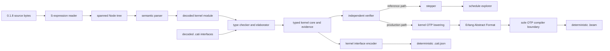

# Semantic-kernel developer guides

This series explains the exact Catena 0.1.8 implementation as a collection of
small boundaries. It is for contributors who need to answer questions such
as “which phase owns this rule?”, “what evidence may this phase trust?”, and
“which two implementations must agree after I change the semantics?”

These pages are explanatory implementation documentation. The applicable
[normative specification](https://github.com/pcharbon70/catena-research/tree/main/60-specification/formal-semantic-kernel)
defines the language; the compiler, tests, reference machine, and these
guides are evidence against that specification.

## The whole system in one diagram

The first four phases establish meaning. After verification, the pipeline
splits:

- the **reference path** runs the specified transition system directly and
  can enumerate scheduler choices; and
- the **production path** translates the same verified core to Erlang forms
  and asks OTP 29 to create a BEAM module.

The two paths should agree on observable results, but they are intentionally
structured differently. Agreement is useful evidence precisely because one
path does not call the other.

## Concepts and ownership

| Concept | Concrete implementation | Owns | Does not own |
| --- | --- | --- | --- |
| [Kernel](kernel.md) | the complete 0.1.8 contract and its `Catena.Kernel.*` implementation | the bounded language whose meaning is being implemented | ergonomic future source syntax or every Catena revision |
| [S-expression](s-expression.md) | `Catena.Kernel.SExpression` and `Catena.Kernel.Node` | bytes, tokens, balanced lists, strings, limits, and source spans | declaration or expression meaning |
| [Parser](parser.md) | `Catena.Kernel.Parser` | the closed module grammar and structurally valid decoded forms | inference, name resolution across declarations, or execution |
| [Type checker](type-checker.md) | `Catena.Kernel.Checker`, assisted by `Catena.Kernel.Type` | static judgments, resolution, elaboration, and typed-core evidence | trusting its own result as sufficient proof |
| [Reference machine](reference-machine.md) | the transition model embodied by `Catena.Kernel.Stepper` | the executable dynamic semantics and observable actor behavior | production BEAM generation |
| [Stepper/explorer](stepper-and-explorer.md) | `Catena.Kernel.Stepper` and `Catena.Kernel.Explorer` | individual transitions, schedules, bounded state-space exploration, and traces | static acceptance or backend lowering |
| [OTP lowering](otp-lowering.md) | `Catena.Kernel.Backend` and `Catena.OTP.Compiler` | verified-core translation, fixed runtime representations, and BEAM production | inventing unresolved language semantics |
| [Compiler](compiler.md) | `Catena`, `Catena.CLI`, and the phase modules | orchestration, public APIs, diagnostics, artifact publication, and conformance testing | language authority |

## Recommended reading order

Read [Kernel](kernel.md) first to understand why this subsystem exists. Then
follow the pipeline through [S-expression](s-expression.md),
[Parser](parser.md), and [Type checker](type-checker.md). Read
[Reference machine](reference-machine.md) before the operational details in
[Stepper and explorer](stepper-and-explorer.md). Finish with
[OTP lowering](otp-lowering.md) and [Compiler](compiler.md).

For adjacent material:

- [Formal Semantic Kernel](../../../guides/language/formal-semantic-kernel.md)
  is the programmer-facing guide to the exact input and behavior.
- [Compiler Architecture](../../../guides/development/compiler-architecture.md)
  places this pipeline beside the retained JSON frontend, package, assurance,
  and governance subsystems.
- [Intermediate Representations](../../../guides/development/intermediate-representations.md)
  compares the repository's representations across all revisions.
- [Diagnostics and Testing](../../../guides/development/diagnostics-and-testing.md)
  explains stable diagnostic families and the layered test strategy.

## A boundary test for design decisions

When deciding where a change belongs, ask these questions in order:

1. Is it about legal bytes, delimiters, strings, or spans? Change the
   S-expression reader.
2. Is it about the exact shape or spelling of a form? Change the parser.
3. Does it require types, declarations, imported facts, effect rows, or
   selected evidence? Change the checker and independent verifier.
4. Does it change evaluation order, effects, messages, traps, or scheduling?
   Change the reference machine and production lowering, then add
   differential tests.
5. Does it only change a runtime representation while preserving specified
   behavior? Change the backend and representation tests, while checking
   interface opacity.
6. Is it about commands, files, diagnostics presentation, or phase
   orchestration? Change the compiler facade or CLI.

If a proposed behavior has no normative answer, the specification has a gap.
Do not let the phase that happens to be easiest to edit silently become the
language authority.
