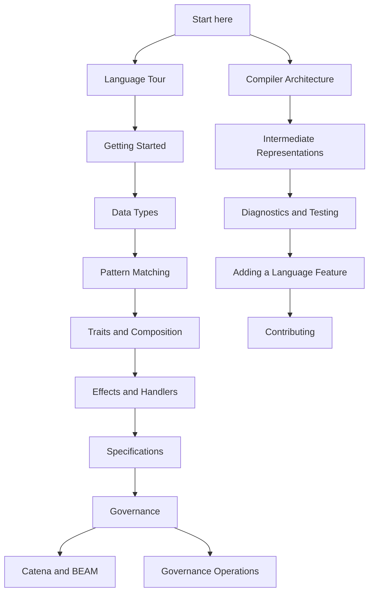

# Catena Guides

These guides explain the executable Catena language model, its assurance
protocol, and the bootstrap compiler. They complement rather than replace the
[normative language specification](https://github.com/pcharbon70/catena-research/tree/main/60-specification).

Catena does not yet have a source parser. Code in a `catena` fence is
**illustrative source notation**: it teaches the selected language meaning but
does not freeze punctuation, layout, or every keyword. Commands and JSON-AST
examples are executable against the current compiler.

## Choose a path

## User path

1. [Language Tour](../LANGUAGE-TOUR.md) — a compact overview of the complete
   language direction.
2. [Getting Started](getting-started.md) — install the toolchain, understand a
   source-first example, and run the executable model.
3. [Algebraic Data Types](language/algebraic-data-types.md) — model a domain
   with nominal variants and controlled module boundaries.
4. [Pattern Matching](language/pattern-matching.md) — consume data with
   ordered, exhaustive clauses and safe conditions.
5. [Traits and Composition](language/traits-and-composition.md) — use shared
   behavior such as `map`, `map2`, and `and_then` without requiring category
   theory terminology.
6. [Effects and Handlers](language/effects-and-handlers.md) — declare external
   abilities, request them through lexical capabilities, and interpret them
   with deep affine handlers.
7. [Specifications](language/specifications.md) — attach typed rules and exact
   examples to named language subjects.
8. [Governance](language/governance.md) — understand policy, evidence,
   approval, lifecycle, and protected package actions.
9. [Catena and BEAM](language/catena-and-beam.md) — understand Abstract Format
   lowering, module interfaces, companion modules, and the current
   interoperability boundary.

## Operator path

- [Governance Operations](operations/governance-operations.md) — establish an
  offline trust root, operate build/publish/activate gates, sign externally,
  verify assurance manifests, rotate authority, revoke credentials, and use
  recovery.

The compiler verifies governance documents but does not manage private keys or
provide an organizational workflow service. Operators remain responsible for
secure key generation, custody, approval collection, and transport.

## Compiler developer path

- [Compiler Architecture](development/compiler-architecture.md) — pipeline,
  modules, trust boundaries, and non-negotiable invariants.
- [Intermediate Representations](development/intermediate-representations.md)
  — JSON AST, decoded AST, typed core, interfaces, Erlang Abstract Format, and
  assurance records.
- [Diagnostics and Testing](development/diagnostics-and-testing.md) — stable
  error families and the layered conformance strategy.
- [Adding a Language Feature](development/adding-a-language-feature.md) — the
  end-to-end specification, implementation, verification, and documentation
  workflow.
- [Contributing](../CONTRIBUTING.md) — repository setup, change discipline,
  review expectations, and pull-request checklist.

## Authority and status

Use this order when documents disagree:

1. the newest applicable normative chapter in `catena-research`;
2. its published conformance requirements and immutable implementation
   evidence;
3. executable compiler tests;
4. these guides and the language tour; and
5. exploratory research notes.

A guide bug does not amend the language. If a guide and the specification
conflict, fix the guide and add a regression test when the mistake could also
appear in the compiler.

## Versioned implementation slices

| Version | Implemented slice |
| --- | --- |
| 0.1 | principal type inference and annotation-directed advanced checking |
| 0.2 | nominal algebraic data, patterns, coverage, folds, and interfaces |
| 0.3 | safe clause conditions and condition-aware coverage |
| 0.4 | coherent traits, structural derivation, specialization, and erasure |
| 0.5 | lexical effects, deep handlers, affine resumptions, and effect-directed CPS |
| 0.6 | typed specifications, offline governance, assurance artifacts, and total erasure |

These versions identify additive semantic slices of the prototype. They are
not end-user language editions or promises that all ordinary language
facilities are complete.
