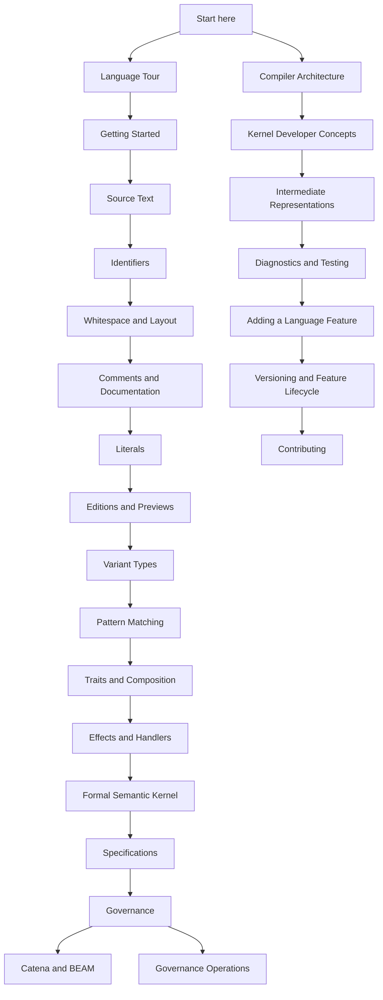

# Catena Guides

These guides explain the executable Catena language model, its assurance
protocol, and the bootstrap compiler. They complement rather than replace the
[normative language specification](https://github.com/pcharbon70/catena-research/tree/main/60-specification).

Catena does not yet have an ergonomic source lexer or parser. Revisions 0.1.9
through 0.1.15 provide the strict source envelope, standalone Unicode name
rules, layout classification, abstract comment/documentation pipeline,
atomic literal scanner, and numeric literal meaning that later stages will
consume. Code in a
`catena` fence is **illustrative source notation**: it teaches the selected
language meaning but does not freeze punctuation or every keyword. Commands,
JSON-AST examples, and the separately identified exact 0.1.8 kernel
S-expressions are executable against the current compiler.

The reader-facing guides use Catena's current behavior-first vocabulary:
`variant`, `payload`, `match`, `Mapper`, `uses`, `request`, `promises`, and
similar words describe what a programmer does. Formal and compiler-internal
terms remain available where precision requires them, especially in the
developer path. Each guide marks vocabulary that is proposed but not yet
accepted by the source parser or implemented semantic slice.

## Choose a path

## User path

1. [Language Tour](../LANGUAGE-TOUR.md) — a compact overview of the complete
   language direction.
2. [Getting Started](getting-started.md) — install the toolchain, understand a
   source-first example, and run the executable model.
3. [Source Text](language/source-text.md) — validate UTF-8, newline handling,
   normalization preservation, and original-byte locations at revision 0.1.9.
4. [Identifiers and Qualified Names](language/identifiers.md) — validate
   Unicode 17 names, NFC, security profiles, keywords, qualification, and
   confusable warnings at revision 0.1.10.
5. [Whitespace, Separators, and Line Continuation](language/whitespace-and-layout.md)
   — resolve non-semantic indentation, hard separators, and grammar-aware soft
   lines over lexer-supplied events at revision 0.1.11.
6. [Comments and Documentation Comments](language/comments-and-documentation-comments.md)
   — scan slash comments, classify nested comment line breaks, and attach
   normalized outer documentation at revision 0.1.12.
7. [Literals](language/literals.md) — scan Boolean, numeric, text, character,
   and byte literals with exact decoding and provenance at revision 0.1.13,
   then elaborate numeric meanings at revision 0.1.14.
8. [Operators](language/operators.md) — tokenize complete files into the
   0.1.15 whole-source stream and resolve operator expressions over the
   fixed precedence ladder.
8. [Editions, Revisions, and Previews](language/editions-and-previews.md) —
   pin one exact language contract, inspect retained revisions, understand
   named feature lifecycle, and read migration diagnostics.
9. [Variant Types and Structured Data](language/algebraic-data-types.md) —
   model a domain with nominal variants, explicit payloads, and controlled
   module boundaries.
10. [Pattern Matching](language/pattern-matching.md) — consume data with
   ordered, exhaustive clauses and safe conditions.
11. [Traits and Composition](language/traits-and-composition.md) — use shared
   behavior such as `map`, `map2`, and `and_then` without requiring category
   theory terminology.
12. [Effects and Handlers](language/effects-and-handlers.md) — declare external
   abilities, request them through lexical capabilities, and interpret them
   with deep affine handlers.
13. [Formal Semantic Kernel](language/formal-semantic-kernel.md) — run the exact
   0.1.8 conformance input and understand structural rows, the small-step
   machine, typed actors, fixed layouts, and normative conformance evidence.
14. [Specifications](language/specifications.md) — attach typed rules and exact
   examples to named language subjects.
15. [Governance](language/governance.md) — understand policy, evidence,
   approval, lifecycle, and protected package actions.
16. [Catena and BEAM](language/catena-and-beam.md) — understand Abstract Format
   lowering, module interfaces, companion modules, and the current
   interoperability boundary.

## Operator path

- [Governance Operations](operations/governance-operations.md) — establish an
  offline trust root, operate build/publish/activate gates, sign externally,
  verify assurance manifests, rotate authority, revoke credentials, and use
  recovery.

The compiler verifies governance documents but does not manage private keys or
provide an organizational workflow service. Operators remain responsible for
secure key generation, custody, approval collection, and transport.

## Compiler developer path

- [Compiler Architecture](development/compiler-architecture.md) — pipeline,
  modules, trust boundaries, and non-negotiable invariants.
- [Semantic-kernel Developer Guides](../docs/guides/developer/README.md) — a
  detailed concept-by-concept account of the kernel, S-expression reader,
  parser, type checker, reference machine, stepper/explorer, OTP lowering, and
  compiler, including their contracts and relationships.
- [Intermediate Representations](development/intermediate-representations.md)
  — JSON AST, decoded AST, typed core, interfaces, Erlang Abstract Format, and
  assurance records.
- [Diagnostics and Testing](development/diagnostics-and-testing.md) — stable
  error families and the layered conformance strategy.
- [Compiler Conformance Profile](../CONFORMANCE.md) — the bootstrap release,
  supported revisions, selected optional paths, recommendation dispositions,
  presentation latitude, and published implementation limits.
- [Adding a Language Feature](development/adding-a-language-feature.md) — the
  end-to-end specification, implementation, verification, and documentation
  workflow.
- [Versioning and Feature Lifecycle](development/versioning-and-feature-lifecycle.md)
  — exact semantic selection, retained formats, previews, migration records,
  signature domains, compatibility tests, and the C008 promotion gate.
- [Contributing](../CONTRIBUTING.md) — repository setup, change discipline,
  review expectations, and pull-request checklist.

Developer guides deliberately show both sides of the vocabulary boundary—for
example, public `variant` and `implementation` alongside internal constructor
identity and instance evidence—so implementation terminology never leaks into
the beginner path by accident.

## Authority and status

The research repository's
[Specification Authority](https://github.com/pcharbon70/catena-research/blob/main/SPECIFICATION-AUTHORITY.md)
defines which documents control. Only an applicable `status: normative`
specification chapter defines the language. A version number does not select a
winner unless normative text explicitly states applicability or replacement.
The companion
[Conformance Vocabulary](https://github.com/pcharbon70/catena-research/blob/main/CONFORMANCE-VOCABULARY.md)
defines canonical requirement words and behavior classes. The local
[compiler profile](../CONFORMANCE.md) discloses implementation choices and
limits against those rules; it remains evidence rather than authority.

Conformance requirements, executable reference paths, compiler tests,
immutable implementation records, and compiler behavior are evidence against
that specification. They do not amend it, resolve its silence, or outrank one
another. Guides, the language tour, and exploratory research are explanatory.

When artifacts disagree, cite the normative document and heading, suspend the
affected conformance claim, and repair the non-normative artifact. If the
normative chapters themselves conflict or remain ambiguous, resolve the
language text explicitly before changing compiler behavior. A guide bug does
not amend the language; add a regression test when the same misunderstanding
could also appear in the compiler.

## Versioned implementation slices

| Version | Implemented slice |
| --- | --- |
| 0.1.1 | principal type inference and annotation-directed advanced checking |
| 0.1.2 | nominal algebraic data, patterns, coverage, folds, and interfaces |
| 0.1.3 | safe clause conditions and condition-aware coverage |
| 0.1.4 | coherent traits, structural derivation, specialization, and erasure |
| 0.1.5 | lexical effects, deep handlers, affine resumptions, and effect-directed CPS |
| 0.1.6 | typed specifications, offline governance, assurance artifacts, and total erasure |
| 0.1.7 | editions, exact revisions, previews, migration records, and selection-bound artifacts |
| 0.1.8 | exact formal semantic kernel, independent verification, and typed local actors |
| 0.1.9 | strict UTF-8 source-text envelope, newline normalization, and original-byte scalar spans |
| 0.1.10 | Unicode 17 identifiers, NFC spelling, secure scripts, keywords, qualification, and confusable diagnostics |
| 0.1.11 | non-semantic indentation, hard separators, abstract continuation, and lossless layout events |
| 0.1.12 | slash comments, nested block comments, layout integration, and outer documentation attachment |
| 0.1.13 | atomic Boolean, numeric, text, character, and byte literal spelling, decoding, and provenance |
| 0.1.14 | numeric literal meaning: monomorphic `Int` and finite binary64 `Float`, correct rounding, static overflow invalidity, negation |
| 0.1.15 | operators and punctuation: closed inventory, maximal munch, C015 capabilities and frames, fixed ladder, pipe, transactional rejection |

Versions 0.1.1 through 0.1.15 identify completed normative revision boundaries;
their accepted frontend formats remain explicit rather than implicitly
cumulative.
Version 0.1.7 implements the normative C008 edition and lifecycle contract;
its immutable promotion evidence is recorded in the research archive. Edition `0.1` is the
end-user compatibility track; each exact three-component revision selects a
specific cumulative contract. The compiler package has its own release
version, so `mix.exs` remains `0.1.0`. Retired two-component slice identifiers
are rejected rather than normalized because they also occurred in digests and
signed protocol domains.
