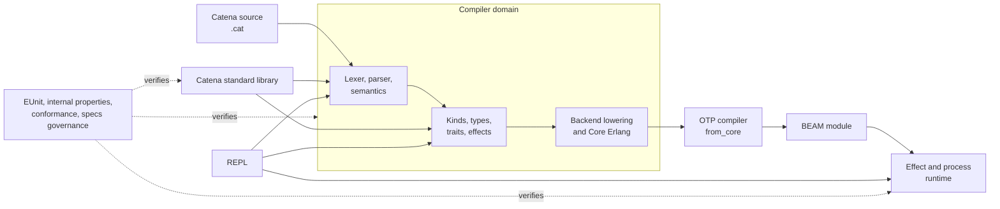
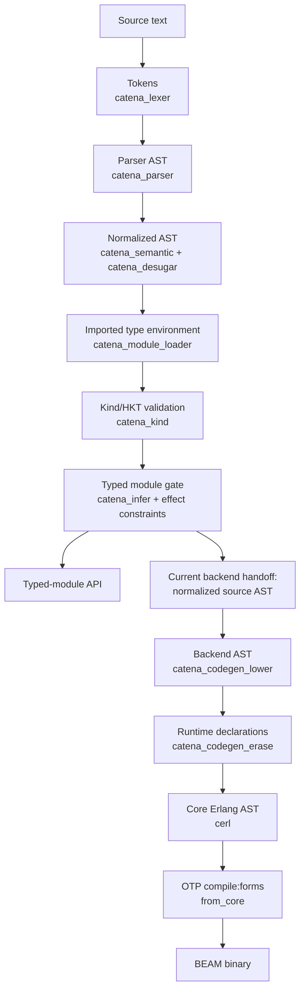
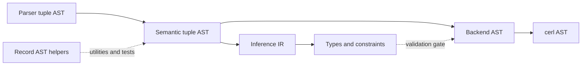
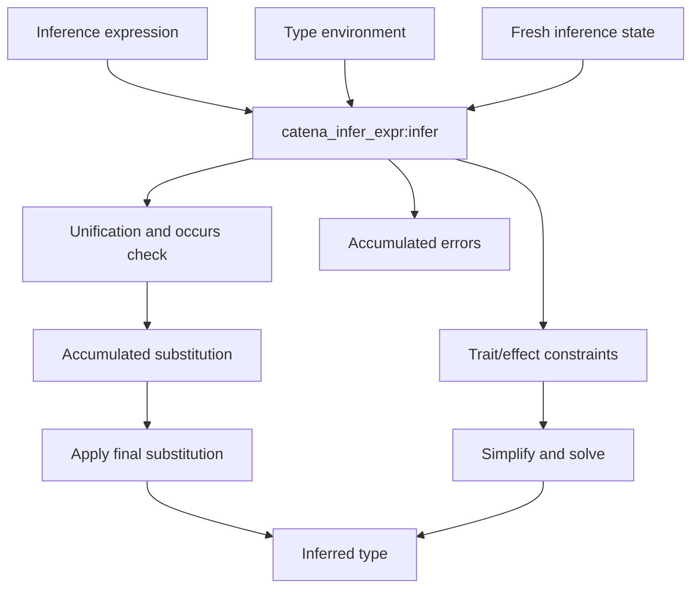
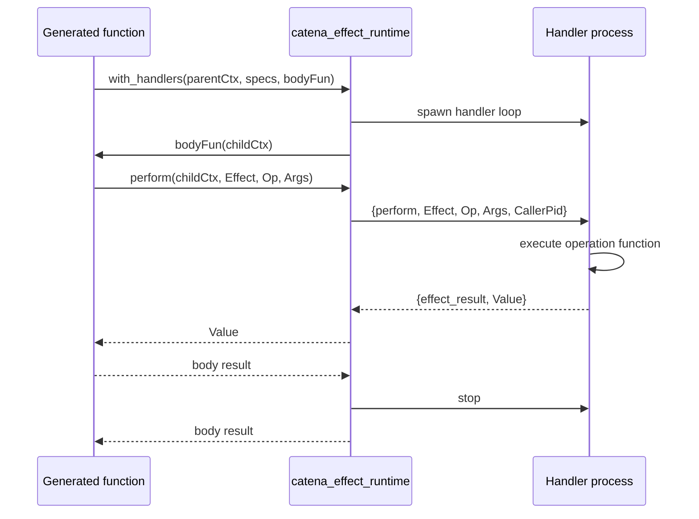
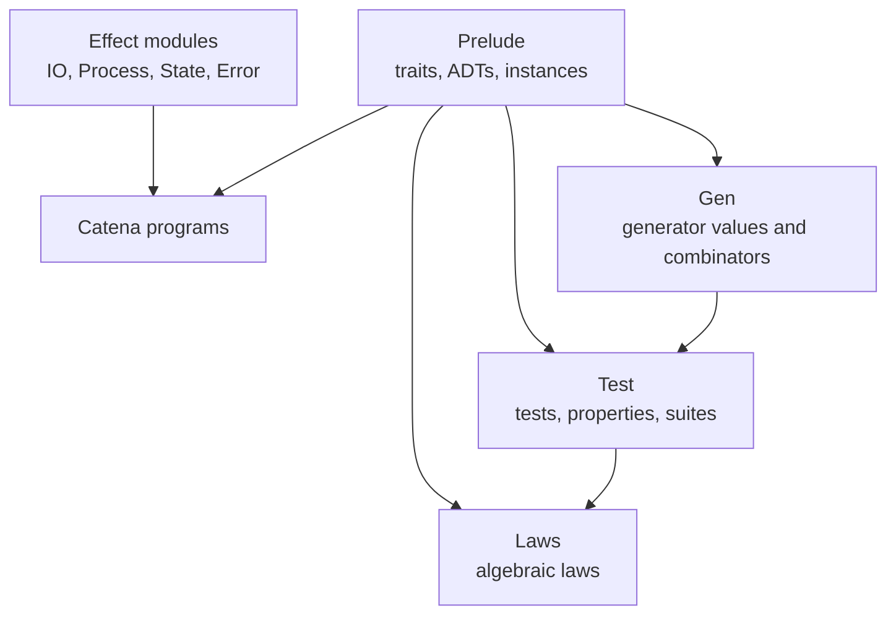
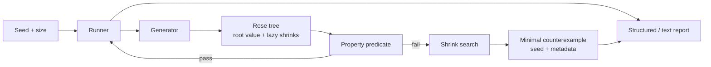

# Catena Architecture Guide

This guide is a practical tour of Catena for developers working on the
compiler, runtime, standard library, REPL, or test infrastructure. It explains
how the pieces cooperate, where the important boundaries are, and which
subsystems are not yet connected to the canonical compilation path.

The short version is:

> Catena is an Erlang implementation of a functional language that validates
> source through a staged frontend, lowers supported programs to Core Erlang,
> and relies on the OTP compiler for BEAM generation. Richer abstractions live
> in the standard library, while runtime-only behavior crosses explicit Erlang
> boundaries.

This is a developer guide, not a normative specification. When code, this
guide, and a promoted specification disagree, use the implementation to
understand current behavior and the [specs index](../../specs/README.md) to
understand the accepted contract. The
[current-status document](../../specs/planning/current_status.md) records which
parts are implemented, partial, or planned.

## 1. The Mental Model

Catena is easiest to understand as four cooperating domains:

1. **Compiler:** turns `.cat` text into validated intermediate forms and,
   for the supported subset, Core Erlang.
2. **Runtime:** supplies behavior that cannot be erased, especially effects
   and BEAM process operations.
3. **Library:** defines category-theory abstractions, tests, laws, generators,
   and standard effects in Catena rather than baking them into the compiler.
4. **Quality tooling:** regenerates the grammar, runs tests, validates
   conformance evidence, and keeps implementation claims aligned with code.



Two ideas recur throughout the repository:

- **Keep the compiler core small.** Traits, laws, generators, and most
  category-theory vocabulary belong in library modules. See
  [ADR-0002](../../specs/adr/ADR-0002-minimal-core-and-library-first-surface.md).
- **Make semantic boundaries explicit.** Type inference threads state,
  generated effect code passes a context, and unsupported backend constructs
  should fail rather than turn into approximate runtime behavior.

## 2. Repository Map

| Path | Responsibility |
| --- | --- |
| `src/compiler/lexer` | Leex grammar and generated tokenizer |
| `src/compiler/parser` | Yecc grammar, parser wrappers, locations, and parser resource limits |
| `src/compiler/ast` | AST constructors, traversal helpers, validation, and pretty-printing |
| `src/compiler/semantic` | Declaration normalization, desugaring, kinds, names, traits, dependency analysis, and pattern checks |
| `src/compiler/types` | Algorithm W, substitutions, environments, constraints, traits, effects, and row types |
| `src/compiler/effects` | Advanced algebraic-effect orchestration, handlers, resumptions, laws, rows, and higher-order effects |
| `src/compiler/codegen` | Frontend-to-backend lowering, erasure, patterns, effects, Core Erlang, and backend diagnostics |
| `src/compiler/runtime` | Explicit-context effect runtime used by generated code |
| `src/repl` | Interactive state, commands, history, completion, and direct effect evaluation |
| `src/runtime` | Local BEAM process, actor, GenServer-style, supervision, registry, pub/sub, and event helpers |
| `lib/catena/stdlib` | Catena-written `Prelude`, `Gen`, `Test`, `Laws`, and effect declarations |
| `src/stdlib` | Erlang-side prelude bindings used by interactive/runtime paths |
| `src/testing` | Compatibility adapters from Catena test/property values into the internal engine |
| `src/proptest` | Catena-owned generators, shrinking, runner, reporting, laws, state machines, and BEAM helpers |
| `src/tooling` | Executable specification-governance checks |
| `test` | Active EUnit and integration evidence organized by subsystem |
| `test_legacy` | Historical property-testing material; not part of the maintained test path |
| `specs` | Canonical contracts, ADRs, status, conformance maps, and implementation plans |

The Erlang application descriptor,
[catena.app.src](../../src/catena.app.src), is intentionally small. Catena is
currently a language-toolchain repository rather than a large OTP application
with a single supervision tree and application callback.

## 3. Architectural Principles

### 3.1 Library-first language design

The compiler recognizes the structural forms needed to define a language:
modules, types, transforms, traits, instances, effects, handlers, patterns,
and expressions. It should not grow a special case for every useful
abstraction.

For example:

- `Mapper`, `Applicator`, `Pipeline`, and `Flow` are traits in
  [prelude.cat](../../lib/catena/stdlib/prelude.cat).
- operator and `do` syntax is compiler-recognized, but
  [catena_desugar](../../src/compiler/semantic/catena_desugar.erl) rewrites it
  toward ordinary calls such as `map`, `chain`, `compose`, and `kleisli`.
- test suites and laws have Catena-side representations in
  [test.cat](../../lib/catena/stdlib/test.cat) and
  [laws.cat](../../lib/catena/stdlib/laws.cat).

When adding a feature, first ask whether the compiler needs new semantics or
whether a library definition plus existing language machinery is sufficient.

### 3.2 Explicit state over hidden global state

Several central systems use immutable values threaded through calls:

- type inference carries `catena_infer_state`;
- code generation carries a codegen state for fresh variables;
- generated effectful code carries an explicit effect context;
- property generators receive an explicit size and seed.

The advanced Erlang-facing effect facade does use process-local handler scopes,
but that is a separate orchestration surface. It does not replace explicit
context passing as the generated-code runtime contract.

### 3.3 Fail by compiler stage

The public pipeline preserves stage-oriented failures:

- lexer errors;
- parser errors;
- semantic errors;
- import and kind errors;
- type, trait, and effect errors;
- backend diagnostics.

Backend errors have stable categories in
[catena_backend_error](../../src/compiler/codegen/catena_backend_error.erl).
The long-term rule is that every runtime-relevant construct must be lowered,
explicitly runtime-lowered, intentionally erased, or rejected. See
[ADR-0005](../../specs/adr/ADR-0005-fail-closed-semantics-preserving-beam-backend.md).

### 3.4 BEAM-native representation

Catena does not invent a separate runtime object model when BEAM already has a
good representation. Lists, tuples, maps, closures, processes, and message
passing remain native BEAM concepts. The compiler primarily decides how Catena
semantics map onto them.

## 4. The Canonical Compiler Pipeline

The main orchestrator is
[catena_compile](../../src/compiler/catena_compile.erl). It exposes three
important result boundaries:

| API | Result |
| --- | --- |
| `compile_string/1,2` | a typed module |
| `compile_file/1` | a typed module read from a `.cat` file |
| `compile_string_to_core/1,2` | a Core Erlang module after frontend validation |
| `compile_file_to_core/1,2` | the same Core path, starting from a `.cat` file |

There is not yet a public `compile_*_to_beam` API. Integration tests perform
the final OTP `from_core` step directly.



The diagram highlights an important current seam: successful typing gates
code generation, but `compile_string_to_core/2` still passes the analyzed AST
to codegen rather than passing the typed declarations as one authoritative
compilation unit. The planned backend-hardening work will join normalized
source, types, symbols, dispositions, options, and locations into one validated
unit. Until then, do not treat raw calls to codegen helpers as equivalent to
the public validated pipeline.

### 4.1 Building the compiler itself

Catena has a small compiler-bootstrapping stage:

```text
catena_lexer.xrl  --Leex-->  catena_lexer.erl
catena_parser.yrl --Yecc-->  catena_parser.erl
```

Rebar3 owns this generation in the canonical build. The generated `.erl`
files are build products; edit
[catena_lexer.xrl](../../src/compiler/lexer/catena_lexer.xrl) and
[catena_parser.yrl](../../src/compiler/parser/catena_parser.yrl), not their
generated counterparts.

`make compile` is a checked wrapper around `rebar3 compile`. The direct scripts
under `scripts/` remain useful for focused grammar generation, but should not
become a second build graph.

### 4.2 Lexing and parsing

The Leex lexer is responsible for:

- keywords and identifiers;
- literals;
- symbolic operators;
- delimiters;
- comments and whitespace;
- source locations and lexical validation.

The Yecc parser turns tokens into tuple-shaped AST terms such as:

```erlang
{module, Name, Exports, Imports, Declarations, Location}
```

and:

```erlang
{transform_decl, Name, Type, Clauses, Location}
{transform_clause, Patterns, Guards, Body, Location}
{perform_expr, Effect, Operation, Arguments, Location}
```

There are several parsing surfaces, and they have different jobs:

- `catena_compile` directly uses the generated lexer and parser in the
  canonical compiler path.
- [catena_parse](../../src/compiler/parser/catena_parse.erl) is a higher-level,
  resource-limited parsing API. It checks token counts, elapsed parse time,
  AST size/depth, pattern depth, type depth, and effect-specific limits.
- [catena_parser_wrapper](../../src/compiler/parser/catena_parser_wrapper.erl)
  adds file context, structured errors, suggestions, and panic-style recovery.

These wrappers are useful, but they are not all invoked in sequence by
`catena_compile`. If you strengthen parser safety or diagnostics, verify which
entry point your caller actually uses.

### 4.3 AST representations

Catena currently has more than one AST vocabulary:

1. **Parser/semantic tuple AST:** the live source-oriented representation used
   by the public compiler.
2. **Record smart constructors:** [catena_ast](../../src/compiler/ast/catena_ast.erl)
   and [catena_ast_utils](../../src/compiler/ast/catena_ast_utils.erl) offer
   record-oriented construction and traversal utilities.
3. **Inference IR:** compact forms such as `{lit, ...}`, `{var, ...}`,
   `{lam, ...}`, and `{app, ...}` consumed by Algorithm W.
4. **Backend AST:** normalized forms consumed by the `catena_codegen_*`
   modules.
5. **Core Erlang AST:** `cerl` nodes handed to OTP.



This is deliberate in some places: type inference and code generation need
simpler shapes than the parser. It is also a source of maintenance cost.
Whenever a parser node changes, search the semantic pass, inference conversion,
effect synthesis, backend lowering, pretty-printer, and tests for every
consumer of that shape.

### 4.4 Semantic normalization

[catena_semantic](../../src/compiler/semantic/catena_semantic.erl) makes
structural promises that later phases rely on. It:

- groups consecutive clauses belonging to one transform;
- merges a type signature with implementation clauses;
- detects duplicate signatures;
- checks consistent transform arity;
- validates pattern structure and or-pattern bindings;
- keeps effectful expressions out of guards;
- invokes desugaring after declaration grouping.

[catena_desugar](../../src/compiler/semantic/catena_desugar.erl) recursively
normalizes expressions. Important rewrites include:

- `do` blocks into nested `chain` calls and `let` expressions;
- `<$>` into `map`;
- `<*>` into `apply`;
- `>>=` into `chain`;
- `>=>` into `kleisli`;
- `>>>`, `<<<`, `***`, and `&&&` into `Flow` operations;
- equality and combination operators into their library vocabulary where
  appropriate.

Desugaring is a semantic boundary, not cosmetic formatting. Type inference
should normally see the normalized meaning rather than independently
reimplementing each piece of syntax sugar.

### 4.5 Imports and the current module boundary

[catena_module_loader](../../src/compiler/catena_module_loader.erl) converts a
module name such as `Effect.IO` to `effect/io.cat`, then searches:

1. `lib/catena/stdlib`;
2. the current directory.

The public compiler parses imported modules, selects their exported
declarations, builds a type environment, and merges it with the local
environment. Local definitions shadow imports; later imports shadow earlier
ones; qualified imports receive a prefix.

This is intentionally a **minimal typing bridge**, not the complete module
system:

- imports contribute compile-time visibility;
- executable imported-call linkage is not complete;
- interfaces and package-level compilation are not the canonical path;
- the separately implemented
  [catena_module_compile](../../src/compiler/semantic/catena_module_compile.erl)
  contains placeholder code generation and binary concatenation and must not
  be used as evidence of real BEAM linking.

The active backend-hardening roadmap reserves complete name/call resolution
and executable module linkage for later phases.

## 5. Kinds, Types, Traits, and Effects

### 5.1 Internal type representation

[catena_types](../../src/compiler/types/catena_types.erl) separates internal
types from parser type expressions. Core forms include:

```erlang
{tvar, Id}
{tcon, Name}
{tapp, Constructor, Arguments}
{tfun, From, To, Effects}
{trecord, Fields, Row}
{ttuple, Elements}
{tvariant, Constructors}
```

A function type carries effects directly:

```erlang
{tfun, InputType, OutputType, {effect_set, Effects}}
```

This lets ordinary unification and function inference remain connected to
effect obligations.

### 5.2 Algorithm W

[catena_infer](../../src/compiler/types/catena_infer.erl) is the public
inference orchestrator. The core workflow is:



The supporting modules have narrow responsibilities:

- [catena_infer_state](../../src/compiler/types/catena_infer_state.erl):
  fresh variables, substitutions, constraints, errors, effect scopes, and
  expression-depth protection.
- [catena_infer_expr](../../src/compiler/types/catena_infer_expr.erl):
  expression rules, instantiation, generalization, and let-polymorphism.
- [catena_infer_pattern](../../src/compiler/types/catena_infer_pattern.erl):
  pattern bindings and pattern/type compatibility.
- [catena_infer_unify](../../src/compiler/types/catena_infer_unify.erl):
  unification and the occurs check.
- [catena_type_env](../../src/compiler/types/catena_type_env.erl):
  mappings from names to polymorphic schemes.
- [catena_type_scheme](../../src/compiler/types/catena_type_scheme.erl):
  quantified variables and constraints.
- [catena_type_subst](../../src/compiler/types/catena_type_subst.erl):
  substitution application and composition.
- [catena_constraint](../../src/compiler/types/catena_constraint.erl):
  trait-constraint construction, substitution, and simplification.

State is explicit so tests can reproduce inference precisely and nested calls
cannot accidentally share fresh-variable counters or substitutions.

### 5.3 Kinds and higher-kinded types

Before declaration typing,
[catena_kind](../../src/compiler/semantic/catena_kind.erl) builds a kind
environment and validates type-constructor usage. Kinds are:

```erlang
star
{arrow, InputKind, OutputKind}
```

So `Int` has kind `star`, `Maybe` has kind `star -> star`, and `Either` has
kind `star -> star -> star`. This early gate keeps malformed higher-kinded
applications out of the more complicated type-inference path.

### 5.4 Traits and instances

Trait behavior spans multiple layers:

- semantic declarations and kind validation;
- trait method signatures in the type environment;
- constraint generation and solving;
- trait hierarchy and method lookup;
- builtin and standard-library instance databases;
- coherence and cross-module resolution helpers;
- runtime dictionary lowering, which remains incomplete end to end.

Representative modules include
[catena_trait_resolve](../../src/compiler/types/catena_trait_resolve.erl),
[catena_trait_hierarchy](../../src/compiler/types/catena_trait_hierarchy.erl),
[catena_instance](../../src/compiler/types/catena_instance.erl), and
[catena_coherence](../../src/compiler/types/catena_coherence.erl).

The repository has meaningful trait machinery, but not every helper is wired
through `catena_compile` for every source construct. In particular, successful
compile-time trait visibility must not be confused with complete runtime
dictionary dispatch in generated BEAM.

### 5.5 Concrete effects and effect rows

The current compiler uses two related representations:

- normalized concrete effect sets in `catena_types`;
- extensible effect rows in
  [catena_row_types](../../src/compiler/types/catena_row_types.erl) and the
  surrounding `catena_row_*` modules.

[catena_effect_synthesis](../../src/compiler/types/catena_effect_synthesis.erl)
walks parser and inference expression shapes to compute effects:

- literals and variables are pure;
- application combines function and argument effects;
- `perform` adds its effect;
- a handler removes its handled effect and includes effects from handler
  bodies;
- compound expressions union their child effects.

[catena_effect_constraints](../../src/compiler/types/catena_effect_constraints.erl)
generates, propagates, and solves obligations such as `has_effect`,
`remove_effect`, `effects_subset`, and row constraints. The transform-checking
path synthesizes effects, solves constraints, attaches effects to the inferred
function type, and validates any declared annotation.

The row-polymorphism and advanced handler modules are substantial, but the
active parser surface is narrower than the internal effect APIs. Treat syntax,
typing, codegen, and runtime execution as separate promotion gates.

## 6. Pattern Matching

Patterns cross four compiler layers:

1. the parser constructs pattern nodes;
2. semantic analysis checks structure, bindings, guards, and transform arity;
3. type inference adds bound variables and unifies constructor shapes;
4. codegen emits Core Erlang patterns and cases.

The default executable path uses
[catena_codegen_pattern](../../src/compiler/codegen/catena_codegen_pattern.erl)
to build Core Erlang clauses directly.

Two more advanced components exist:

- [catena_pattern_check](../../src/compiler/semantic/catena_pattern_check.erl)
  implements exhaustiveness, redundancy, and missing-pattern analysis using a
  pattern-matrix algorithm.
- [catena_pattern_decision_tree](../../src/compiler/codegen/catena_pattern_decision_tree.erl)
  builds optimized decision trees using column selection and constructor
  specialization.

Both are tested as real subsystems, but neither is selected automatically by
the public `compile_string_to_core` path. A change to either module does not
alter public compilation unless the integration boundary is changed too.

## 7. Core Erlang and the BEAM Backend

### 7.1 Backend normalization

[catena_codegen_lower](../../src/compiler/codegen/catena_codegen_lower.erl) is
the explicit boundary between source-shaped AST terms and backend terms. Among
other things it:

- turns a multi-clause transform into one function with generated parameters
  and a match body;
- normalizes expressions, patterns, constructors, and operators;
- moves function-head pattern matching into a form Core Erlang can express.

[catena_codegen_erase](../../src/compiler/codegen/catena_codegen_erase.erl)
then removes compile-time-only information:

- type annotations disappear;
- type declarations disappear after representation decisions;
- effect declarations disappear as static metadata;
- trait declarations disappear;
- instance declarations have a provisional dictionary transformation.

Erasure is not permission to ignore behavior. A declaration can be erased only
when it has no required runtime identity.

### 7.2 Runtime representations

| Catena construct | Core Erlang / BEAM representation |
| --- | --- |
| integers, floats, atoms, strings | native BEAM terms |
| lists | native linked lists |
| tuples | native tuples |
| structural records | maps keyed by field atoms |
| algebraic constructors | tagged tuples such as `{'Some', Value}` |
| lambdas | Core Erlang functions / BEAM closures |
| matches | Core Erlang `case` and clauses |
| arithmetic and comparisons | explicit calls to Erlang BIFs |
| `perform` | call to `catena_effect_runtime:perform/4` |
| handlers | call to `catena_effect_runtime:with_handlers/3` |
| types and most annotations | erased after validation |

[catena_codegen_expr](../../src/compiler/codegen/catena_codegen_expr.erl),
[catena_codegen_pattern](../../src/compiler/codegen/catena_codegen_pattern.erl),
and [catena_effect_codegen](../../src/compiler/codegen/catena_effect_codegen.erl)
construct the individual `cerl` expressions.

[catena_codegen_module](../../src/compiler/codegen/catena_codegen_module.erl)
collects functions, exports, and attributes into `cerl:c_module`. It also
checks provisional declaration dispositions before filtering erased nodes.

### 7.3 From Core Erlang to BEAM

OTP owns the final compilation step:

```erlang
compile:forms(
    CoreModule,
    [from_core, binary, return_errors, return_warnings]
).
```

On success OTP returns a module name and BEAM binary. Tests can load it with
`code:load_binary/3`; tooling can write the binary to `Module.beam`.

The executable vertical slice is demonstrated in
[catena_core_pipeline_tests](../../test/compiler/integration/catena_core_pipeline_tests.erl).
It covers representative transforms, arithmetic, constructors, and
constructor-pattern dispatch.

### 7.4 Backend status

The backend is being hardened in explicit phases. Today:

- unknown expressions, unsupported operators, lossy binding patterns, unknown
  patterns, and unclassified declarations fail with structured diagnostics;
- the public Core API still has a loose analyzed-AST handoff after the typed
  gate;
- named top-level calls can still become unbound Core variables;
- imported runtime linkage and trait dispatch are incomplete;
- there is no public in-memory source-to-BEAM API;
- packaging and release assembly are separate future tooling concerns.

The authoritative support inventory is the
[BEAM backend feature ledger](../../specs/compiler/beam_backend_feature_ledger.md),
and the active work is in the
[backend-hardening roadmap](../../specs/planning/backend-hardening/README.md).

## 8. Effect Execution Architecture

Catena has two effect execution surfaces. Their names are similar, but their
roles are different.

### 8.1 Generated-code runtime: explicit contexts

[catena_effect_runtime](../../src/compiler/runtime/catena_effect_runtime.erl)
is the canonical target for generated code.

An effect context contains:

```erlang
#{
    handlers => #{EffectName => HandlerPid},
    parent => ParentContext | undefined
}
```

`with_handlers/3` spawns one handler process per effect specification, builds a
child context, invokes the body with that context, and stops the handlers
afterward. `perform/4` walks the context chain, sends a request to the selected
handler process, and waits for a result.



If no explicit handler exists, the runtime supplies builtin `IO` and `Process`
operations. The runtime also enforces timeouts, process-count limits, file-size
limits, and path protections.

This explicit model is an accepted architectural decision; see
[ADR-0003](../../specs/adr/ADR-0003-explicit-effect-context-runtime.md).

### 8.2 Erlang-facing advanced effect orchestration

The `src/compiler/effects` tree provides a broader component API:

- [catena_effect_system](../../src/compiler/effects/catena_effect_system.erl):
  lifecycle, registration, handler scopes, equations, optimization, and type
  integration.
- [catena_effects](../../src/compiler/effects/catena_effects.erl):
  convenience facade and concrete State, Reader, Writer, Error, and Async
  helpers.
- [catena_handler](../../src/compiler/effects/catena_handler.erl) and
  [catena_resumption](../../src/compiler/effects/catena_resumption.erl):
  operation handlers and continuation-like wrappers.
- `catena_deep_handler` and `catena_shallow_handler`: nested handler policies.
- `catena_one_shot` and `catena_multi_shot`: resumption-usage policies.
- `catena_equation_*` and `catena_algebraic_laws`: validation and rewriting of
  effect laws.
- `catena_hefty`, `catena_ho_effects`, and `catena_ho_execution`:
  explicit trees and contexts for higher-order effects.
- [catena_effect_validation](../../src/compiler/validation/catena_effect_validation.erl):
  deterministic theoretical, property, and conformance checks.

This layer is valuable for internal experimentation, validation, and direct
Erlang component use. It uses process-local handler scopes in places and does
not capture true delimited continuations from an ordinary Erlang call stack.
Do not substitute it silently for the explicit-context ABI expected by
generated code.

## 9. The Local Process and Actor Runtime

The `src/runtime` tree is a BEAM-native toolkit implemented in Erlang. It is
not yet a complete source-language actor system.

| Module | Role |
| --- | --- |
| [catena_process](../../src/runtime/catena_process.erl) | spawn, send, call, receive, links, monitors, names, liveness, and exits |
| [catena_actor](../../src/runtime/catena_actor.erl) | callback-driven stateful actor loop |
| [catena_gen_server](../../src/runtime/catena_gen_server.erl) | Catena-owned GenServer-style protocol and callbacks |
| [catena_supervisor](../../src/runtime/catena_supervisor.erl) | minimal local one-for-one child management |
| [catena_registry](../../src/runtime/catena_registry.erl) | monitored key-to-process registration and metadata |
| [catena_pubsub](../../src/runtime/catena_pubsub.erl) | hierarchical topics, wildcard subscription, and local fan-out |
| [catena_event_broadcaster](../../src/runtime/catena_event_broadcaster.erl) | listener fan-out with optional filters |

These components deliberately use BEAM semantics:

- asynchronous sends return immediately;
- links and monitors belong to the calling process;
- registered names disappear when their process exits;
- monitored registries and fan-out services clean up dead participants.

The boundary to remember is:

```text
implemented Erlang runtime toolkit
    !=
fully parsed, typed, and generated Catena actor syntax
```

Source-language actor declarations, typed protocols, full OTP parity, and
distributed actors remain beyond the currently promoted compiler surface.

## 10. The REPL

[catena_repl](../../src/repl/catena_repl.erl) maintains:

- a type environment;
- user bindings;
- Erlang runtime prelude bindings;
- command history;
- prompt and multiline-continuation state.

Its main commands are `:type`, `:load`, `:browse`, `:env`, `:clear`,
`:prelude`, `:help`, and `:quit`.

The REPL reuses the lexer, parser, desugarer, and inference engine. Loading a
file calls `catena_compile:compile_file/1`, merges the returned environment,
and records typed transforms.

There is an important maturity boundary: general expression evaluation
currently returns a typed, desugared AST rather than executing arbitrary
compiled BEAM. The REPL is therefore best understood as a compiler-backed
interactive inspection and definition environment, with a separate direct
effect evaluator in
[catena_repl_effects](../../src/repl/catena_repl_effects.erl). That evaluator
provides direct `IO`, `Process`, `Error`, and `State` handlers and is not the
same path as generated Core Erlang.

## 11. Standard Library Architecture

The Catena-written standard library is not just a collection of helpers. It is
where the language keeps abstractions that do not need privileged compiler
semantics.



Key modules are:

- [prelude.cat](../../lib/catena/stdlib/prelude.cat): core traits such as
  `Comparable`, `Mapper`, `Pipeline`, `System`, and `Flow`, plus types such as
  `Maybe`, `Either`, and `Result`.
- [gen.cat](../../lib/catena/stdlib/gen.cat): Catena-facing generator values.
- [test.cat](../../lib/catena/stdlib/test.cat): first-class test, property,
  configuration, law-check, and suite values.
- [laws.cat](../../lib/catena/stdlib/laws.cat): concrete algebraic law
  definitions.
- `effect/*.cat`: declarations for `IO`, `Process`, `State`, and `Error`.

[catena_prelude](../../src/stdlib/catena_prelude.erl) is a different layer: it
provides Erlang function bindings and type descriptions for the REPL and
runtime-oriented evaluation. Keep Catena library source and Erlang runtime
bindings conceptually separate even when they expose similar names.

## 12. Property Testing and Law Verification

Catena owns its property-testing engine. PropEr-era material is historical and
does not drive the maintained workflow.

The core data flow is:



Major layers:

- [catena_tree](../../src/proptest/catena_tree.erl): a lazy rose tree whose
  children are valid shrink candidates.
- [catena_gen](../../src/proptest/catena_gen.erl): generators represented as
  `(Size, Seed) -> Tree`, deterministic SplitMix-style seeds, and categorical
  combinators.
- `catena_range`, `catena_stdgen`, and `catena_shrink`: size-aware domains,
  standard generators, and shrink control.
- [catena_property](../../src/proptest/catena_property.erl): named properties,
  predicates, labels, and configuration.
- [catena_runner](../../src/proptest/catena_runner.erl): generation loops,
  discards, shrinking, seeds, and result metadata.
- [catena_report](../../src/proptest/catena_report.erl): human and CI-oriented
  output.
- `catena_laws`, `catena_trait_laws`, and `catena_discipline`: reusable
  algebraic laws and packaged suites.
- `catena_statem`, `catena_concurrency`, `catena_distribution`, and
  `catena_otp`: stateful and BEAM-oriented testing helpers, with some advanced
  paths still partial.

The `src/testing` directory is a compatibility and front-end layer:

- `catena_property_adapter` converts legacy `property_decl` AST terms;
- `catena_first_class_property_adapter` converts `Test.prop` and `Gen` values;
- `catena_stdlib_law_bridge` maps known stdlib instances and trait names to
  internal law disciplines;
- `catena_test_runner` evaluates declaration-based and first-class tests and
  delegates properties to the internal engine.

This convergence matters: new property features should extend the internal
engine rather than create another independent execution loop.

## 13. Diagnostics, Safety, and Quality Boundaries

### 13.1 Source-oriented diagnostics

Locations are carried on parser AST nodes and should survive normalization
long enough to report errors in Catena vocabulary. Frontend errors should not
collapse into a generic compiler error, and backend errors should prefer the
source transform or construct over a generated Core variable.

When adding a failure:

1. choose the stage that owns the invariant;
2. include the original source term and location where possible;
3. return a structured error at a public boundary;
4. add a formatting path;
5. add negative evidence that no artifact is returned.

### 13.2 Resource protection

The repository contains protections at several levels:

- lexer/parser token, depth, size, time, pattern, type, and effect limits;
- inference expression-depth and type-variable bounds;
- backend path validation for emitted Core files;
- effect runtime response timeouts;
- builtin IO path and file-size restrictions;
- process-count limits around builtin spawning.

These checks are part of the architecture, not merely test scaffolding.
Compiler-facing input may be untrusted, so new recursive traversals need
explicit complexity and depth consideration.

### 13.3 Testing layers

Use the smallest test layer that proves the behavior:

| Change | Minimum useful evidence |
| --- | --- |
| lexer rule | lexer test, including location/error cases |
| grammar production | parser AST-shape test |
| semantic invariant | semantic negative and positive tests |
| type rule | focused inference/unification test |
| effect rule | type/effect test plus handler/runtime test if executable |
| backend lowering | codegen unit test and structured rejection tests |
| BEAM-supported feature | source-to-Core-to-BEAM execution test |
| runtime process behavior | focused runtime test, including cleanup/timeout |
| stdlib abstraction | compilation test and law/property evidence |
| promoted architecture claim | spec/conformance update where required |

A `cerl` term constructed successfully is not enough to call a feature
BEAM-supported. The term must pass OTP `from_core`, load, and produce the
observable source-level result.

### 13.4 Executable governance

The quality plane treats promoted documentation as checked project data:

- `make check-specs` validates requirements, scenarios, ADRs, paths, links, and
  evidence relationships;
- `make conformance` runs scenario-selected test modules;
- `make verify` runs specs governance and the full active EUnit suite;
- CI uses `make verify`.

This prevents an architectural claim from drifting indefinitely away from the
implementation and tests.

## 14. How to Change the System Safely

### Adding or changing syntax

Trace the feature through the whole pipeline:

1. update the `.xrl` token rule if needed;
2. update the `.yrl` production and precedence;
3. define the parser AST shape and source location;
4. add semantic validation or desugaring;
5. convert or support the shape in inference and effect synthesis;
6. add backend lowering, erasure disposition, and codegen;
7. define the runtime representation if behavior survives erasure;
8. add parser, type, backend, and executable tests in proportion to support;
9. update the feature ledger and promoted specs if support changes.

Stopping after step 2 creates syntax the backend may accept only accidentally.
Stopping after a codegen unit test does not establish end-to-end support.

### Adding a type-system feature

Decide which layer owns it:

- representation in `catena_types`;
- parser-to-internal conversion;
- free-variable and substitution behavior;
- unification;
- generalization and instantiation;
- constraint solving;
- pretty-printing and error explanation;
- erasure or runtime representation.

Every new type form must participate in substitution and free-variable
calculation. Missing either often produces inference that looks correct for
simple cases but fails under polymorphism.

### Adding an effect

Separate four questions:

1. **Declaration:** can the parser represent its operations?
2. **Typing:** does `perform` introduce it and does handling remove it?
3. **Code generation:** does it lower to the explicit runtime ABI?
4. **Execution:** is there a handler specification or builtin implementation?

A Catena effect declaration does not automatically create an Erlang runtime
handler. Likewise, an Erlang helper is not automatically available to source
programs.

### Adding a library abstraction

Prefer a Catena module under `lib/catena/stdlib` when existing types, traits,
transforms, and desugaring can express the feature. Add Erlang-side bindings
only when the REPL, test evaluator, or runtime needs an executable bridge.

Lawful abstractions should normally receive:

- trait or transform definitions;
- concrete instances;
- law definitions;
- internal property generators;
- bridge metadata if they participate in generic stdlib law verification.

### Adding runtime process behavior

Preserve BEAM semantics unless Catena deliberately specifies otherwise. Be
especially careful with:

- which process owns a link or monitor;
- mailbox ordering and restoration;
- synchronous call timeouts;
- cleanup when a monitored participant exits;
- registered-name races;
- differences between native OTP protocols and Catena-owned protocols.

For example, `catena_process:call/3` uses native `gen_server:call`, while
`catena_actor` and `catena_gen_server` implement their own message envelopes.
They are not interchangeable wire protocols.

## 15. Current Seams and Known Limits

These are the most important facts to keep in mind while navigating the code:

- the typed module gates Core generation, but codegen still consumes the
  normalized source AST rather than one validated compilation unit;
- the parser/semantic AST, inference IR, backend AST, record AST helpers, and
  Core Erlang AST are distinct representations;
- import processing supplies a type environment but not complete executable
  linkage;
- named local, forward, and recursive calls are not yet resolved reliably for
  Core emission;
- the public API stops at Core Erlang, with OTP BEAM generation performed in
  tests;
- fail-closed fallback removal is implemented, while broader exhaustive
  lowering is still in progress;
- pattern exhaustiveness analysis and decision-tree compilation are separate
  from the default public path;
- advanced effect machinery exceeds the currently integrated source syntax;
- generated-code effects and direct Erlang effect orchestration have different
  context models;
- the REPL types and records general expressions but does not yet execute
  arbitrary expressions as compiled BEAM;
- the local actor toolkit is implemented, but source-language actor
  integration is incomplete;
- the internal property framework is the destination, while `src/testing`
  remains a compatibility bridge;
- `catena_module_compile` contains planned/placeholder linkage behavior and is
  not the canonical compiler entry point.

These are not reasons to avoid the relevant modules. They are the boundaries
that new work should either respect or deliberately close.

## 16. Developer Workflows

```bash
# Canonical build; regenerates lexer and parser
rebar3 compile

# Complete maintained EUnit suite
rebar3 eunit

# Make wrappers with repository integrity checks
make compile
make test

# Coverage
make coverage
make coverage-report

# Focused module
rebar3 eunit --module=catena_core_pipeline_tests

# Static analysis
rebar3 dialyzer

# Specs and evidence
make check-specs
make conformance
make verify
```

Generated lexer and parser modules are excluded from the owned coverage and
Dialyzer surfaces where configured. The source grammars remain the files to
review.

## 17. Suggested Reading Paths

### If you are changing the compiler frontend

1. [catena_compile](../../src/compiler/catena_compile.erl)
2. [lexer grammar](../../src/compiler/lexer/catena_lexer.xrl)
3. [parser grammar](../../src/compiler/parser/catena_parser.yrl)
4. [catena_semantic](../../src/compiler/semantic/catena_semantic.erl)
5. [catena_desugar](../../src/compiler/semantic/catena_desugar.erl)
6. [core compiler pipeline spec](../../specs/compiler/core_compiler_pipeline.md)

### If you are changing types or traits

1. [catena_types](../../src/compiler/types/catena_types.erl)
2. [catena_infer](../../src/compiler/types/catena_infer.erl)
3. [catena_infer_expr](../../src/compiler/types/catena_infer_expr.erl)
4. [catena_infer_unify](../../src/compiler/types/catena_infer_unify.erl)
5. [type and effect system spec](../../specs/compiler/type_and_effect_system.md)

### If you are changing code generation

1. [catena_codegen_lower](../../src/compiler/codegen/catena_codegen_lower.erl)
2. [catena_codegen_erase](../../src/compiler/codegen/catena_codegen_erase.erl)
3. [catena_codegen_expr](../../src/compiler/codegen/catena_codegen_expr.erl)
4. [catena_codegen_pattern](../../src/compiler/codegen/catena_codegen_pattern.erl)
5. [catena_codegen_module](../../src/compiler/codegen/catena_codegen_module.erl)
6. [backend specification](../../specs/compiler/core_erlang_and_beam_backend.md)
7. [backend feature ledger](../../specs/compiler/beam_backend_feature_ledger.md)

### If you are changing effects

1. [catena_effect_synthesis](../../src/compiler/types/catena_effect_synthesis.erl)
2. [catena_effect_codegen](../../src/compiler/codegen/catena_effect_codegen.erl)
3. [catena_effect_runtime](../../src/compiler/runtime/catena_effect_runtime.erl)
4. [catena_effect_system](../../src/compiler/effects/catena_effect_system.erl)
5. [effect runtime spec](../../specs/runtime/effect_runtime.md)

### If you are changing testing or laws

1. [catena_tree](../../src/proptest/catena_tree.erl)
2. [catena_gen](../../src/proptest/catena_gen.erl)
3. [catena_property](../../src/proptest/catena_property.erl)
4. [catena_runner](../../src/proptest/catena_runner.erl)
5. [catena_test_runner](../../src/testing/catena_test_runner.erl)
6. [property-testing framework spec](../../specs/stdlib/property_testing_framework.md)

## 18. A Compact Glossary

**Analyzed AST:** Parser AST after semantic grouping and desugaring.

**Backend AST:** Smaller normalized representation consumed by codegen.

**Core Erlang:** OTP intermediate language used as Catena's backend target.

**Effect context:** Explicit map of handler processes plus a parent context,
threaded through generated effectful code.

**Effect row:** Set of known effects with an optional row variable representing
additional effects.

**Inference state:** Explicit state containing fresh variables, substitutions,
constraints, effects, and accumulated errors.

**Promoted surface:** Behavior accepted by the canonical specifications and
supported by corresponding implementation evidence.

**Rose tree:** Generated property value whose lazy child trees are valid shrink
candidates.

**Static erasure:** Deliberate removal of compile-time-only information after
all runtime representation decisions have been made.

**Typed module:** Current successful analysis artifact containing the module
name, typed declarations, and effective type environment.

**Validated compilation unit:** Planned authoritative backend input combining
normalized source, types, symbols, dispositions, options, and locations.
