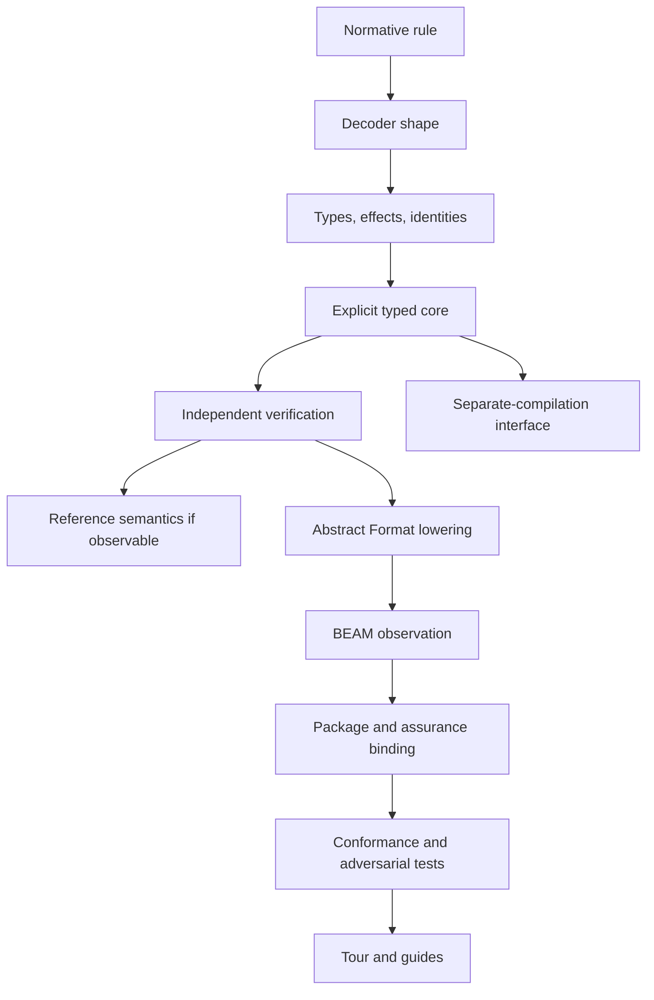

# Adding a Language Feature

A Catena feature is complete only when its meaning, frontend protocol,
elaboration, independent verification, backend behavior, interfaces,
diagnostics, tests, documentation, and conformance identity agree.

## Begin with the language gap

Before editing the compiler, find the corresponding item in the
[language completeness checklist](https://github.com/pcharbon70/catena-research/blob/main/00-inbox/language-specification-completeness-checklist.md).

Determine whether the request:

- completes a partial item;
- fills a gap;
- deliberately implements a deferred item;
- extends an already completed version through a new version; or
- fixes a compiler bug without changing normative behavior.

Do not silently reinterpret an older normative slice because a new feature is
convenient. Add a versioned rule with explicit compatibility behavior.

## Research and specify first

For a new semantic feature:

1. define the question, scope, terminology, and operational claims;
2. research primary specifications and papers when the design depends on
   external evidence;
3. compare alternatives, limits, and negative results;
4. freeze a bounded candidate specification;
5. assign stable diagnostics and deterministic limits;
6. define positive, negative, differential, and adversarial conformance cases;
7. state what remains excluded; and
8. decide the promotion gate before implementation evidence exists.

The research archive keeps source claims, synthesis, inquiry, map, normative
chapters, and conformance journal distinct. Compiler code should link to the
applicable specification rather than embed rationale as accidental behavior.

## Decide whether the frontend version changes

A version change is normally required when adding:

- a declaration or expression kind;
- new typing/effect semantics;
- interface-visible evidence;
- a different runtime calling or representation contract;
- a new package/governance protocol field; or
- behavior that an old valid input could not observe before.

Keep decoder support for valid earlier versions unless the specification
explicitly defines migration or removal. Do not infer new evidence when
decoding an old interface.

## Map the implementation surface

Not every feature touches every box, but every box needs an explicit “changed”
or “not applicable” decision.

## Extend decoding narrowly

In `Catena.AST.Decoder`:

- add the new form only to the version that introduces it;
- validate structural keys, names, lists, and tags;
- assign stable JSON paths;
- reject unknown alternatives;
- normalize only compatibility behavior defined by the specification; and
- leave type-dependent questions for elaboration.

Add decoder tests for missing fields, duplicate names, malformed tags, wrong
versions, and valid minimal input.

## Implement semantic elaboration

Choose the owning subsystem rather than placing all logic in `Type.Infer`.
Examples:

- datatype identity and constructors belong in `Catena.Data`;
- coverage belongs in `Catena.Pattern.Coverage`;
- safe conditions belong in `Catena.Condition`;
- trait coherence belongs in `Catena.Categorical` and `Type.Trait`;
- capability selection belongs in `Catena.Effect`;
- claim identity belongs in `Catena.Specification`; and
- authority belongs in `Catena.Governance`, not module inference.

Elaboration must record every selected identity and proof-relevant fact in
typed core. Backend lowering should never need to repeat overload resolution
or guess source intent.

## Add an independently checkable core form

For every new core node, specify:

- input and result type;
- evaluation effect;
- bound variables and scope;
- nominal, trait, or capability identities;
- evaluation order;
- evidence dependencies;
- whether the node can reach runtime; and
- how source location is retained.

Then extend `Catena.TypedCore.Verifier` or the dedicated independent verifier.
Create forged-core tests that fail even though the ordinary frontend would
never emit that malformed evidence.

If the verifier cannot state the invariant without rerunning the entire
frontend, reconsider whether the core form is explicit enough.

## Define observable semantics independently

When a feature changes runtime behavior, build a reference path that does not
call the production lowering/dispatch implementation. Compare values and,
where relevant, traces.

Current examples include:

- pure semantic evaluation versus compact and uniform ADT layouts;
- condition meaning versus native and ordinary lowering;
- free-request handler semantics versus effect-directed CPS; and
- production policy evaluation versus a separately structured reference
  evaluator.

Published external vectors should supplement local round trips for protocol
standards such as canonicalization and signatures.

## Lower only verified meaning

Extend `Catena.Backend.ErlangAbstract` after the core and verifier are stable.
Preserve:

- strict left-to-right evaluation;
- source-order clause selection;
- nominal and capability identities;
- direct calling convention for unrelated pure code;
- deterministic generated names and forms;
- source file metadata; and
- the sole OTP 29 `compile:noenv_forms/2` boundary.

Do not add a Rust or Python compiler stage, direct BEAM assembly, or Core
Erlang detour. Catena remains a BEAM-only language using the supported OTP 29
path.

## Evolve interfaces explicitly

If downstream compilation needs the new fact:

1. add it to the new interface version;
2. include it in the interface digest;
3. validate it before exposing it to inference or linking;
4. preserve decoding of valid earlier versions;
5. reject missing or forged evidence rather than inventing it; and
6. keep runtime representation out unless the language deliberately promises
   an ABI.

Add round-trip, tamper, backward-version, and cross-module execution tests.

## Review package and erasure impact

Ask whether the feature changes:

- package manifest inputs;
- specialization roots or keys;
- artifact set or output paths;
- claim subject resolution;
- compiler evidence;
- assurance manifest contents;
- governance policy inputs; or
- verification-only erasure.

Compile-time evidence must either be removed before Abstract Format or have an
explicit runtime semantics and cost contract. Add full-BEAM byte comparisons
when the specification requires zero runtime impact.

## Design diagnostics with the feature

Define errors before happy-path implementation obscures the boundaries. Cover:

- malformed protocol shape;
- unknown identity;
- type/effect mismatch;
- ambiguity;
- scope escape;
- deterministic resource exhaustion;
- independent-verifier inconsistency;
- backend rejection; and
- unsafe or substituted artifacts when applicable.

Each category needs one stable identifier and repair-oriented details.

## Build the conformance matrix

At minimum, include:

| Dimension | Required evidence |
| --- | --- |
| accepted semantics | minimal and representative positive programs |
| rejected semantics | one-field near misses with stable diagnostics |
| inference/core boundary | forged evidence rejected independently |
| runtime behavior | compile, load, execute, and compare with reference |
| evaluation order | observable trace or counter example |
| separate compilation | interface round trip, tamper rejection, importing module |
| representation | differential layouts/lowerings when multiple paths exist |
| determinism | repeated bytes/digests/keys |
| resource limit | at-limit success and over-limit diagnostic |
| erasure | forbidden metadata absence and byte identity where promised |
| compatibility | all previous version tests remain green |
| security | substitution, replay, duplicates, path, and signature attacks when relevant |

## Update the learning path

Update the root README, `LANGUAGE-TOUR.md`, guide index, relevant task guide,
developer architecture, and current-boundary lists. Examples must distinguish:

- executable JSON or CLI commands;
- illustrative future source notation;
- normative selected semantics; and
- research proposals that remain unsettled.

Do not let a guide casually close a completeness gap that the specification
still marks partial or open.

## Freeze and promote implementation evidence

When a candidate specification uses an immutable implementation promotion
gate:

1. finish implementation and pre-commit conformance checks;
2. obtain the explicitly required authorization;
3. create one immutable compiler commit;
4. rerun conformance against that exact hash;
5. record environment, commands, results, and artifact digests in the research
   journal;
6. promote only the eligible checklist items and chapters;
7. commit the research record separately; and
8. publish without replacing the tested compiler identity.

Later documentation fixes may be separate descendant commits. Never amend the
recorded conformance commit to make its hash prettier or include unrelated
changes.

## Completion checklist

- normative scope and exclusions are written;
- JSON/frontend versioning is explicit;
- elaboration records every semantic choice;
- independent verification covers the new evidence;
- backend consumes only verified meaning;
- interfaces and old versions behave deliberately;
- reference/differential evidence exists where appropriate;
- diagnostic and deterministic limits are stable;
- runtime and erasure behavior are inspected;
- previous suites pass unchanged;
- guide and tour language matches normative status; and
- immutable conformance identity is recorded when required.

Repository mechanics continue in [Contributing](../../CONTRIBUTING.md).
