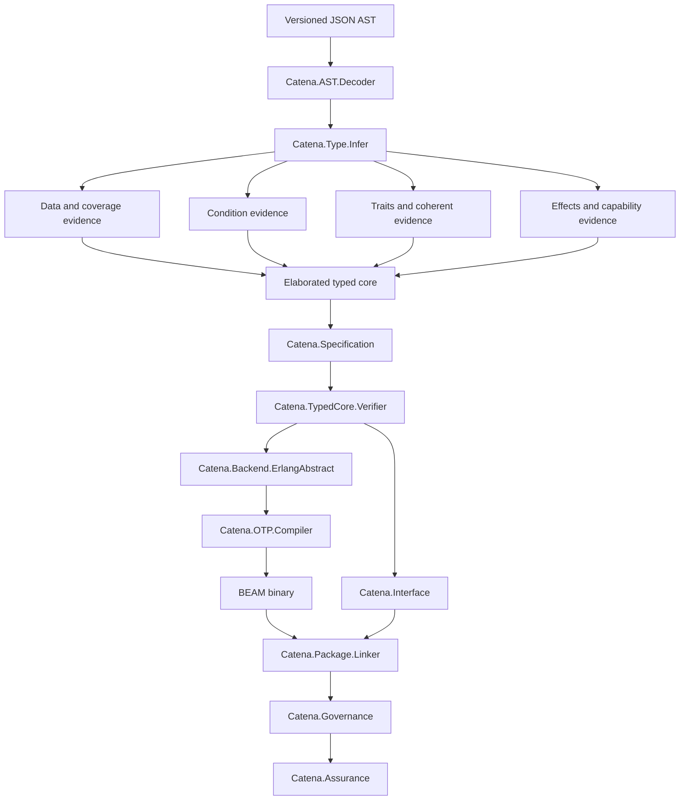

# Compiler Architecture

This guide explains the Elixir bootstrap compiler as an implementation of the
C001 through C006 normative slices. The compiler is intentionally small and
explicit: semantic checks occur before backend lowering, independently
rechecked evidence protects important boundaries, and OTP 29 owns `.beam`
generation.

## Repository role

The two Catena repositories have different responsibilities:

| Repository | Responsibility |
| --- | --- |
| `catena-research` | normative specification, research rationale, evidence trail, open questions, and conformance records |
| `catena` | executable model, typed-core verifier, backend, package gate, and conformance tests |

Implementation convenience does not amend the specification. When a new
language choice is needed, settle and version it in the research repository
before treating compiler behavior as normative.

## Preserve the vocabulary boundary

The compiler necessarily uses more exact internal terms than an introductory
guide. Keep the mapping explicit so diagnostics and documentation return to
the programmer's words:

| Public language | Compiler ledger |
| --- | --- |
| variant type, variant, payload | nominal datatype, constructor identity, ordered fields |
| match, clause, condition, witness | pattern matrix, usefulness, condition facts, coverage witness |
| trait, implementation, requirement, guarantee | trait declaration, instance evidence, predicate, law record |
| effect, operation, `uses`, `request`, `handle`, `resume` | effect row, capability identity, request core, handler table, affine continuation |
| rule, example, promise, evidence | claim graph, checker definition, semantic digest, evidence record |
| owner, approve, activate, replace | principal/role, signed approval, governed action, lifecycle transition |

For example, a programmer writes a `match` over the `Some` variant and receives
a missing-variant diagnostic. Internally, the decoder resolves a constructor
ID, coverage runs a usefulness matrix, typed core stores the selected nominal
identity, and the backend lowers the verified decision. Only a technical
detail view should require the programmer to know those intermediate names.

## Pipeline at a glance



The module compiler and package linker share the same final backend boundary:
Erlang Abstract Format passed to `:compile.noenv_forms/2`.

## Public entry points

### Library API

`Catena.check_json/2` decodes and checks one JSON module:

```elixir
{:ok, core} = Catena.check_json(json, interfaces: dependencies)
```

`Catena.compile_json/2` additionally lowers and invokes OTP:

```elixir
{:ok, module, beam, metadata} =
  Catena.compile_json(json,
    interfaces: dependencies,
    layout: :compact,
    condition_lowering: :auto,
    source: source_path
  )
```

Metadata includes typed core, Erlang forms, interface bytes, warnings, layout,
and condition-lowering selection.

### CLI

`Catena.CLI` wraps those APIs and the package/assurance path:

```text
check-ir
elaborate-ir
compile-ir
compile-package-ir
verify-assurance
```

The CLI prints one structured JSON result. Stable diagnostics go to standard
error with a nonzero exit status.

## Frontend decoding

`Catena.LanguageVersion` is the single executable registry for prototype slice
identifiers and their ordered feature thresholds. `Catena.AST.Decoder` is a
strict boundary for JSON AST 0.1.1 through 0.1.6. It
validates:

- version and required origin;
- module, type, constructor, value, and export naming;
- declaration shapes and uniqueness;
- expression and pattern tags;
- type syntax;
- categorical sections from 0.1.4;
- effects and handlers from 0.1.5; and
- specifications and verification-only definitions from 0.1.6.

Version 0.1.1 is normalized into the 0.1.2 internal data-capable form while its
frontend identity is preserved for compiler metadata. Newer inputs retain
their versioned sections. Unknown versions or tags fail rather than becoming
opaque extension nodes.

The decoder should enforce structural shape. Type-dependent and
cross-declaration meaning belongs in elaboration, not in an ever-growing JSON
parser.

## Inference and elaboration

`Catena.Type.Infer` coordinates the semantic frontend. Its supporting modules
include:

- `Catena.Type`, `Scheme`, `Unify`, `Row`, `Trait`, and `Advanced` for kinds,
  unification, generalization, skolemization, rows, and annotation-directed
  checks;
- `Catena.Data` and `Catena.Pattern.Coverage` for nominal declarations,
  constructor/pattern typing, inhabitation, usefulness, and witnesses;
- `Catena.Condition` and `Condition.Facts` for the closed condition language
  and certified coverage facts;
- `Catena.Categorical`, `Kind`, `Derive`, and categorical submodules for
  traits, instances, laws, standard-interface binding, and derivation;
- `Catena.Effect` and effect submodules for effect families, lexical
  capabilities, rows, handlers, and affine resumptions; and
- `Catena.Specification` for resolved subjects, typed checkers, examples,
  semantic identities, and compiler evidence.

Elaboration resolves every implicit semantic choice—nominal identity, selected
constructor, chosen trait evidence, lexical capability, handler, GADT
equality, or resumption token—before backend lowering.

## Independent typed-core verification

`Catena.TypedCore.Verifier` does not merely trust annotations produced by
inference. It rechecks structural evidence including:

- expression types and schemes;
- effect rows and declaration agreement;
- condition evidence;
- constructor and generated-fold provenance;
- pattern decisions and coverage invariants;
- derived capabilities and helper completeness;
- request identity, handler structure, and resumption discipline; and
- equality evidence scope.

Specification elaboration separately checks 0.1.6 checker purity, example
execution, subject resolution, semantic digests, and runtime dependency
closure.

A verifier failure after successful surface inference is a compiler defect,
reported as internal family `I001`, not blamed on the source program.

This independent pass is a trust boundary. Do not weaken it simply because an
earlier phase “already checked” the same fact.

## Backend lowering

`Catena.Backend.ErlangAbstract` accepts verified core and produces Erlang
Abstract Format tuples. It is responsible for:

- preserving source order and source paths;
- selecting uniform or compact ADT layout without changing semantics;
- lowering conditions through auto, native, or ordinary paths;
- retaining direct calls for pure definitions;
- introducing CPS workers only for effectful definitions;
- generating deterministic hidden handler entry points;
- lowering specialized operations to direct calls; and
- removing verification-only definitions before forms are constructed.

The backend must not redo language-level inference or choose unresolved trait,
capability, pattern, or governance behavior.

## OTP boundary

`Catena.OTP.Compiler` calls `:compile.noenv_forms/2` with deterministic binary
output, source information, and Catena frontend/specification compile metadata.

No other production module may call the OTP form compiler. Direct Core Erlang,
BEAM assembly, and hand-built `.beam` chunks are outside the architecture.
Tests should keep a repository-wide assertion that this remains the sole call.

## Interfaces and separate compilation

`Catena.Interface` creates deterministic `.cati.json` records. Interfaces carry
semantic facts needed by later compilation while hiding runtime representation:

- public values and schemes;
- nominal types and, when transparent, constructors;
- verified conditions;
- traits, instances, laws, templates, and standard digest;
- effect families, handlers, and normalized rows; and
- claims and inherited obligations.

Decoding verifies the content digest before exposing any imported evidence.
Backward decoding supports valid interface versions 0.1.2 through 0.1.6.

## Package compilation

`Catena.Package.Manifest` strictly decodes toolchain manifests.
`Catena.Package.Linker` then:

1. resolves only declared inputs;
2. compiles modules in manifest order;
3. loads and verifies dependency interfaces;
4. specializes verified templates under a deterministic budget;
5. generates one companion BEAM;
6. constructs candidate artifact records;
7. validates package-level claim subjects;
8. evaluates governance when adopted; and
9. commits staged outputs transactionally.

The linker is not a package manager. It performs no discovery, fetching,
version solving, registry communication, or network access.

## Governance and assurance modules

The 0.1.6 package gate is divided by responsibility:

| Module | Responsibility |
| --- | --- |
| `Catena.CanonicalJCS` | strict canonical signed bytes and digests |
| `Catena.Governance.Crypto` | Ed25519 verification, role thresholds, delegation audit |
| `Catena.Governance.TrustRoot` | root decoding, rotation, recovery, revocation, historical states |
| `Catena.Governance.Lifecycle` | signed transition replay and hash-chain validation |
| `Catena.Governance.Policy` | production closed-policy evaluation |
| `Catena.Governance.Reference` | separately structured decision oracle |
| `Catena.Governance` | bundle decoding, evidence admission, policy/lifecycle coordination |
| `Catena.Assurance` | manifest construction and independent artifact/governance verification |

The reference evaluator must not call the production policy evaluator. Shared
fixtures alone are not independent evidence; published canonicalization and
signature vectors supplement local round trips.

## Output transaction

The package linker holds or stages every candidate output until checking,
governance, and signatures succeed. Path validation rejects absolute paths,
parent traversal, symlink escape, collisions, and input overwrite.

Commit uses backups and rollback so a failure does not leave a partially
updated artifact set. Security tests must check both the returned diagnostic
and the absence or restoration of final outputs.

## Non-negotiable invariants

Every compiler change preserves these boundaries:

1. **BEAM only:** OTP 29 Abstract Format is the sole binary-generation path.
2. **Verify before lower:** backend input has passed independent core checks.
3. **No unresolved semantics in backend:** identity and selection are explicit.
4. **Coherence:** instance choice cannot depend on imports or runtime state.
5. **Lexical effects:** requests dispatch by capability identity, never label
   search.
6. **Affine resumptions:** escape and duplicate use are rejected, with dynamic
   defense before continuation entry.
7. **Representation independence:** interfaces do not expose ADT layout.
8. **Determinism:** identical bounded inputs produce identical semantic
   digests, forms, and BEAM bytes where specified.
9. **Total assurance erasure:** no 0.1.6 rule or governance payload reaches BEAM.
10. **Fail closed and transactional:** malformed governance denies and failed
    gates leave no new final output.
11. **No private keys:** the compiler emits payloads and verifies signatures.
12. **Stable diagnostics:** known failures retain their family and machine path.

Continue with [Intermediate Representations](intermediate-representations.md)
for the data passed between these stages.
