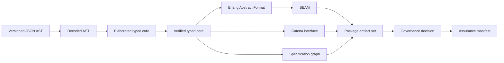
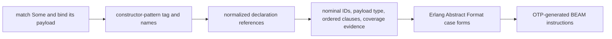

# Intermediate Representations

Catena uses several representations because parsing, type checking, backend
lowering, separate compilation, and governance need different information.
Calling all of them “the IR” obscures which invariants have been established.

## Representation map



Only Erlang Abstract Format is the OTP-facing compiler representation. Core
Erlang is not part of the normative backend route.

## Follow one public idea through the representations

Suppose source-oriented documentation says:

```catena
match option with
| Option.None -> 0
| Option.Some value -> value
```

The programmer needs only `match`, `variant`, and `payload`. Each compiler
representation adds the facts required by its job:



Do not make a public guide teach “constructor-pattern tag” or “coverage
evidence” before it can explain matching. Conversely, do not name an internal
field only `variant` when the verifier needs to distinguish declaration,
constructor, representation, and branch identity.

## Versioned JSON AST

The current frontend consumes JSON objects with versions 0.1.1 through 0.1.7.
This is a temporary, explicit toolchain input used to test semantics before
Catena source syntax is frozen.

Example expression node:

```json
{
  "tag": "call",
  "callee": { "tag": "variable", "name": "identity" },
  "arguments": [{ "tag": "integer", "value": 7 }]
}
```

Properties:

- JSON names and tagged unions are frontend protocol, not user syntax.
- Each version has a closed set of sections and tags.
- Decoding rejects unknown or malformed values.
- AST 0.1.1 has a legacy origin and normalizes into the internal 0.1.2-capable
  shape.
- Versions 0.1.2 through 0.1.7 require a package/build origin.
- Frontend format and selected language revision are separate in 0.1.7; a
  package selection controls semantic applicability.

The decoder adds paths such as `$.definitions[0].body` so later diagnostics can
identify their protocol location.

## Decoded AST

`Catena.AST.Decoder` converts raw JSON into Elixir maps with normalized names,
atoms, declaration records, parsed sections, and retained source paths. It has
validated structural shape but has not yet proven the program well typed.

Examples of work still pending at this stage:

- resolving a constructor to a nominal declaration;
- inferring a local binding's scheme;
- deciding whether a match is exhaustive;
- selecting a trait instance;
- selecting a lexical effect capability;
- checking a handler's clauses; and
- resolving a specification subject.

Keep this distinction when adding fields: decoding should not manufacture
semantic evidence that only elaboration can justify.

## Elaborated typed core

Inference and elaboration produce explicit records for definitions and
expressions. Every expression carries its result type and evaluation effect.
Implicit source choices become explicit core data:

```text
source constructor name  -> nominal type ID + constructor ID
trait operation          -> selected coherent evidence
unqualified request      -> selected lexical capability ID
match clauses            -> ordered exhaustive decision representation
GADT branch              -> scoped equality evidence
resume                   -> affine token + continuation
```

Generalized bindings record type abstraction/application. Trait constraints
record evidence abstraction/application. Effects record normalized rows and
capability identities. Source paths remain attached for diagnostics.

Typed core is still compiler-produced evidence. It becomes a trusted backend
input only after the independent verifier accepts it.

## Specification graph

For AST 0.1.6, `Catena.Specification` adds a separate typed graph containing:

- stable claim ID;
- formatting-insensitive semantic digest;
- resolved subject kind and name;
- checker definition and type;
- exact examples and outcomes;
- assumptions and dependencies; and
- compiler evidence records.

Verification-only definitions remain present long enough for checker execution
and dependency analysis. The runtime-definition set excludes them before
Abstract Format lowering.

The graph is not a runtime IR and must never be embedded in BEAM.

## Verified typed core

Verification does not create a wholly new data structure; it establishes an
invariant over elaborated core. Conceptually, the transition is important:

```text
elaborated core + successful independent verification
  = backend-admissible core
```

The verifier rechecks type/effect consistency, evidence applications,
constructor provenance, coverage facts, derivations, effect selection,
handlers, and affine use. Backend functions should be structured so they are
called only after this gate.

If a new core node cannot be independently verified, the feature is not ready
for backend lowering.

## Erlang Abstract Format

`Catena.Backend.ErlangAbstract` produces the documented Erlang syntax-tree
tuples accepted by OTP. Representative forms include:

```elixir
{:attribute, line, :module, :ModuleName}
{:attribute, line, :export, [{:function_name, arity}]}
{:function, line, :function_name, arity, clauses}
```

The generated forms carry source file metadata and deterministic names. Pure
definitions lower directly; effectful definitions may add private CPS workers;
traits specialize to direct calls; datatype layout is selected explicitly.

Abstract Format contains runtime code only. Verification-only definitions and
governance data must already be absent.

Inspect it from the library API:

```elixir
{:ok, _module, _beam, metadata} = Catena.compile_json(json)
IO.inspect(metadata.forms, pretty: true, limit: :infinity)
```

## BEAM binary

`Catena.OTP.Compiler` submits forms to `:compile.noenv_forms/2` with
`:deterministic`, `:binary`, source, frontend, and specification metadata.
The returned binary is opaque to Catena's semantic phases.

Tests may inspect standard OTP chunks and execute exports, but no compiler
phase patches or assembles the binary. Byte identity is required in selected
conformance cases, including specification erasure.

## Catena module interface

`.cati.json` is the separate-compilation representation. It contains public
semantic information but deliberately omits runtime layout. Its SHA-256 digest
covers the payload.

Interface evolution is additive by implemented slice:

| Version | Added interface content |
| --- | --- |
| 0.1.2 | nominal datatypes, constructors according to visibility, values |
| 0.1.3 | condition definitions and normalized evidence |
| 0.1.4 | traits, instances, laws, templates, standard hierarchy digest |
| 0.1.5 | effects, handlers, and normalized `uses` rows |
| 0.1.6 | claim summaries, specification digest, inherited obligations |
| 0.1.7 | edition, exact language revision, enabled previews, public preview requirements |

Decoders retain compatibility with valid earlier interfaces. Never infer
missing newer evidence from an older version.

## Package manifest and specialization input

`catena-package-manifest` is a toolchain instruction, not a language IR or
package-manager lockfile. It names:

- module sources and their BEAM/interface outputs;
- explicit dependency interfaces;
- verified template roots and concrete types;
- companion module and output;
- 0.1.6 package/profile/assurance identity;
- 0.1.7 edition, exact language revision, previews, and diagnostic policy; and
- optional governance bundle.

The linker operates only on those named inputs and a fixed deterministic
specialization budget.

## Canonical governance records

Three retained 0.1.6 and 0.1.7 protocol formats use strict JCS canonical bytes:

- `catena-trust-root`;
- `catena-governance-bundle`; and
- `catena-assurance-manifest`.

They are not compiler core. They bind external identity, policy, history, and
artifact decisions to core-derived claims and generated bytes.

The governance bundle digest excludes `manifest_signatures`, allowing a
two-pass external signing workflow over a stable candidate decision. Every
other meaning-sensitive change alters the relevant digest and invalidates
dependent signatures.

The declared artifact version selects the signing domain. Historical 0.1.6
payload bytes remain unchanged; 0.1.7 selection joins approvals and assurance
identity without cross-version verification fallback.

## Assurance manifest

The assurance manifest is the final build-time ledger. Its signed payload
includes:

- package, profile, action, compiler, frontend, specification, and OTP;
- sorted artifact paths, sizes, and SHA-256 hashes;
- modules and dependency interface digests;
- claims, evidence, and assumptions;
- replayed governance state and explanation; and
- an erasure report.

`Catena.Assurance.verify/3` reconstructs artifact hashes and governance
decisions from the supplied files and root. Verification does not rebuild
source modules and does not declare external attestations true.

## Representation ownership rules

When changing the compiler, preserve these ownership boundaries:

| Fact | Owning stage |
| --- | --- |
| JSON structural validity | decoder |
| kinds, types, effects, identities, selections | inference/elaboration |
| independent consistency | typed-core/specification verifier |
| runtime control/data representation | backend |
| `.beam` binary validity | OTP 29 |
| public separate-compilation contract | interface encoder/decoder |
| package specialization and output transaction | linker |
| authority, evidence admission, lifecycle | governance evaluator |
| exact artifact ledger | assurance builder/verifier |

Duplicating a check for defense in depth can be useful, but moving ownership
downstream creates semantic drift. A backend error should not become the first
place an invalid source construct is discovered.

Continue with [Diagnostics and Testing](diagnostics-and-testing.md) for how
these boundaries are exercised independently.
