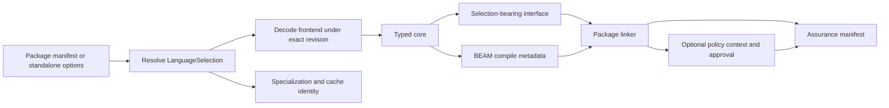

# Versioning and Feature Lifecycle

This guide explains how the bootstrap compiler implements Catena's normative
0.1.7 edition, exact-revision, preview, migration, and compatibility model. It
is for compiler contributors; the programmer-facing guide is
[Editions, Revisions, and Previews](../language/editions-and-previews.md).

## Preserve the four identities

Never collapse these values into one variable:

| Identity | Executable owner | Typical consumer |
| --- | --- | --- |
| edition | `Catena.LanguageSelection` | package compatibility and policy |
| language revision | `Catena.LanguageVersion` | semantic feature gates and specification applicability |
| artifact version | each decoder/encoder | schema, canonical bytes, and signature domain |
| compiler release | `mix.exs` | tool distribution and evidence records |

The current compiler release remains `0.1.0`; it can implement several
language revisions. Incrementing it does not move a package's exact language
pin.

## Follow selection through the pipeline



`Catena.AST.Decoder` separates frontend schema from selected semantics. A
newer neutral transport can encode an older program, but a construct
introduced after the exact pin fails as `EDN001`. Package options provide the
authoritative selection so every module is checked consistently; an explicit
contradictory module selection is rejected.

Legacy 0.1.4 and 0.1.6 manifests receive an inferred selection plus `EDN002`.
That advisory must not change historical interface bytes, BEAM bytes,
assurance bytes, or signature payloads.

## Maintain the registries

`Catena.LanguageVersion` owns the ordered, retained revision list and current
selection. `Catena.LanguageLifecycle` owns immutable feature IDs, state
history, compatibility changes, diagnostic IDs, and structured migration
edits. `Catena.LanguageInfo` exposes both registries without mutation.

For a new revision:

1. reserve the next approved language revision in the research specification;
2. add it once to `Catena.LanguageVersion`;
3. add or transition immutable feature records in
   `Catena.LanguageLifecycle`;
4. classify each compatibility change and affected dimension;
5. provide migration guidance and only semantics-preserving automatic edits;
6. update every artifact decoder that must retain or introduce a format; and
7. add exact-pin, invalid-pin, lifecycle, migration, and downgrade tests.

Do not delete an older stable revision during an ordinary feature change. Do
not reuse withdrawn or removed feature IDs.

## Keep feature states closed

The only transitions are:

```text
preview -> stable
preview -> withdrawn
stable -> deprecated
deprecated -> removed
```

A direct `stable -> removed` boundary is accepted only by the separately
validated security/soundness emergency-record path. Never represent an
ordinary removal with that exception.

The registry validates identifiers, unique history boundaries, ordered known
revisions, and transition paths. State lookup always receives an exact
revision.

Catena 0.1.7 contains no preview entry. A contributor must not use the public
preview registry for implementation switches, hidden syntax, or vendor
experiments.

When a real preview is added, compute `required_previews` from exported
semantics. The enabled set alone is not the dependency contract. Validate
import requirements before trait solving, specialization, governance, or
backend lowering.

## Bind persisted outputs

For artifact format 0.1.7:

- interfaces carry edition, exact revision, enabled previews, and public
  required previews inside their digest;
- BEAM compile information carries frontend format, specification revision,
  edition, exact revision, and previews;
- specialization keys include artifact version and language selection;
- package results report selection and diagnostics;
- assurance signed data includes selection and diagnostic IDs; and
- verification cross-checks assurance selection against interface data and
  BEAM compile metadata.

These values are compile-time metadata. Erlang Abstract Format function bodies
must contain no edition registry lookup or preview dispatch.

Historical formats retain historical encoding. Do not add 0.1.7 fields to a
0.1.6 interface, BEAM compile-information list, root state digest, approval,
or assurance payload.

## Version signing domains once

The signed payload function is:

```text
"catena:" ++ kind ++ ":" ++ artifact_version ++ "\n" ++ canonical_json(value)
```

`Catena.CanonicalJCS.payload/3` receives the already validated artifact
version. `Catena.Governance.Crypto` derives that version from the decoded trust
root. Roots, bundles, and assurance records must agree before verification.
There is no cross-version retry.

New 0.1.7 root-state digests bind their format version. The 0.1.6 state-payload
function remains byte-for-byte compatible.

## Extend policy without opening it

The 0.1.7 policy evaluator and separately structured reference oracle both
implement `edition`, `language_revision`, `previews`, and `diagnostics` leaves.
They validate exact fields and known values, consume the shared step budget,
and include selected versus allowed values in their explanation trees.

The same leaves are invalid in a 0.1.6 bundle. This preserves the historical
closed algebra rather than retroactively extending it.

## Test the compatibility matrix

The focused C008 suite covers:

- every exact retained revision and malformed pins;
- lifecycle paths, registry uniqueness, and the intentionally empty preview
  set;
- standalone current reporting, legacy inference, structured edits, and
  warning denial;
- explicit older semantic pins over a newer transport;
- manifest requirements and interface preview propagation;
- interface, BEAM, specialization, assurance, approval, root, and signature
  selection binding;
- production/reference policy agreement and version mismatch rejection;
- historical byte preservation; and
- absence of runtime selection dispatch.

Run it with:

```bash
asdf exec mix test test/catena/c008_editions_lifecycle_test.exs --trace
```

Then run formatting, warning-free compilation, the complete suite, escript
build, and repository diff checks.

## Respect the promotion gate

An implementation branch and green tests are only candidate evidence. C008 was
promoted after an explicitly authorized immutable compiler commit and a
reproducible research-journal record. Future promotions using this gate must
likewise record the exact implementation identity before candidate chapters
become normative or a partial checklist item becomes complete.

## Keep bootstrap language separate from target language

The 0.1.7 compiler remains written in Elixir. Compiler self-hosting is tracked
separately as G141 for a late 0.x milestone, after Catena can express the
compiler's own needs. The migration is staged: define the self-hosting subset,
compile Catena compiler modules with the trusted bootstrap compiler, compare
bootstrap and self-hosted outputs, require a two-stage fixed point, and retain
a reproducible bootstrap path.

Changing the implementation language must not change Catena's BEAM-only
target, verified typed-core boundary, or OTP 29 `compile:noenv_forms/2`
production boundary.

Continue with [Adding a Language Feature](adding-a-language-feature.md) for the
full archive-to-compiler workflow.
