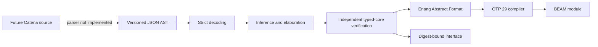

# Getting Started with Catena

This guide gives you a source-first mental model and then shows how to run the
current executable prototype. Catena targets the BEAM VM, but it is not yet a
general-purpose source-language distribution.

## What you can do today

The repository contains an Elixir bootstrap compiler that can:

- decode versioned Catena JSON AST 0.1 through 0.6;
- infer and check types, data, patterns, conditions, traits, effects, and
  typed specifications;
- independently verify its typed core;
- lower accepted programs to Erlang Abstract Format;
- ask Erlang/OTP 29 to produce deterministic `.beam` modules;
- emit digest-bound `.cati.json` module interfaces; and
- build artifact-bound assurance manifests for 0.6 packages.

It does not yet contain a Catena source parser, formatter, REPL, package
manager, stable Erlang FFI, or complete standard library.

## Install the pinned toolchain

The repository pins Erlang/OTP and Elixir in `.tool-versions`. With
[asdf](https://asdf-vm.com/) installed:

```bash
asdf install
asdf exec mix test
asdf exec mix escript.build
```

The last command creates the `catena` executable in the repository root.

## A source-first example

Suppose we want to represent delivery progress and explain it to a user. In
illustrative Catena notation:

```catena
type DeliveryStatus =
  | Queued
  | InTransit { tracking_id: TrackingId }
  | Delivered { at: Instant }
  | Failed { reason: DeliveryFailure }

describe : DeliveryStatus -> Text
describe(status) =
  match status with
  | DeliveryStatus.Queued -> "Waiting to ship"
  | DeliveryStatus.InTransit { tracking_id } -> tracking_link(tracking_id)
  | DeliveryStatus.Delivered { at } -> delivered_at(at)
  | DeliveryStatus.Failed { reason } -> explain_failure(reason)
```

This example demonstrates the intended programming model:

- `DeliveryStatus` has nominal identity; another declaration with the same
  variants is still another type.
- Constructors are qualified, so the origin of a value remains visible.
- Matching is ordered and the compiler requires every possible variant to be
  covered.
- Each exported function has a written signature.
- Values are immutable and evaluation is strict.

The notation is instructional. The normative semantics are fixed, but the
future parser may choose different separators or layout.

## Run the executable model

The repository includes one durable JSON-AST fixture representing an `Option`
datatype:

```bash
./catena check-ir test/fixtures/c002-option.catena.json
```

`check-ir` decodes, elaborates, type checks, performs coverage analysis, and
verifies typed core without producing files. Successful output is structured
JSON.

Compile the same fixture in a temporary directory:

```bash
catena_tour_directory="$(mktemp -d)"
cp test/fixtures/c002-option.catena.json "$catena_tour_directory/"
./catena compile-ir "$catena_tour_directory/c002-option.catena.json"
ls -l "$catena_tour_directory"
```

The compiler writes:

- `C002Fixture.beam`, generated by OTP 29; and
- `C002Fixture.cati.json`, a deterministic, digest-bound module interface.

The interface intentionally describes types and callable values without
exposing the chosen runtime layout.

## The compilation story



JSON is a bootstrap boundary, not a preview of the final source file format.
Keeping that boundary explicit lets the project test language semantics before
parser choices become permanent.

## Understand signatures and inference

Catena infers ordinary private rank-1 definitions, including polymorphic local
bindings. Public definitions always have explicit signatures:

```catena
identity : A -> A
identity(value) = value
```

Advanced features such as GADT refinement, existential values, nested
`forall`, and polymorphic recursion require annotations. The compiler rejects
ambiguity instead of guessing a default type or trait instance.

Functions that may leave an external request to their caller expose that fact
with `uses`:

```catena
load_customer : CustomerId -> Customer uses store: Store[CustomerId, Customer]
```

An absent `uses` list is a pure boundary. Effects are not exceptions hidden
behind a nominally pure signature.

## Read diagnostics

CLI failures are JSON objects written to standard error. A diagnostic contains:

```json
{
  "status": "error",
  "diagnostic": {
    "id": "M001",
    "message": "match is not exhaustive",
    "path": "$.definitions[0].body",
    "details": {
      "witness": "Option.Some(_)"
    }
  }
}
```

Treat the stable identifier as the diagnostic category and the path/details as
the concrete occurrence. Useful errors should tell you what failed, why it
matters, and what evidence or source change can repair it.

## Useful compiler commands

```text
catena check-ir PROGRAM.json
catena elaborate-ir [--interface DEP.cati.json] PROGRAM.json
catena compile-ir [--layout compact|uniform] PROGRAM.json
catena compile-ir [--condition-lowering auto|native|ordinary] PROGRAM.json
catena compile-package-ir [--action build|publish|activate] PACKAGE.json
catena verify-assurance --trust-root ROOT.json ASSURANCE.json
```

`elaborate-ir` currently reports the same checked module summary as
`check-ir`; use compiler APIs or tests when you need the complete in-memory
typed core. `compile-package-ir` is a deterministic manifest-driven linker,
not a dependency resolver or package manager.

## Learn the language by decisions

Continue in this order:

1. [Algebraic Data Types](language/algebraic-data-types.md) when you need to
   define possible states.
2. [Pattern Matching](language/pattern-matching.md) when you need to consume
   those states safely.
3. [Traits and Composition](language/traits-and-composition.md) when the same
   operation should work across types.
4. [Effects and Handlers](language/effects-and-handlers.md) when code needs an
   external ability.
5. [Specifications](language/specifications.md) when a package needs checked
   rules and durable evidence.
6. [Governance](language/governance.md) when an organization needs to control
   build, publication, or activation.
7. [Catena and BEAM](language/catena-and-beam.md) when you need to understand
   generated artifacts and runtime boundaries.

## Know the current boundary

Do not infer unspecified facilities from familiar syntax. In particular:

- list, map, binary, view, and pattern-synonym patterns are not implemented;
- list comprehensions remain research work;
- handlers do not yet promise resource cleanup or multi-shot resumptions;
- specifications have no runtime-monitoring profile in 0.6;
- governance uses logical sequence windows, not wall-clock expiry; and
- calling arbitrary Erlang functions or validating arbitrary Erlang terms is
  not yet a stable Catena language feature.

The [Language Tour](../LANGUAGE-TOUR.md) gives the compact overview. The
[guide index](README.md) provides the complete learning and developer paths.
