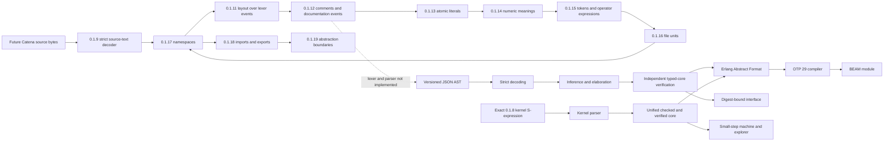

# Getting Started with Catena

This guide gives you a source-first mental model and then shows how to run the
current executable prototype. Catena targets the BEAM VM, but it is not yet a
general-purpose source-language distribution.

## What you can do today

The repository contains an Elixir bootstrap compiler that can:

- decode versioned Catena JSON AST 0.1.1 through 0.1.7;
- parse the exact normative 0.1.8 semantic-kernel S-expression with source
  spans;
- validate the normative 0.1.9 strict UTF-8 source-text envelope while
  preserving original-byte scalar spans;
- validate normative 0.1.10 standalone Unicode identifiers, qualification,
  keywords, and confusable-name diagnostics;
- resolve normative 0.1.11 whitespace, separators, and line continuation over
  lexer-supplied token events;
- scan normative 0.1.12 comments and attach outer documentation over lexer-
  and parser-supplied events;
- scan one normative 0.1.13 atomic literal with exact decoded payload and
  source provenance, then elaborate it as a typed 0.1.14 numeric meaning;
- tokenize a complete file into the 0.1.15 whole-source token stream and
  resolve operator expressions over the fixed ladder;
- resolve a `.cat` file unit at 0.1.16: at most one module, basename
  verified, with first-line generated markers;
- build a namespace environment at 0.1.17 and resolve names with
  local-over-imported precedence;
- validate imports against digest-bound export sets at 0.1.18 and report
  unused admissions as deny-able warnings;
- confirm the abstraction boundary at 0.1.19: binary authority, no stable
  layout, and the smart-constructor invariant idiom;
- infer and check types, data, patterns, conditions, traits, effects, and
  typed specifications;
- independently verify its typed core;
- lower accepted programs to Erlang Abstract Format;
- ask Erlang/OTP 29 to produce deterministic `.beam` modules;
- emit digest-bound `.cati.json` module interfaces; and
- build artifact-bound assurance manifests for 0.1.6 and 0.1.7 packages; and
- execute the normative 0.1.7 edition, exact-revision, preview-lifecycle, and
  selection-binding contract; and
- check and run normative 0.1.8 structural rows, handlers, typed local actors,
  process-local traps, and bounded schedule exploration.

It does not yet contain an ergonomic Catena source parser, formatter, REPL, package
manager, stable Erlang FFI, or complete standard library.

## Learn Catena's words from behavior

The current public vocabulary describes programming tasks first:

| Catena word | Read it as |
| --- | --- |
| `value` | data available to a program |
| `transform` | a pure function that changes a value |
| `variant type` | a type with a closed set of named alternatives |
| `variant` | one alternative of a variant type |
| `payload` | the data carried by a variant |
| `match` | choose behavior from a value's variant and payload |
| `trait` | a reusable capability a type may provide |
| `implementation` | how one type provides a trait |
| `requirement` | a capability generic code needs |
| `guarantee` | behavior an implementation promises to preserve |
| `effect` | a named external ability |
| `operation` | one request that ability provides |
| `handle` | supply behavior for effect operations |
| `resume` | continue the handled computation with a value |

These words are the learning interface, not nicknames that must later be
replaced with mathematical terminology. Exact parser punctuation is still
open, and individual guides identify proposed words whose semantics have not
yet entered the executable prototype.

## Install the pinned toolchain

The repository pins Erlang/OTP and Elixir in `.tool-versions`. With
[asdf](https://asdf-vm.com/) installed:

```bash
asdf install
asdf exec mix test
asdf exec mix escript.build
```

The last command creates the `catena` executable in the repository root.

Validate a future `.catena` source file's encoding and newline envelope before
the later lexer and parser exist:

```bash
./catena check-source-text program.catena
```

The command reports deterministic byte, logical-scalar, and logical-newline
counts. It does not claim that the file is a grammatically valid program.

Validate names independently of the later whole-source lexer:

```bash
./catena check-identifiers alpha Option.Some '`type`'
```

The 0.1.11 layout contract is available through `Catena.resolve_layout/2`, not
a whole-source command. It consumes events from a future lexer so it does not
guess the still-open literal or concrete-token rules. See
[Whitespace, Separators, and Line Continuation](language/whitespace-and-layout.md).

The 0.1.12 comment contract is available through `Catena.scan_comment/2` and
`Catena.resolve_comments/2`, also without a whole-source command. See
[Comments and Documentation Comments](language/comments-and-documentation-comments.md).

The 0.1.13 literal contract is available through `Catena.scan_literal/2` and
the 0.1.14 numeric meaning through `Catena.elaborate_numeric_literal/2`,
the 0.1.15 token stream through `Catena.tokenize_source/2` and
`Catena.parse_operator_expression/1`, the 0.1.16 file unit through
`Catena.resolve_file_unit/4`, 0.1.17 names through
`Catena.build_namespace_environment/2` and `Catena.resolve_name/2`, 0.1.18
imports through `Catena.check_unused_imports/2`, and 0.1.19's
abstraction-boundary exclusions through the idiom corpus,
also without a whole-source command. See [Literals](language/literals.md).

Inspect the compiler's current default, retained revisions, feature states,
and migrations before compiling a package:

```bash
./catena language-info
```

Inspect the implementation's exact choices, portable limits, analysis bounds,
and runtime-capacity constraints as deterministic JSON:

```bash
./catena conformance-info
```

## A source-first example

Suppose we want to represent delivery progress and explain it to a user. In
illustrative Catena notation:

```catena
type DeliveryStatus =
  | Queued
  | InTransit { tracking_id: TrackingId }
  | Delivered { at: Instant }
  | Failed { reason: DeliveryFailure }

describe : DeliveryStatus -> Text
describe(status) =
  match status with
  | DeliveryStatus.Queued -> "Waiting to ship"
  | DeliveryStatus.InTransit { tracking_id } -> tracking_link(tracking_id)
  | DeliveryStatus.Delivered { at } -> delivered_at(at)
  | DeliveryStatus.Failed { reason } -> explain_failure(reason)
```

This example demonstrates the intended programming model:

- `DeliveryStatus` is a **variant type** with four possible states.
- `InTransit`, `Delivered`, and `Failed` are **variants** carrying named
  **payloads**.
- Constructing a value qualifies its variant, so its origin remains visible.
- `match` reads the variant and makes its payload available; the compiler
  requires every possible variant to be covered.
- Each exported function has a written signature.
- Values are immutable and evaluation is strict.

The notation is instructional. The normative semantics and 0.1.11 layout
classification are fixed, while later grammar work still chooses concrete
operators, delimiters, and complete productions.

## Run the executable model

The repository includes one durable JSON-AST fixture representing an `Option`
datatype:

```bash
./catena check-ir test/fixtures/c002-option.catena.json
```

`check-ir` decodes, elaborates, type checks, performs coverage analysis, and
verifies typed core without producing files. Successful output is structured
JSON.

Compile the same fixture in a temporary directory:

```bash
catena_tour_directory="$(mktemp -d)"
cp test/fixtures/c002-option.catena.json "$catena_tour_directory/"
./catena compile-ir "$catena_tour_directory/c002-option.catena.json"
ls -l "$catena_tour_directory"
```

The compiler writes:

- `C002Fixture.beam`, generated by OTP 29; and
- `C002Fixture.cati.json`, a deterministic, digest-bound module interface.

The interface intentionally describes types and callable values without
exposing the chosen runtime layout.

## The compilation story



JSON is a bootstrap boundary, not a preview of the final source file format.
Keeping that boundary explicit lets the project test language semantics before
ergonomic parser choices become permanent. The exact kernel input is a retained
conformance format, not a preview of ergonomic layout.

## Understand signatures and inference

Catena infers ordinary private rank-1 definitions, including polymorphic local
bindings. Public definitions always have explicit signatures:

```catena
identity : A -> A
identity(value) = value
```

Advanced features such as GADT refinement, existential values, nested
`forall`, and polymorphic recursion require annotations. The compiler rejects
ambiguity instead of guessing a default type or trait implementation.

Functions that may leave an external request to their caller expose that fact
with `uses`:

```catena
load_customer : CustomerId -> Customer uses store: Store[CustomerId, Customer]
```

An absent `uses` list is a pure boundary. Effects are not exceptions hidden
behind a nominally pure signature.

## Read diagnostics

CLI failures are JSON objects written to standard error. A diagnostic contains:

```json
{
  "status": "error",
  "diagnostic": {
    "id": "M001",
    "message": "match is not exhaustive",
    "path": "$.definitions[0].body",
    "details": {
      "witness": "Option.Some(_)"
    }
  }
}
```

Treat the stable identifier as the diagnostic category and the path/details as
the concrete occurrence. Useful errors should tell you what failed, why it
matters, and what evidence or source change can repair it.

## Useful compiler commands

```text
catena check-ir PROGRAM.json
catena elaborate-ir [--interface DEP.cati.json] PROGRAM.json
catena compile-ir [--layout compact|uniform] PROGRAM.json
catena compile-ir [--condition-lowering auto|native|ordinary] PROGRAM.json
catena compile-package-ir [--action build|publish|activate] PACKAGE.json
catena verify-assurance --trust-root ROOT.json ASSURANCE.json
catena check-kernel PROGRAM.catena-kernel
catena compile-kernel [--interface DEP.cati.json] PROGRAM.catena-kernel
catena language-info
```

`elaborate-ir` currently reports the same checked module summary as
`check-ir`; use compiler APIs or tests when you need the complete in-memory
typed core. `compile-package-ir` is a deterministic manifest-driven linker,
not a dependency resolver or package manager.

New package manifests pin an edition and exact language revision:

```json
{
  "format": "catena-package-manifest",
  "version": "0.1.7",
  "edition": "0.1",
  "language_revision": "0.1.7",
  "previews": []
}
```

The complete manifest still needs its package, module, interface, output,
profile, and assurance fields. Standalone commands can select explicitly with
`--edition`, `--language-revision`, and repeatable `--preview`; successful JSON
output reports the resolved selection.

## Learn the language by decisions

Continue in this order:

1. [Editions, Revisions, and Previews](language/editions-and-previews.md) when
   you need a stable answer to which language contract a package uses.
2. [Variant Types and Structured Data](language/algebraic-data-types.md) when
   you need to define possible states and their payloads.
3. [Pattern Matching](language/pattern-matching.md) when you need to consume
   those states safely.
4. [Traits and Composition](language/traits-and-composition.md) when the same
   operation should work across types.
5. [Effects and Handlers](language/effects-and-handlers.md) when code needs an
   external ability.
6. [Formal Semantic Kernel](language/formal-semantic-kernel.md) when you need
   the exact 0.1.8 input, structural rows, reference semantics, or typed actors.
7. [Specifications](language/specifications.md) when a package needs checked
   rules and durable evidence.
8. [Governance](language/governance.md) when an organization needs to control
   build, publication, or activation.
9. [Catena and BEAM](language/catena-and-beam.md) when you need to understand
   generated artifacts and runtime boundaries.

## Know the current boundary

Do not infer unspecified facilities from familiar syntax. In particular:

- list, map, binary, view, and pattern-synonym patterns are not implemented;
- list comprehensions remain research work;
- handlers do not yet promise resource cleanup or multi-shot resumptions;
- 0.1.8 actors are local, typed, fire-and-forget processes without timeouts,
  links, monitors, supervision, distribution, or fairness guarantees;
- specifications have no runtime-monitoring profile in 0.1.6;
- 0.1.7 publishes no actual preview feature, despite defining how named
  previews will work;
- governance uses logical sequence windows, not wall-clock expiry; and
- calling arbitrary Erlang functions or validating arbitrary Erlang terms is
  not yet a stable Catena language feature.

The [Language Tour](../LANGUAGE-TOUR.md) gives the compact overview. The
[guide index](README.md) provides the complete learning and developer paths.
