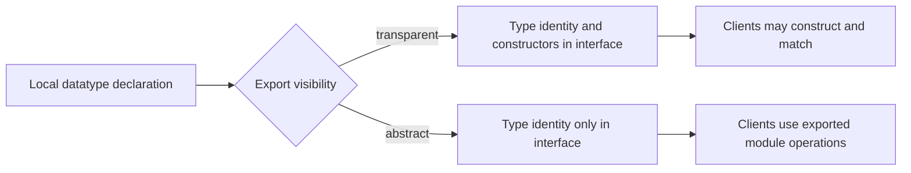

# Variant Types and Structured Data

Variant types let a program name every valid shape of a domain value. Catena
uses closed, nominal declarations: the declaration establishes identity, and
its variants establish the possible values. The specification and compiler
also call these algebraic data types and constructors, but ordinary code can
be learned through variants and their payloads.

Code in this guide uses illustrative source notation. The normative 0.2 model
is implemented through JSON AST today; final parser punctuation remains open.

## Use the data vocabulary

| Public word | What it means in Catena |
| --- | --- |
| `variant type` | a closed type whose values come from named alternatives |
| `variant` | one named alternative, such as `Queued` or `Failed` |
| `payload` | positional or named data carried by a variant |
| `construct` | create a value by naming its type and variant |
| `match` | select behavior from the variant and expose its payload |
| `record` | a value or payload with named fields |
| `tuple` | a value or payload with positional fields |

For example, read
`DeliveryStatus.InTransit { tracking_id: id }` as: construct the `InTransit`
variant of `DeliveryStatus` with a named `tracking_id` payload. A later
`match` can select that variant and bind `tracking_id` without knowing its
private BEAM representation.

## Model states, not flag combinations

Consider a request that may be waiting, running, complete, or failed. Several
independent Boolean fields allow impossible combinations such as “running and
complete.” A variant type makes the alternatives exclusive:

```catena
type JobState Result Error =
  | Waiting
  | Running { started_at: Instant }
  | Complete Result
  | Failed Error
```

Each variant says exactly what information exists in that state. Code
handling `Complete result` receives a `Result`; code handling `Waiting` cannot
pretend that a result already exists.

## Declaration forms

Catena 0.2 supports three variant payload shapes.

### No payload

```catena
type Light =
  | Red
  | Yellow
  | Green
```

Payload-free variants represent alternatives that carry no additional data.

### Positional payload

```catena
type Option A =
  | None
  | Some A

type Pair A B =
  | Pair A B
```

Positional fields are useful when their meaning is obvious from the type and
position.

### Named payload

```catena
type DeliveryStatus =
  | Queued
  | InTransit { tracking_id: TrackingId, carrier: Carrier }
  | Delivered { at: Instant }
```

Named fields make larger payloads self-describing. A declaration cannot mix
named and positional fields within one variant.

## Construct variants explicitly

Variant construction is qualified by its type:

```catena
Option.Some(7)

DeliveryStatus.InTransit {
  carrier: selected_carrier,
  tracking_id: tracking
}
```

For named construction:

- every declared field appears exactly once;
- fields may be written in any order;
- expressions evaluate once, from left to right in written order; and
- the semantic payload is ordered by the declaration, independent of physical
  BEAM layout.

Qualification prevents unrelated types with a variant called `Failed`
from becoming ambiguous.

## Nominal identity matters

These two declarations are intentionally different types:

```catena
type CustomerId = | CustomerId Int
type InvoiceId = | InvoiceId Int
```

They happen to carry the same runtime-shaped payload, but a `CustomerId`
cannot be passed where an `InvoiceId` is expected. Equality follows the
origin-qualified declaration identity, not structural similarity.

This remains true across packages. Moving or copying a declaration under a new
package origin creates a new nominal identity unless an explicit future
migration mechanism says otherwise.

## Generic data

Type parameters let one structure store many value types:

```catena
type Result Error Value =
  | Error Error
  | Ok Value
```

Ordinary variant construction and matching remain in Catena's principal
rank-1 inference profile. The compiler freshly instantiates its internal
constructor types at each use, so `Result.Ok(1)` and `Result.Ok(true)` need not
share a concrete `Value` type.

Parameters have explicit kinds in the semantic model. The initial kinds are
`Type`, `Type -> Type`, and `Type -> Type -> Type`; arbitrary type-level
computation is not part of the language.

## Recursive and mutually recursive data

A datatype can refer to itself:

```catena
type Tree A =
  | Leaf A
  | Branch (Tree A) (Tree A)
```

Mutually recursive declarations belong to one atomic declaration group. The
group is accepted or rejected together, so one member cannot observe a
half-elaborated sibling.

The compiler checks positivity, regularity, inhabitation, constructor
identity, and parameter use before expressions are checked. Recursive data is
not automatically a promise of stack-safe recursion; an operation's
implementation and documented cost still matter.

## Control abstraction at module boundaries

A public datatype is exported as either transparent or abstract.



With a transparent export, importing modules can construct and match the
visible constructors. With an abstract export, the type identity crosses the
boundary but constructors do not. Abstract clients must use exported
functions, and coverage treats the imported type as an open domain that needs
a wildcard or binder.

Catena 0.2 does not split construction permission from matching permission.
That finer capability would require a later specification.

## Derive a complete fold deliberately

An ordinary closed datatype may request a compiler-generated `fold`. The fold
has one handler for every constructor, making structural consumption explicit:

```catena
size(tree) =
  Tree.fold(
    fn _value -> 1,
    fn left_size right_size -> 1 + left_size + right_size,
    tree
  )
```

The precise generated signature depends on the datatype. Generation is
explicit rather than automatic, applies only to suitable regular positive
ADTs, and is independently checked in typed core. GADTs do not receive this
ordinary fold.

## Advanced indexed data

Constructors may explicitly refine their result type or introduce existential
variables. Those declarations move matching into the annotation-directed
advanced profile:

```catena
type Expr A =
  | IntValue Int : Expr Int
  | BoolValue Bool : Expr Bool
  | Equals (Expr Int) (Expr Int) : Expr Bool
```

Inside a selected branch, constructor equality evidence may refine the local
result type. That evidence is scoped to the branch and may not escape. Catena
does not guess GADT result types or infer arbitrary higher-rank uses; enclosing
signatures carry the necessary intent.

## Representation is not source meaning

The compiler tests both uniform and compact BEAM layouts. A uniform value may
carry a straightforward tagged representation; a compact value may omit
redundant information. Both must agree with the same reference semantics.

Module interfaces intentionally omit runtime layout. Client code consumes
nominal constructors and exported operations, never tuple positions inferred
from a `.beam` file.

```bash
./catena compile-ir --layout uniform program.json
./catena compile-ir --layout compact program.json
```

Layout selection is a conformance-testing option, not a source-level
representation promise or foreign data format.

## Design checklist

When introducing a datatype, ask:

1. Are the alternatives truly closed and known here?
2. Does each variant carry only data available in that state?
3. Would named fields prevent positional mistakes?
4. Should clients see variants or only the abstract type?
5. Is generic behavior better provided through a trait or derived operation?
6. Does recursive processing need an explicit stack-safety or cost contract?

## Current boundaries

Catena 0.2 does not define structural variants, structural records, open
datatypes, stable foreign/wire layout, automatic serialization, or validation
of arbitrary Erlang terms. List syntax and collection literals also remain
separate language work.

Continue with [Pattern Matching](pattern-matching.md). Exact requirements are
in the [normative data and pattern specification](https://github.com/pcharbon70/catena-research/tree/main/60-specification/data-and-patterns).
