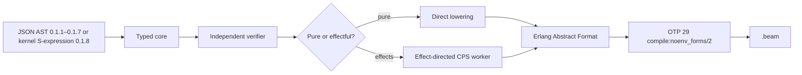
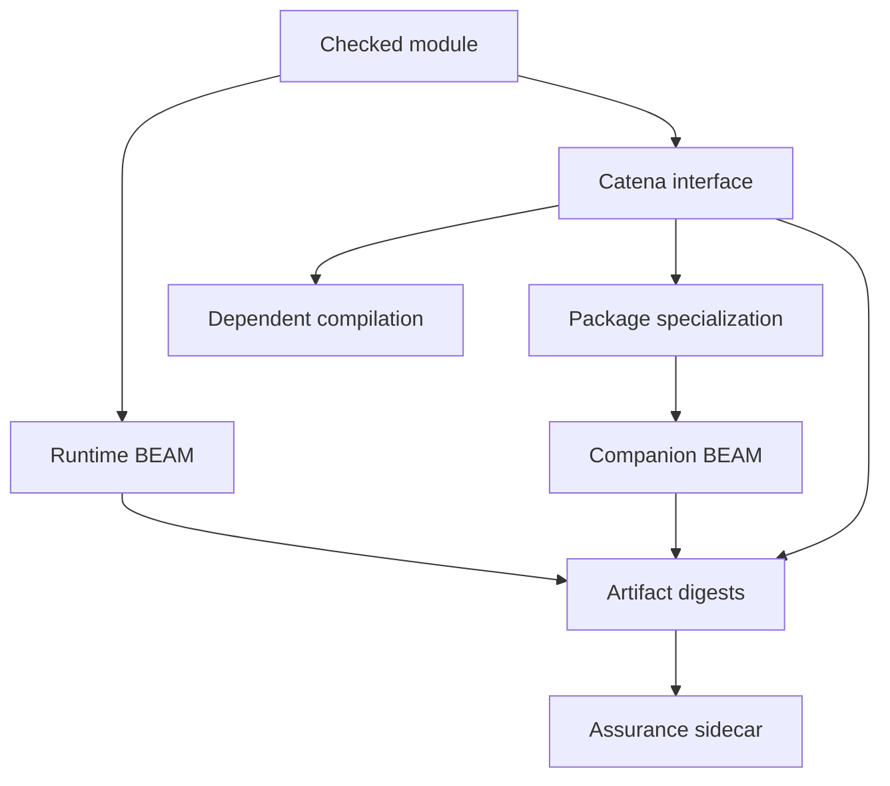

# Catena and BEAM

Catena targets only the BEAM VM. The bootstrap compiler lowers verified Catena
typed core to Erlang Abstract Format and delegates binary generation to the
supported Erlang/OTP 29 compiler interface.

This guide explains generated artifacts and the present runtime boundary. It
does not define a stable Erlang FFI, foreign-term conversion system, or direct
`.beam` ABI for arbitrary external callers; those language facilities remain
open.

## Keep source and runtime vocabulary separate

Programmers describe source behavior with `value`, `transform`, `variant`,
`match`, `trait`, `effect`, `request`, and `handle`. Compiler developers then
describe lowering with typed core, CPS workers, Erlang Abstract Format, and
BEAM modules. The latter are implementation representations, not extra source
concepts.

The candidate 0.1.8 kernel implements `process`; the wider concurrency
vocabulary remains distinct:

| Public word | Runtime relationship |
| --- | --- |
| `process` | one isolated concurrent computation |
| `link` | propagate abnormal process termination |
| `monitor` | observe another process's termination without linking fate |
| `supervise` | apply a restart policy to child processes |
| `restart` | start a failed child again according to that policy |

For example, a domain function may return `Result Quote QuoteProblem`, a
transform may `use` `RateLookup`, and the process running it may terminate.
Those are three different events: an expected value, an external ability, and
a concurrency failure. Catena should not rename all three “errors” merely
because BEAM can carry each one at runtime. Exact kernel process syntax exists;
ergonomic process syntax, links, monitors, and supervision remain research
work.

## One supported backend path



The backend does not emit Core Erlang as a normative interchange, generate
BEAM assembly, or construct `.beam` chunks directly. OTP owns the final binary
format and validation boundary.

The sole production call is in `Catena.OTP.Compiler`:

```elixir
:compile.noenv_forms(forms, compiler_options)
```

## Runtime and build-time artifacts

A module compilation produces two different artifacts:

| Artifact | Purpose |
| --- | --- |
| `Module.beam` | executable runtime code and ordinary OTP compiler metadata |
| `Module.cati.json` | digest-bound Catena module interface for later compilation |

A package specialization can also produce a companion `.beam` containing
direct specialized operations. A 0.1.6 package produces an assurance sidecar
that binds the exact BEAM and interface bytes. A 0.1.7 package additionally
binds its edition, exact language revision, previews, and diagnostics across
those artifacts.



The interface and assurance manifest are compiler/build artifacts, not runtime
state.

## Compile and load a module

Build the CLI and compile a fixture in a temporary directory:

```bash
asdf exec mix escript.build
catena_beam_directory="$(mktemp -d)"
cp test/fixtures/c002-option.catena.json "$catena_beam_directory/"
./catena compile-ir "$catena_beam_directory/c002-option.catena.json"
```

The test suite demonstrates loading generated bytes directly through OTP:

```elixir
binary = File.read!("C002Fixture.beam")
{:module, :C002Fixture} =
  :code.load_binary(:C002Fixture, ~c"C002Fixture.beam", binary)

result = apply(:C002Fixture, :main, [])

:code.purge(:C002Fixture)
:code.delete(:C002Fixture)
```

This is useful for compiler conformance tests. It is not yet a declaration
that every Catena type has a stable Erlang-term representation suitable for a
public FFI.

## Source exports become BEAM exports

Exported Catena definitions lower to callable BEAM functions. The current
bootstrap preserves curried semantics where a top-level function is used as a
value, while direct known calls can use ordinary BEAM functions.

Public effectful definitions receive an ordinary direct wrapper plus a private
CPS worker. Handler declarations may produce hidden deterministic entry points
for cross-module dispatch. Those hidden functions are compiler ABI, not Catena
values and not public interoperability hooks.

Do not infer source-level calling conventions from generated function names or
arities. Only documented Catena exports and digest-verified interfaces are
stable within the implemented slice.

A public 0.1.8 process entry lowers to a deterministic hidden spawn export
`__catena_spawn_Name/arity`; its worker remains private. Kernel programs obtain
only an opaque send-only `Process M` handle. The native PID and worker symbol
are backend facts, not general FFI promises.

## Direct lowering for pure code

Definitions proven pure and free of effect-control forms retain an ordinary
direct calling convention. Adding effect support does not transform unrelated
code into CPS.

This matters for predictability:

- pure calls remain ordinary local or remote BEAM calls;
- trait specialization becomes direct calls rather than dictionary dispatch;
- verification-only code is removed rather than wrapped; and
- generated output remains inspectable as Erlang Abstract Format before OTP
  compilation.

## CPS lowering for effects

An effectful worker receives lexical handler state and a continuation.
Requests dispatch by the statically selected capability identity; resumptions
close over the relevant handler state and a one-use token.

The direct wrapper preserves an ordinary exported entry point. This is a
compiler implementation strategy that realizes the normative effect behavior,
not an effect API that Erlang callers should construct manually.

## Data representation is private

The compiler supports `uniform` and `compact` ADT layouts for differential
testing:

```bash
./catena compile-ir --layout uniform program.json
./catena compile-ir --layout compact program.json
```

Both layouts must behave like the same reference value. `.cati.json`
interfaces omit layout information so dependent Catena modules cannot couple
themselves to tuple positions or tags.

The candidate kernel intentionally has one fixed lowering: maps for structural
records, tagged three-tuples for structural variants, and a tagged tuple with a
field tuple for regular nominal constructor values. These are conformance
backend facts for exact 0.1.8, not foreign construction or inspection APIs.

Until foreign-term validation and representation attributes are specified:

- do not persist a Catena ADT by serializing its observed Erlang tuple;
- do not manufacture Catena nominal values from arbitrary Erlang terms;
- do not treat compact layout as stable ABI; and
- do not pattern match generated values from external Erlang code as a
  language guarantee.

Primitive integers, Booleans, tuples, and ordinary exported calls are used by
the executable model, but a complete boundary contract still needs failure,
ownership, exception, process, and version semantics.

## Module interfaces are the compilation boundary

A `.cati.json` interface records the information another Catena compilation
needs:

- origin and module identity;
- public value signatures;
- transparent or abstract datatypes;
- condition evidence;
- traits, instances, laws, templates, and standard hierarchy digest;
- effect families, handlers, and normalized `uses` rows;
- 0.1.6 claim summaries and inherited obligations;
- for a 0.1.7 interface, edition, exact revision, enabled previews, and public
  preview requirements; and
- for a separate 0.1.8 kernel interface, exported regular datatypes and public
  process identities, parameter/mailbox types, arities, and spawn symbols.

The interface is deterministic and protected by SHA-256. A content mismatch
is rejected before dependent checking or linking. It is content binding, not
publisher identity; publisher authorization appears only in governance.

Use one or more interfaces when checking a dependent module:

```bash
./catena check-ir \
  --interface dependency.cati.json \
  consumer.json
```

## Package specialization and companion modules

The manifest-driven package linker resolves verified trait templates for
concrete types and emits one companion BEAM. Specialization keys bind template
content, concrete types, evidence digests, compiler/specification versions,
the standard hierarchy digest, and—under artifact format 0.1.7—the exact
language selection.

The output contains direct calls. Trait dictionaries, law statuses, instance
identity, proof objects, and template graphs are erased. The companion still
uses Erlang Abstract Format and the same OTP 29 boundary.

`compile-package-ir` does not fetch dependencies, solve versions, or publish
packages. Every source, interface, root, and output must be named explicitly
in the package manifest.

## Assurance metadata stays outside BEAM

Version 0.1.6 removes rules, examples, checkers, evidence, policies, approvals,
keys, signatures, histories, and assurance digests before Abstract Format.
The assurance manifest records them beside the runtime artifacts.

Ordinary OTP compile information may contain the Catena specification and
JSON-frontend version. Version 0.1.7 also records edition, exact revision, and
previews there so assurance verification can reject selection substitution.
That compiler provenance is not runtime dispatch, a retained claim, policy,
or signature. The erasure audit requires
`assurance_metadata_in_beam: false` and no runtime monitors.

## Inspect generated artifacts

From Elixir, inspect OTP chunks without executing a module:

```elixir
binary = File.read!("C002Fixture.beam")
{:ok, chunks} = :beam_lib.chunks(binary, [:exports, :compile_info])
IO.inspect(chunks)
```

For compiler development, `Catena.compile_json/2` also returns generated
Abstract Format in `metadata.forms`, the interface bytes, warnings, selected
layout, condition lowering, and typed core.

## Current interoperability boundary

Implemented and tested:

- deterministic OTP 29 compilation;
- loading and executing generated modules;
- cross-module Catena compilation through `.cati.json` interfaces;
- direct specialized calls in companion modules;
- hidden effect-handler ABI generated from verified interfaces;
- candidate 0.1.8 public process-entry interfaces and local BEAM actor
  execution; and
- artifact binding and offline assurance verification.

Not yet specified as user-facing language features:

- arbitrary Erlang function imports;
- exception translation;
- PID, port, reference, binary, and map boundary types;
- foreign-term validation into nominal Catena types;
- NIFs, ports, distribution, or hot-code upgrade declarations;
- stable data representation; and
- a package-level OTP application/release format.

Compiler internals continue in
[Compiler Architecture](../development/compiler-architecture.md). The backend
contract is defined across the normative
[type-system](https://github.com/pcharbon70/catena-research/tree/main/60-specification/type-system),
[trait](https://github.com/pcharbon70/catena-research/tree/main/60-specification/traits-and-categorical-operations),
[effect](https://github.com/pcharbon70/catena-research/tree/main/60-specification/effects-and-handlers),
and [assurance](https://github.com/pcharbon70/catena-research/tree/main/60-specification/specifications-and-governance)
chapters.
