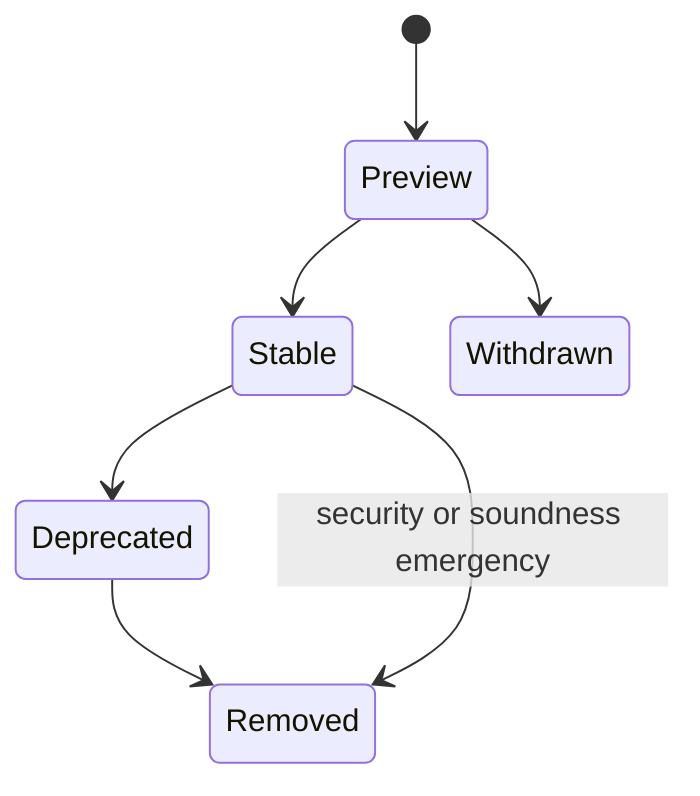

# Editions, Revisions, and Previews

Catena records which language contract a package uses. The goal is simple: a
compiler update must not silently change the meaning of a package that names
an exact contract.

The 0.1.7 implementation described here follows the normative C008
specification. Its authorized immutable implementation evidence is recorded by
the
[Catena research specification](https://github.com/pcharbon70/catena-research/tree/main/60-specification/editions-and-feature-lifecycle)
promotion record.

## Read the four version numbers separately

Catena has four version axes because they answer different questions:

| Identity | Example | What it selects |
| --- | --- | --- |
| edition | `0.1` | a programmer-facing compatibility track |
| language revision | `0.1.7` | one exact cumulative set of language rules |
| artifact version | `0.1.7` | the schema and canonical encoding of a manifest, interface, or assurance record |
| compiler release | `0.1.0` | one release of this bootstrap implementation |

An artifact number never selects language meaning by resemblance. A package
selects its language revision explicitly.

## Select a package contract

A new package manifest records all three language choices:

```json
{
  "format": "catena-package-manifest",
  "version": "0.1.7",
  "edition": "0.1",
  "language_revision": "0.1.7",
  "previews": [],
  "diagnostics": {
    "deny": []
  }
}
```

The manifest's other package, module, interface, root, output, profile, and
assurance fields remain required. The one selection applies to every module
compiled by that package. Dependencies retain their own selections.

An exact pin does not float. Selecting `0.1.6` continues to apply the 0.1.6
language even when the current compiler also knows 0.1.7.

## Inspect what the compiler knows

Build the executable and ask for its deterministic registry:

```bash
asdf exec mix escript.build
./catena language-info
```

The JSON result contains:

- the current standalone default;
- every retained edition and exact revision;
- stable, preview, deprecated, withdrawn, and removed feature records; and
- compatibility changes with migration guidance and safe edit suggestions.

The library API exposes the same data through `Catena.LanguageInfo.document/0`.

## Use an exact selection without a package

Standalone commands report their resolved selection. The current selection
can be made explicit:

```bash
./catena check-ir \
  --edition 0.1 \
  --language-revision 0.1.7 \
  program.json
```

`--preview NAME` is repeatable. Catena 0.1.7 deliberately publishes no actual
preview feature, so every nonempty preview selection currently fails. This is
not an invitation to invent implementation-specific flags.

A historical JSON frontend can still imply its historical language revision.
The compiler reports `EDN002` and machine-applicable JSON additions rather
than silently calling the inferred fields user configuration. Adding those
fields preserves the same legacy BEAM, interface, companion, assurance, and
signature-payload bytes.

## Understand previews

A preview is a named, bounded language feature whose long-term presence is
not promised. It is not a compiler experiment flag.

The lifecycle is deliberately small:



Each preview has one permanent lowercase identifier. A withdrawn or removed
identifier is never reused for another meaning.

The direct Stable-to-Removed edge is not an ordinary lifecycle shortcut. It
requires an explicit normative security or soundness emergency record with
affected rules, exposure, containment or replacement, and migration guidance.

When a future revision publishes a preview, a package opts in by exact name.
If preview behavior becomes visible through an exported type, effect,
requirement, or other semantic obligation, the module interface records it in
`required_previews`. A consumer that did not enable it receives `PRV002`.
Private preview use does not burden downstream packages.

Selection happens at compile time. Generated functions do not query an
edition table or dispatch on preview flags at runtime.

## Read lifecycle diagnostics

| ID | Default | Meaning |
| --- | --- | --- |
| `EDN001` | error | the edition/revision selection is invalid, or selected rules do not contain a used construct |
| `EDN002` | warning | a historical artifact supplied an inferred selection |
| `PRV001` | error | a preview name is unknown or unavailable at the selected revision |
| `PRV002` | error | a dependency publicly requires a preview the consumer did not enable |
| `DEP001` | warning | code uses a deprecated stable feature |

Warnings remain warnings by default. A 0.1.7 package can promote a known
warning to failure:

```json
{
  "diagnostics": {
    "deny": ["DEP001"]
  }
}
```

Suggestions are reported as structured edits. The 0.1.7 compiler never
applies them to a file.

## Constrain selection with governance only when needed

Ordinary packages need no governance bundle. A governed package may narrow an
otherwise valid selection with four closed policy requirements:

```json
{
  "op": "all",
  "requirements": [
    {"op": "edition", "allowed": ["0.1"]},
    {"op": "language_revision", "from": "0.1.6", "to": "0.1.7"},
    {"op": "previews", "allowed": []},
    {"op": "diagnostics", "absent": ["DEP001"]}
  ]
}
```

The selected edition, revision, previews, and diagnostic IDs become part of
the approval decision. Changing any of them invalidates an approval for the
old selection.

Version 0.1.7 roots, bundles, approvals, transitions, and assurance signatures
use a `0.1.7` signing domain. Historical 0.1.6 records remain verifiable in
their original domain; a verifier never retries another domain after a
failure.

## Know what compatibility means during 0.1

Edition 0.1 is a prototype track. A patch revision may contain a documented
breaking language change, but an exact older pin keeps the older contract.
Stable removal normally needs at least one earlier deprecation revision and
migration guidance. An emergency security or soundness removal needs an
explicit normative record.

After 1.0.0, Catena follows ordinary semantic-versioning intent: incompatible
stable changes require a major revision, compatible additions use a minor
revision, and compatible corrections use a patch revision.

Continue with [Getting Started](../getting-started.md) for executable commands,
or [Catena and BEAM](catena-and-beam.md) for the artifact and runtime boundary.
