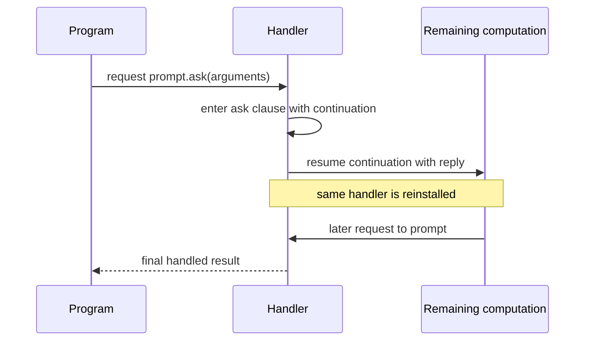
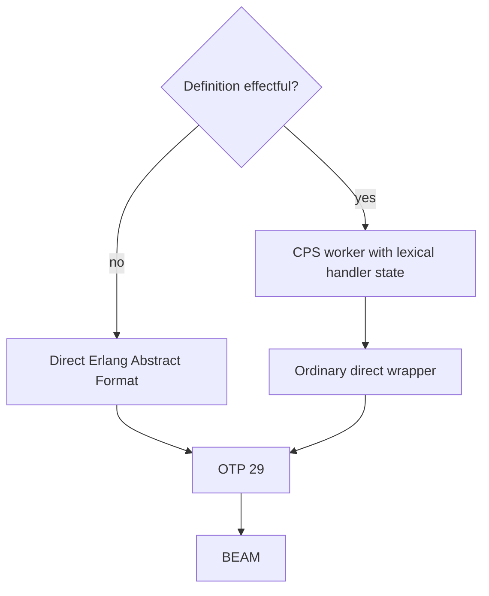

# Effects and Handlers

Effects describe named external abilities a computation may request. Handlers
supply behavior for those requests. Catena keeps the ability visible in types
and resolves it through lexical capability identity rather than runtime label
search.

Source examples are illustrative. The effect identity, selection, handler,
evaluation, and resumption semantics are normative in version 0.5.

## Use the external-ability vocabulary

| Public word | What it means in Catena |
| --- | --- |
| `effect` | a named external ability a transform may need |
| `operation` | one typed request offered by an effect |
| `uses` | expose which abilities may remain for the caller to provide |
| `request` | ask one lexical capability to perform an operation |
| `handle` | supply behavior for requests around one expression |
| `resume` | continue the handled computation with the operation's reply |

Read the following example from its boundary inward:

```catena
current_greeting : Unit -> Text uses clock: Clock
current_greeting() =
  hour = request clock.hour()
  greeting_for(hour)

test_greeting =
  handle current_greeting() using FixedClock(9) as clock
```

`current_greeting` **uses** the external `Clock` ability. It **requests** the
`hour` operation through the lexical `clock` capability. The test **handles**
that request with `FixedClock`. None of those words implies an ordinary
`Result` value or a process failure.

## Separate domain outcomes from external abilities

A function returning `Result Error Value` describes an ordinary value that
may represent failure. A function that `uses Store` may perform an external
store request. These are different dimensions:

```catena
load_customer : CustomerId -> Result LoadError Customer
  uses store: Store[CustomerId, Customer]
```

The result tells callers what value comes back. The `uses` row tells callers
which abilities may escape unless handled locally.

## Declare an effect family

```catena
effect Prompt {
  ask(message: Text, validate: Text -> Bool) -> Text
}
```

An effect family has nominal identity derived from its package origin and
name. Its operations have ordered parameters and one reply type. Operation
arguments may contain ordinary data and pure function values, but the 0.5
boundary excludes effectful function arguments, capabilities, handlers, and
resumptions.

## Expose abilities with `uses`

```catena
ask_name : Unit -> Text uses prompt: Prompt

copy : Key -> Value
  uses source: Store[Key, Value], target: Store[Key, Value]
```

`uses` is the only public effect-annotation word. A named entry binds a
capability that can be requested in the body. Names are required when the same
effect family appears more than once.

Public definitions write their effect requirements explicitly. Private
definitions may infer them, but inferred and written rows normalize to the
same identity-aware representation.

## Make requests through lexical capabilities

```catena
request prompt.ask("Name?", nonempty)
```

If exactly one compatible capability is visible, the name may be omitted:

```catena
request ask("Name?", nonempty)
```

With two compatible capabilities, the unqualified request is ambiguous and
rejected. Lexical nesting does not silently choose the nearest family. Typed
core records the selected capability identity, so runtime code never searches
for a handler by operation string.

Request arguments evaluate once, from left to right, before control transfers
to a handler.

## Handle an effect around one expression

A named handler provides one return clause and exactly one clause for each
effect operation. Apply it around an expression:

```catena
handle ask_name() using TestPrompt(["Ada"]) as prompt
```

Handler arguments evaluate first in the outer capability environment. The
compiler then creates the fresh `prompt` capability and evaluates the handled
expression. The binder is visible only inside that expression—not in handler
arguments or in the handler declaration's clauses.

Handlers are named module-level declarations, not first-class values. They
cannot be stored, returned, pattern matched, or selected dynamically.

## Resume under the same handler



Resuming the captured computation reinstalls the same handler around the
remainder. A later request to the same capability returns to the handler
again. The semantic ledger calls this a **deep handler**; a programmer can
predict it from the observable “same handler remains active” rule.

A request made directly by an operation clause uses only outer capabilities.
The current handler is not implicitly installed around its own clause body.
Requests for other capability identities forward outward unchanged.

## Resume at most once

An operation clause receives a dedicated continuation binder:

```catena
resume continuation with reply
```

The continuation is one-use: the clause may use it zero or one time. The
compiler's internal term for that restriction is **affine**.

- Zero uses aborts the captured remainder; the clause result becomes the
  result of the complete `handle` expression.
- One use continues from the request point with the supplied reply.
- Two uses are rejected statically where visible and defended by a consumed
  runtime token before duplicate continuation entry.

A resumption is not a function. It cannot escape its clause, be stored in
data, captured by a nested function, passed as an argument, generalized, or
sent to another process.

## Handler results and outer effects

A handler may change the result type of the handled computation. Every return
and operation clause must agree on the handler's declared output type.

A handler may also declare outer abilities. Individual clauses may use
subsets, while the union of clause effects must equal the declared outer
`uses` row. This permits an operation clause to log through an outer
capability without pretending that every return path logs.

## Evaluation and forwarding

The following remain observable and left to right:

- request arguments;
- handler arguments;
- work before a request;
- handler clause evaluation; and
- the resumed remainder.

An abort performs none of the discarded remainder's later actions. Nested
handlers preserve identity and order; no commutativity is assumed.

## Compilation strategy

Pure definitions keep an ordinary direct calling convention. Definitions
whose bodies contain requests, handlers, resumptions, or nonempty `uses` rows
receive effect-directed CPS workers plus direct wrappers:



Requests become statically identity-keyed dispatch. Deep resumptions capture
the current handler state. Unrelated pure code is not globally CPS-translated.

## Common design mistakes

### Hiding an effect

If a request may escape, write it in `uses`. A declaration cannot hide the
ability behind an ordinary result type.

### Treating handler selection as dynamic scoping

Selection is lexical and identity-aware. Add a capability qualifier when two
compatible capabilities are in scope.

### Assuming abort performs cleanup

Version 0.5 specifies discarded control, not finalization, cancellation,
resource unwinding, or exception cleanup. Resource scopes need a later
language contract.

### Treating resumptions as reusable callbacks

They are affine control binders. If a design requires retrying or cloning a
continuation, it lies outside the current language slice.

## Current boundaries

The initial feature excludes anonymous effectful functions, shallow handlers,
multi-shot resumptions, scoped or higher-order effects, cleanup guarantees,
top-level host-effect policy, and a stable exception boundary.

Continue with [Specifications](specifications.md). Exact rules are in the
[normative effect and handler specification](https://github.com/pcharbon70/catena-research/tree/main/60-specification/effects-and-handlers).
