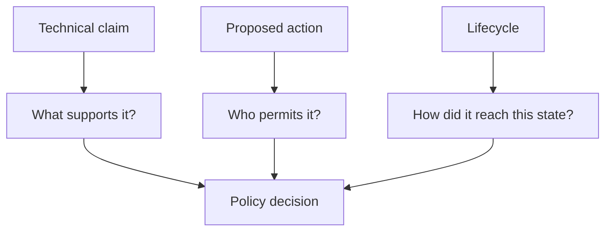
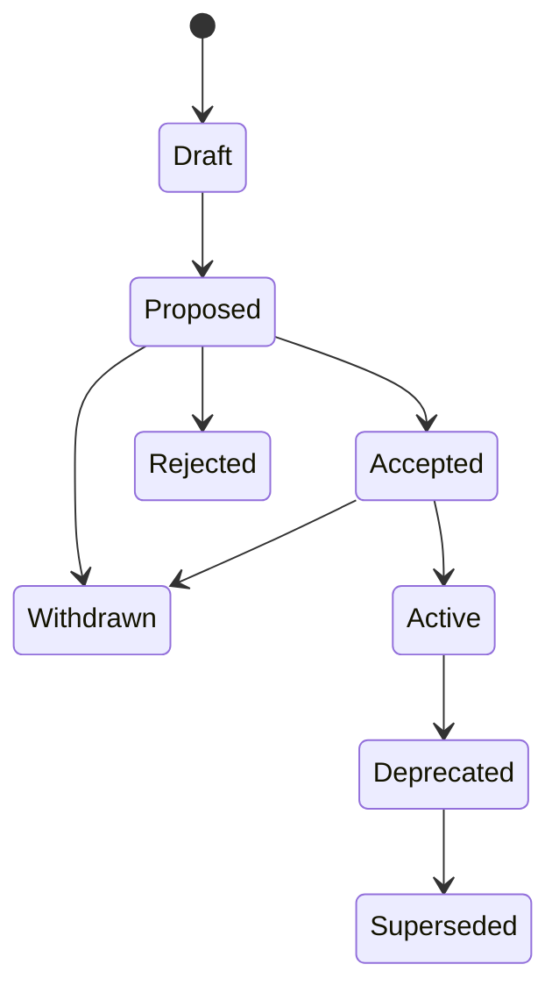

# Governance

Governance answers whether an authorized actor may perform a protected action
over exact package artifacts. It does not decide whether a technical claim is
true, and it does not apply to ordinary packages unless they adopt a
governance bundle.

## Keep three questions separate



- **Evidence** connects a result or observation to an exact claim and
  artifact.
- **Approval** is an actor's signed permission for an exact proposal.
- **Transition history** records how the governed subject changed state.

Collapsing these into `verified: true` would hide which claim was checked, who
authorized the action, and whether the artifact changed afterward.

## Adoption is explicit

There are two independent boundaries:

1. declaring 0.6 specifications adopts typed rules and an assurance sidecar;
2. naming a governance bundle in the package manifest adopts policy and
   organizational authority.

Once a bundle is named, every matching policy is enforced and failures are
closed. There is no “force but report success” switch. A failed governed action
leaves no new or partially replaced final outputs.

Governance does not automatically spread through dependencies. Imported
interfaces contribute only the claim obligations and digests they explicitly
export; a consuming package may strengthen but not discard them.

## Protected actions

Version 0.6 has three actions:

| Action | Meaning |
| --- | --- |
| `build` | check and stage exact package artifacts; may emit an unsigned signing payload |
| `publish` | authorize making the exact staged artifacts externally available |
| `activate` | authorize the exact lifecycle transition into `Active` |

A policy may permit local builds while preventing publication or activation.
That separation keeps ordinary development available without weakening a
release gate.

## Scope says where policy applies

A policy scope can name:

- the package;
- a module;
- a typed claim subject;
- an action;
- an output;
- an interface; or
- a named assurance profile.

Scope matching is additive. If a package policy requires conformance evidence
and a profile policy requires two reviewers, both requirements apply. A
narrower rule cannot cancel a broader one.

## The policy language is intentionally closed

Policy requirements are finite data, not arbitrary Catena or host-language
functions:

| Operation | Question |
| --- | --- |
| `all` | did every child requirement succeed? |
| `any` | did at least one child succeed? |
| `threshold` | did at least `k` child requirements succeed? |
| `role` | did at least `k` distinct valid principals in this role approve? |
| `evidence` | are at least `k` acceptable evidence records present? |
| `action` | is the requested action in the allowed set? |
| `state` | is the replayed lifecycle state allowed? |
| `profile` | does the exact assurance profile match? |
| `sequence` | is the logical sequence inside the inclusive window? |
| `deny` | deny explicitly with a stable reason |

The evaluator has no recursion, I/O, network access, randomness, wall clock,
dynamic code, or regular expressions. Every node consumes one unit from a
shared 20,000-step budget, making decisions terminating and replayable.

## A minimal governance bundle

This readable structural example allows package builds only when at least one
compiler conformance record is present:

```json
{
  "approvals": [],
  "evidence": [],
  "format": "catena-governance-bundle",
  "manifest_signatures": [],
  "package": "demo",
  "policies": [
    {
      "id": "build-policy",
      "requirement": {
        "op": "all",
        "requirements": [
          { "allowed": ["build"], "op": "action" },
          { "kind": "conformance", "minimum": 1, "op": "evidence" }
        ]
      },
      "scope": { "kind": "package", "name": "demo" }
    }
  ],
  "profile": "static",
  "transitions": [],
  "version": "0.6"
}
```

Canonicalize the complete document before passing it to the compiler. Signed
0.6 documents must use Catena's strict canonical JSON profile. Do not
pretty-print or reorder a signed payload and assume the signature remains
valid; sign the exact domain-separated bytes emitted by the compiler.

## Decisions explain themselves

Policy evaluation produces `allow` or `deny` plus an ordered explanation tree.
Threshold explanations separate valid, invalid, revoked, and duplicate counts.

Malformed policy, budget exhaustion, unknown operations, missing input,
invalid signatures, and unrecognized subjects deny rather than disappearing
from evaluation. If any applicable policy fails, the combined decision is
deny—there is no last-match or most-specific-wins rule.

## Principals, roles, and distinct thresholds

A principal is an Ed25519 public-key identity. A role groups principals under
a required threshold. One principal contributes at most once even if its
signature appears repeatedly or it holds authority through more than one
path.

Delegations can be bounded by role, action, subject, profile, and logical
sequence. Revoked principals and delegations no longer count at or after their
recorded sequence.

The trust root and all private keys live outside Catena source modules. The
compiler reads public trust material and verifies supplied signatures; it
never imports or generates private signing keys.

## Lifecycle is immutable history



`Rejected`, `Withdrawn`, and `Superseded` are terminal. There is no backward
edge or mutable status replacement. Every transition binds its sequence,
prior digest, states, action, subject, proposal, claims, artifacts, policy,
evidence, approvals, decision explanation, and signatures.

Replaying the chain from `Draft` must reproduce every state and decision. A
well-signed transition is still invalid if any bound digest or policy result
does not match the package being admitted.

## Approval is exact permission

An approval covers:

- action and subject;
- old and proposed state;
- claim and artifact digests;
- policy digest;
- prior transition digest and sequence; and
- every admitted evidence identifier and semantic record digest.

Changing any field invalidates the approval. Copying approval from one build
to a changed artifact cannot authorize the new bytes.

## Assurance keeps runtime clean

After a successful gate, the package contains ordinary BEAM/interface
artifacts and a separate canonical assurance manifest. The manifest records
what was checked, which policy allowed the action, who signed, the lifecycle
state, artifact hashes, and the erasure audit.

Specification and governance data is absent from runtime BEAM. Removing the
sidecar does not change execution, although it removes the evidence needed for
later verification or governed distribution.

## Failure families

| Family | Meaning |
| --- | --- |
| `GOV001` | missing policy requirement or explicit denial |
| `GOV002` | malformed or over-budget policy |
| `GOV003` | invalid, duplicate, unauthorized, or revoked signature/actor |
| `GOV004` | invalid lifecycle edge, sequence, prior digest, or terminal transition |
| `GOV005` | invalid delegation, rotation, revocation, or recovery chain |
| `ART001` | unsafe, colliding, substituted, or mismatched artifact |
| `EVD001` | malformed, stale, revoked, duplicate, or wrongly bound evidence |

Operational procedures are in
[Governance Operations](../operations/governance-operations.md). Exact policy,
trust, lifecycle, and artifact rules are in the
[normative 0.6 specification](https://github.com/pcharbon70/catena-research/tree/main/60-specification/specifications-and-governance).
