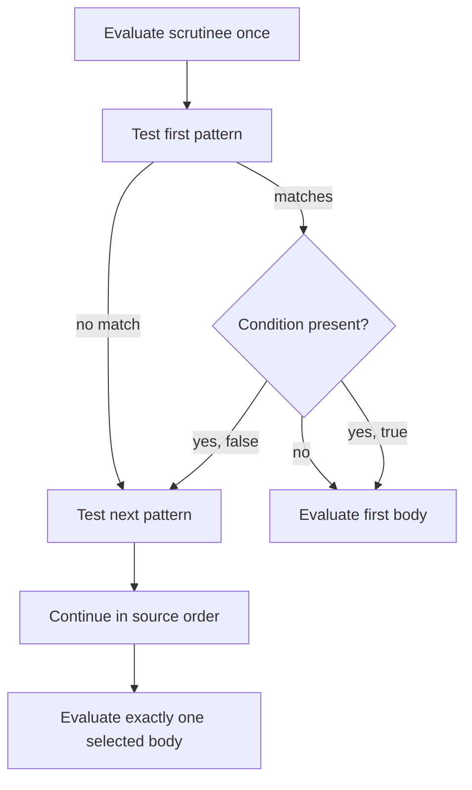

# Pattern Matching

Pattern matching consumes structured values by describing their possible
shapes. Catena combines ordered runtime selection with compile-time
exhaustiveness and redundancy checking.

Code in this guide is illustrative source notation. The supported pattern
forms and their behavior are normative even though final parser punctuation is
not.

## Match every possible value

```catena
describe : Option Int -> Text
describe(value) =
  match value with
  | Option.None -> "nothing"
  | Option.Some item -> show_int(item)
```

The compiler knows that `Option` has two visible constructors and rejects a
match that forgets one. A diagnostic includes a concrete missing witness when
possible, such as `Option.Some(_)`.

## Runtime selection is ordered



The exact sequence is:

1. evaluate the scrutinee once;
2. inspect clauses from top to bottom;
3. structurally test a pattern without effects;
4. evaluate its condition only after the pattern matches;
5. select the first matching clause whose condition is `true`; and
6. evaluate only that clause body.

A body failure does not cause matching to resume at the next clause.

## Supported pattern forms

The initial pattern language contains:

```catena
_                                      -- wildcard
item                                   -- binder
0                                      -- integer literal
true                                   -- Boolean literal
(left, right)                          -- tuple
Option.Some(item)                      -- positional constructor
Delivery.InTransit { tracking_id: id } -- named constructor
Delivery.InTransit { carrier, .. }     -- named constructor with omitted fields
pattern as complete                    -- bind part and whole
first | second                         -- alternatives within one clause
```

Patterns perform no calls, conversions, effects, or user-defined tests. That
purity is what makes structural coverage reliable.

## Binding rules

A name may occur at most once in one pattern. Repeating a name does not mean
“these fields must be equal”:

```catena
-- Invalid: `value` appears twice.
(value, value)
```

Express equality in a clause condition instead.

An `as` pattern binds the complete value in addition to bindings inside the
pattern:

```catena
| Delivery.InTransit { tracking_id: id, .. } as delivery ->
    audit_in_transit(delivery, id)
```

Every alternative in an `or` pattern must bind the same names with the same
types and establish the same GADT refinements:

```catena
| Delivery.Queued as pending | Delivery.InTransit { .. } as pending ->
    still_pending(pending)
```

If the alternatives bind different names, the body would not have one stable
environment, so the compiler rejects the pattern.

## Exact named patterns

A named constructor pattern without `..` names every field exactly once:

```catena
| Delivery.InTransit { tracking_id: id, carrier } -> ...
```

Adding `..` intentionally ignores the remaining fields:

```catena
| Delivery.InTransit { tracking_id: id, .. } -> ...
```

Unknown fields, duplicated fields, and positional/named style mismatches are
errors rather than silent omissions.

## Exhaustiveness and redundancy share one model

The compiler asks whether each clause covers a value not already handled.
That one usefulness relation detects both:

- **non-exhaustive matches**, where a value has no clause; and
- **redundant clauses**, where every matching value was already selected.

```catena
match option with
| _ -> fallback
| Option.Some item -> use(item) -- rejected: unreachable
```

Coverage understands visible nominal constructors, Booleans, tuples, integer
literals, abstract imported types, and compatible GADT constructors. Integers
form an infinite domain, so finitely many integer literals cannot close a
match without a wildcard or binder.

## Conditions are deliberately smaller than ordinary code

A clause can add a safe condition:

```catena
match amount with
| value when value < 0 -> negative(value)
| value when value == 0 -> zero
| value -> positive(value)
```

The 0.3 condition language is a closed, pure, total `Bool`/`Int` fragment. It
supports Boolean logic, exact equality, integer ordering, total integer
arithmetic, variables, and direct calls to verified nonrecursive condition
predicates. It excludes ordinary calls, recursion, effects, trait dispatch,
partial operations, and truthiness.

This distinction provides two benefits:

- eligible conditions can lower to native Erlang guards; and
- the compiler can derive conservative facts for coverage without executing
  arbitrary user code.

Compile both lowering paths when testing a condition-sensitive change:

```bash
./catena compile-ir --condition-lowering native program.json
./catena compile-ir --condition-lowering ordinary program.json
```

Both paths must select the same clause and produce the same result.

## How conditions affect coverage

Coverage gives a condition one of three classifications:

| Classification | Coverage meaning |
| --- | --- |
| proved true | the structural pattern contributes to exhaustiveness |
| proved false | the clause is redundant |
| unknown | the clause is selectable at runtime but contributes nothing to exhaustiveness |

An unknown condition therefore needs a later unconditional clause if its
structural domain must be closed:

```catena
match amount with
| value when approved(value) -> accepted(value)
| value -> rejected(value)
```

The compiler must not assume that an opaque Boolean function will eventually
return `true`.

## Result types and effects

Every clause body must produce a unifiable result type. Patterns add no
effects. The scrutinee, conditions, and selected body contribute their normal
evaluation effects according to the surrounding effect system.

Clause order is observable whenever conditions or bodies perform observable
work. Catena does not reorder clauses based on perceived specificity.

## Empty, recursive, and abstract domains

The compiler computes a terminating three-valued inhabitation fact:

```text
inhabited | empty | unknown
```

Only a proven-empty scrutinee permits a match with no clauses. Type parameters
and imported abstract types are normally `unknown`, which is treated
conservatively. This avoids claiming exhaustiveness from an incomplete view of
a type.

## Advanced GADT branches

Selecting a GADT constructor may introduce equality evidence local to that
branch. The branch body can use the refined type, but the evidence cannot
escape or affect sibling branches. Coverage discards constructors whose
refined result cannot inhabit the scrutinee indices.

## Current boundaries

The initial grammar does not include list, map, binary, string, range, view,
active, or pattern-synonym patterns. Function parameters and `let` bindings do
not yet inherit the full refutable pattern language, because their failure
semantics have not been specified. Receive clauses and handler clauses have
their own selection contracts.

Continue with [Traits and Composition](traits-and-composition.md). Exact rules
are in the [data and pattern](https://github.com/pcharbon70/catena-research/tree/main/60-specification/data-and-patterns)
and [clause condition](https://github.com/pcharbon70/catena-research/tree/main/60-specification/clause-conditions)
specifications.
