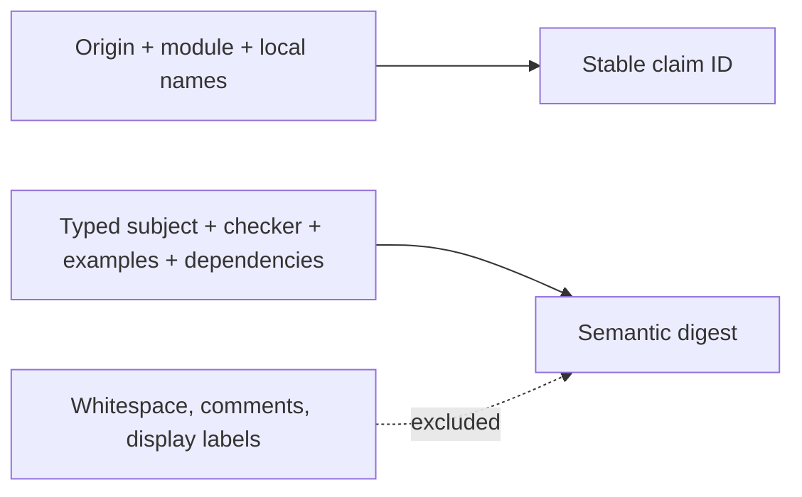
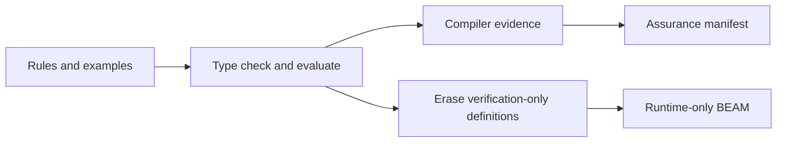

# Specifications

Catena specifications attach typed, executable statements to exact language
subjects. They are optional to adopt, mandatory to interpret once declared,
and completely erased from runtime BEAM code in version 0.6.

This guide uses Catena's accepted behavior-first vocabulary. The words and
their meanings are part of the language design; their final parser punctuation
is not. The JSON AST is the normative executable form for 0.6.

## Use the accepted vocabulary

Catena describes obligations in words that say who must do what. It does not
make programmers begin with terms such as precondition, postcondition,
invariant calculus, proof obligation, or model checker.

| Public word | What it tells a programmer | Current status |
| --- | --- | --- |
| `spec` | group related statements about one typed subject | accepted source vocabulary; parser form remains open |
| `describes` | name the function, type, module, effect, or other subject being described | accepted source vocabulary; represented by a typed `subject` in 0.6 |
| `rule` | name a behavior that Catena must check honestly | implemented by the 0.6 specification graph |
| `needs` | state what a caller must provide before using a boundary | accepted vocabulary; general contract checking is later work |
| `promises` | state what an implementation or result must provide | accepted vocabulary; 0.6 can represent a bounded pure rule, not a general runtime contract |
| `example` | give one exact input and expected observation | implemented and evaluated in 0.6 |
| `property` | challenge a behavior with generated cases | accepted vocabulary; generation and shrinking are later work |
| `always` | state an invariant or temporal obligation | accepted vocabulary; temporal checking is later work |
| `check` | say which concrete observation an example or property makes | accepted source vocabulary; represented by the rule checker and expected result in 0.6 |

The words used to explain support and trust are equally deliberate:

| Public word | Meaning |
| --- | --- |
| `evidence` | a typed record of what supported an exact rule and artifact |
| `attestation` | an external statement signed by an authorized identity |
| `assumption` | an explicitly unverified premise that policy chose to admit |
| `approve` | authorize an exact proposal; it does not prove a technical rule |
| `activate` | authorize an accepted artifact to become active |
| `replace` | supersede an older governed subject through recorded lifecycle history |

The compiler's semantic ledger still uses precise terms such as `claim`,
`subject`, `checker`, `conformance`, `principal`, and `transition`. Those terms
keep implementation and protocol records unambiguous, but they do not replace
the behavior-first words in source-oriented explanations.

## Read a rule and an example

The intended source reading is:

```catena
spec RetryCount describes retry_count {
  rule retry_count_is_nonnegative(value : Int) {
    promises value >= 0
  }

  example zero_is_valid {
    check retry_count_is_nonnegative(0) == true
  }
}
```

This is a vocabulary example, not frozen grammar and not source accepted by
the current bootstrap compiler. It says:

- `spec` groups statements about `retry_count`;
- `describes` attaches them to that resolved function rather than a text
  label;
- the `rule` names the required behavior;
- `promises` assigns that behavior to the implementation;
- the `example` records one exact case; and
- `check` names the observation and expected result.

Version 0.6 elaborates the implemented part of this reading into a named pure,
verification-only Boolean checker and an exact example. General `needs` and
`promises` contracts, generated `property` checks, and temporal `always`
statements require later semantic versions.

## See the 0.6 semantic form

Until the source parser is specified, an equivalent implementation model uses
a verification-only definition and an explicit specification entry:

```catena
retry_count : Job -> Int

verification positive_retry_count(value : Int) : Bool =
  value >= 0

specification RetryCountRules {
  rule retry_count_is_nonnegative
    subject retry_count
    checker positive_retry_count

    example queued_job
      arguments (retry_count(queued_job),)
      expected true
}
```

This source-shaped form exposes the current compiler concepts rather than the
preferred public spelling. Semantically:

- the **subject** resolves to a real exported language entity;
- the **rule** names a typed Boolean checker;
- the checker is **verification-only**;
- an **example** supplies exact literal arguments and an expected Boolean; and
- the compiler records outcomes as evidence tied to exact artifacts.

## The normative JSON shape

Inside a complete JSON AST 0.6 module, the corresponding sections resemble:

```json
{
  "specifications": [
    {
      "name": "retry_count_contract",
      "claims": [
        {
          "name": "retry_count_is_nonnegative",
          "kind": "rule",
          "subject": { "kind": "value", "name": "retry_count" },
          "checker": "positive_retry_count",
          "examples": [
            {
              "name": "zero_is_valid",
              "arguments": [0],
              "expected": true
            }
          ]
        }
      ]
    }
  ]
}
```

The named checker is an ordinary definition in the same module with
`"verification_only": true`, an explicit signature ending in `Bool`, and a
pure body. See
[`c006_specification_governance_test.exs`](../../test/catena/c006_specification_governance_test.exs)
for complete executable AST examples.

## What a rule can describe

A rule subject has one of these closed kinds:

- exported value;
- datatype;
- trait;
- instance;
- effect family;
- handler;
- module;
- package output;
- module interface;
- governed action; or
- named assurance profile.

The compiler resolves the name against the typed module and package graph.
Unknown names, private values where an export is required, kind mismatches,
and future subject kinds fail as `SPC001`. A claim is never accepted as opaque
metadata.

## Rule checkers are deliberately restricted

A 0.6 checker must:

- have an explicit function signature ending in `Bool`;
- accept every parameter declared by the rule;
- infer an empty effect row;
- use only pure 0.6 expressions and pure helper definitions;
- exclude `request`, `handle`, and `resume`; and
- remain unreachable from every runtime definition.

The ordinary type checker establishes the signature and purity boundary. An
independent dependency pass rejects any runtime call into verification-only
code before lowering.

Why require a fixed fragment? A specification result must not depend on a
clock, network service, random source, mutable process, ambient handler, or
which machine happens to compile the package.

## Examples are exact witnesses

An example calls the checker with a finite input and expected Boolean. Version
0.6 admits JSON integers, Booleans, and recursively nested tuples compatible
with the checker's parameters.

It excludes floats, constructors, opaque host terms, functions, processes,
references, ports, and binaries. Those values require a later canonical
encoding contract rather than host-dependent comparison.

Each example receives a deterministic 20,000 semantic-step budget and one
outcome:

| Outcome | Meaning |
| --- | --- |
| `supported` | the checker completed with the expected Boolean |
| `counterexample` | it completed with the opposite Boolean |
| `runtime_error` | the checked expression reached an evaluation fault |
| `budget_exhausted` | another step would exceed the fixed limit |

Only `supported` satisfies the example. An example is evidence for one exact
invocation, not proof of a universal rule.

## Stable identity separates names from meaning

Every claim receives a stable identifier from its package origin, module,
specification name, and claim name. It also receives a semantic digest covering
the elaborated subject, checker type and core, examples, assumptions, and
dependencies.



Formatting or moving source without changing those meanings preserves the
semantic digest. A meaning change invalidates evidence and approvals bound to
the previous digest.

## Keep evidence kinds honest

Version 0.6 distinguishes:

- **conformance evidence**, emitted by the compiler for a named successful
  checker or artifact audit;
- **example evidence**, recording the exact example and outcome;
- **attestation**, an external statement signed by an authorized principal;
  and
- **assumption**, an explicitly unverified premise admitted by policy.

These categories are not interchangeable. A signature proves who signed the
canonical bytes, not that the statement is true. An approval permits an
action, not a technical conclusion. An unavailable checker does not become an
assumption automatically.

## Assumptions remain visible

An assumption binds the exact claim digest, subject, reason, and logical
validity window. It counts only when every matching policy explicitly permits
that assumption kind and an authorized assumption role approves the exact
record.

Assumptions remain labelled in diagnostics and the assurance manifest. This
lets a downstream reviewer distinguish “checked,” “externally attested,” and
“accepted as a trust boundary.”

## Build-time adoption, not runtime monitoring

Declaring rules adopts typed checking and an assurance sidecar for the package
build. It does not require an organizational governance bundle.



The checker, rules, examples, evidence, and digests are absent from executable
functions, exports, literals, custom chunks, attributes, compile information,
and companion specialization functions. Fully discharged specifications must
leave identical runtime input byte-identical at the BEAM level.

Version 0.6 has no monitor-retaining profile. A declaration that genuinely
needs runtime enforcement belongs to future work with an explicit semantics,
effect, and cost contract.

## Use the assurance manifest

A 0.6 package build produces ordinary runtime artifacts plus a canonical
`catena-assurance-manifest`. The sidecar records claims, evidence, assumptions,
artifact hashes, compiler identity, dependencies, and the erasure audit.

Removing the sidecar after an admitted build does not change program
execution. Changing a bound BEAM or interface byte makes later assurance
verification fail.

For a package that uses specifications but no governance bundle:

```bash
./catena compile-package-ir package.catena-package.json
```

Such a package can build and emit assurance evidence. It cannot claim a
governed `publish` or `activate` result.

## Diagnose specification failures

| Family | Repair direction |
| --- | --- |
| `SPC001` | correct the subject name, visibility, or kind |
| `SPC002` | remove malformed or duplicate claim identity |
| `SPC003` | provide a typed, pure, verification-only checker |
| `SPC004` | make example arguments and expectation compatible |
| `EVD002` | inspect the counterexample or runtime fault |
| `EVD003` | simplify the checker; the fixed budget is part of 0.6 |
| `ERS001` | remove runtime reachability or retained assurance material |

Continue with [Governance](governance.md) when checked evidence must gate an
organizational action. Exact rules are in the
[normative 0.6 specification](https://github.com/pcharbon70/catena-research/tree/main/60-specification/specifications-and-governance).
