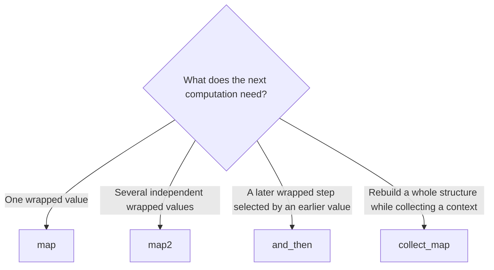
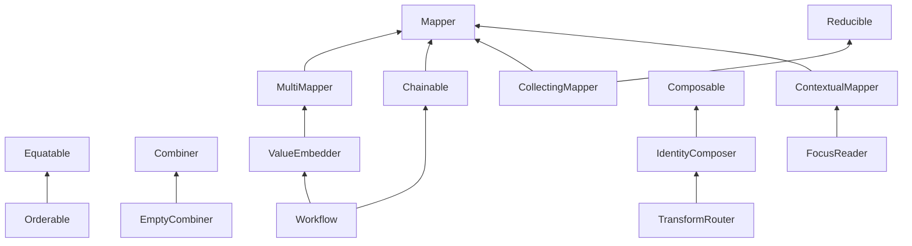
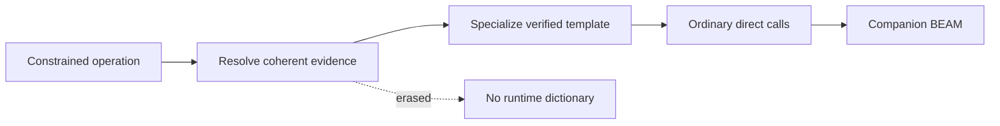

# Traits and Composition

Traits describe reusable behavior that more than one type can provide. Catena
uses programming-oriented names such as `Mapper` and `Chainable`; the formal
mathematical lineage remains metadata for specification and advanced study.

The public names and minimal methods below are normative ABI. Source examples
remain illustrative until the parser is implemented.

## Use the shared-behavior vocabulary

| Public word | What it means in Catena |
| --- | --- |
| `trait` | a named capability that more than one type can provide |
| `implementation` | the unique way a concrete type provides that trait |
| `requirement` | the trait behavior a generic transform needs |
| `operation` | an action supplied by the trait, such as `map` or `combine` |
| `guarantee` | a behavior-preserving promise every implementation must keep |
| `derive` | ask the compiler to construct a valid implementation from a type declaration |

This vocabulary keeps the programming decision visible. For example:

```catena
normalize_optional(value) = Option.map(normalize_name, value)

normalize_all : Mapper Container -> Container Text -> Container Text
normalize_all(values) = map(normalize_name, values)
```

The first line uses one concrete operation. The signature on `normalize_all`
then states a reusable **requirement**: whatever `Container` is, its
**implementation** must provide the `Mapper` operation. The guide does not
require a second mathematical name for that capability.

## Begin with the operation you need

Use a concrete operation before reaching for a trait constraint:

```catena
normalized = Option.map(normalize_name, maybe_name)
```

Once code must accept any outer structure that supports the same behavior, a
trait describes the requirement:

```catena
normalize_all : Mapper Container -> Container Text -> Container Text
normalize_all(values) = map(normalize_name, values)
```

The exact future constraint punctuation may differ. The important meaning is
that `map` changes stored results while preserving the outer structure.

## Choose by dependency shape

Four operations form the most useful decision path:



### `map`: change stored results

```catena
map : (A -> B) -> Container A -> Container B

map(normalize, Option.Some("  Ada  "))
```

`map` preserves the outer shape. It cannot turn `None` into `Some`, select a
different number of tree nodes, or introduce a new external effect by itself.

### `map2`: combine independent wrapped values

```catena
map2 : (A -> B -> C) -> F A -> F B -> F C

map2(make_account, validated_name, validated_email)
```

Neither input computation depends on the value produced by the other. This
distinction can enable different evaluation and error-accumulation behavior
than dependent sequencing.

### `and_then`: select dependent work

```catena
and_then : (A -> M B) -> M A -> M B

find_customer(id)
|> and_then(load_account)
```

`load_account` is chosen using the customer returned by `find_customer`.
Replacing `and_then` with `map2` would misrepresent that dependency.

### `collect_map`: rebuild while collecting

```catena
collect_map : (A -> F B) -> Structure A -> F (Structure B)

collect_map(validate_line, invoice.lines)
```

The outer structure is traversed and rebuilt while an independent context
such as validation is accumulated. Traversal order, early termination, and
cost remain part of the concrete implementation's operational contract.

## The standard capabilities

| Capability | Minimal operation | Programmer-facing meaning |
| --- | --- | --- |
| `Equatable` | `equals left right` | decide whether two values count as equal |
| `Orderable` | `compare left right` | place values in a total order compatible with equality |
| `Combiner` | `combine left right` | join values of one type consistently |
| `EmptyCombiner` | `empty` | provide a neutral starting value for combination |
| `Reducible` | `summarize callback initial subject` | consume a structure into a result |
| `Mapper` | `map callback subject` | transform stored results while preserving shape |
| `TwoSlotMapper` | `map_both first second subject` | transform two independent stored positions |
| `MultiMapper` | `map2 callback first second` | combine independent wrapped values |
| `ValueEmbedder` | `from_value value` | introduce a plain value into a wrapping structure |
| `CollectingMapper` | `collect_map callback subject` | traverse and rebuild while collecting a context |
| `Chainable` | `and_then callback subject` | choose a later wrapped computation from an earlier value |
| `Workflow` | no new method | combine value embedding and dependent sequencing |
| `Composable` | `compose first next` | connect compatible transforms left to right |
| `IdentityComposer` | `identity` | add a do-nothing composable transform |
| `TransformRouter` | `from_transform`, `on_first` | lift and route ordinary transforms over structured inputs |
| `ContextualMapper` | `map_with_context callback subject` | compute each result from its surrounding structure |
| `FocusReader` | `read_focus subject` | read the distinguished value of a contextual structure |

Callbacks come before data and the principal subject comes last. This makes
partial application and pipelines read from behavior toward the value being
processed. `compose first next` means run `first`, then `next`.

## Capability relationships



An arrow means the child requires the parent's behavior. Parent evidence is
resolved explicitly; implementations do not copy or silently override parent
methods.

## Implementations are coherent

For one trait and one concrete type combination, Catena selects at most one
implementation. The semantic ledger calls this record an `instance`, but
selection cannot vary with import order, local preference, or runtime state.

The initial coherence rules require:

- the trait or a participating nominal type to be owned by the declaring
  package;
- implementation heads not to overlap globally;
- recursive implementation requirements to decrease structurally;
- functional dependencies and associated types to agree; and
- imported interfaces to carry digest-bound evidence.

Ambiguity is an error. Catena does not choose the “closest” implementation or
apply type defaulting.

## Minimal methods are exact

An implementation supplies exactly the minimal methods declared by its trait. A
missing method is incomplete; an extra method pretending to override a
derived or parent operation is also rejected. This keeps the ABI small and
prevents two implementations from assigning different meanings to supposedly
derived behavior.

`Workflow` deliberately has no new minimal method. It states that both
`ValueEmbedder` and `Chainable` contracts are present without inventing a
second sequencing operation.

## Guarantees are evidence, not optimizer permission

Traits may declare behavioral guarantees. An implementation records whether
those guarantees are promised, tested, or compiler-derived. Those statuses
remain distinct:

- **promised** means the author accepts responsibility;
- **tested** means named finite tests supplied evidence; and
- **compiler-derived** means a checked derivation established the bounded
  construction.

The compiler does not perform law-directed rewrites merely because an author
promised a law. Optimization requires its own trusted justification.

## Structural derivation

Catena can derive a bounded set of capabilities for suitable transparent
variant types:

- `Equatable`;
- `Orderable`;
- `Mapper`;
- `TwoSlotMapper`;
- `Reducible`; and
- `CollectingMapper`.

Derivation is explicit and names the type-parameter positions being targeted.
The compiler verifies field usage, constructor completeness, helper closure,
and generated typed core. It does not infer a public capability merely because
a datatype looks structurally convenient.

## Specialization and erasure

Trait selection is compile-time work. Package specialization resolves
implementations, substitutes their minimal methods, and emits ordinary direct
calls in a companion BEAM module:



Trait predicates, dictionaries, law status, derivation proofs, and template
graphs do not become runtime arguments or dispatch tables. Identical package
inputs produce deterministic specialization keys and companion output.

## Operational questions still matter

The trait name alone does not answer every runtime question. Documentation for
a concrete type must still state:

- left-to-right or another traversal order;
- eager or lazy evaluation;
- short-circuiting versus full traversal;
- stack behavior for recursive structures;
- error accumulation versus early termination; and
- asymptotic time and allocation where those are promised.

The standard `List` mapping and reduction implementations are tested for
stack safety on large inputs, but that does not make every user-defined
implementation stack safe.

Continue with [Effects and Handlers](effects-and-handlers.md). The exact ABI,
coherence, derivation, and specialization rules are in the
[normative trait specification](https://github.com/pcharbon70/catena-research/tree/main/60-specification/traits-and-categorical-operations).
