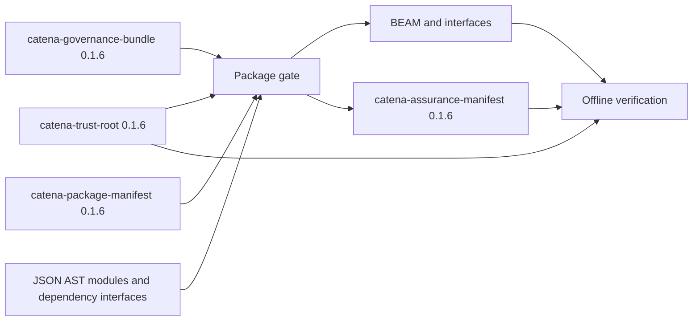
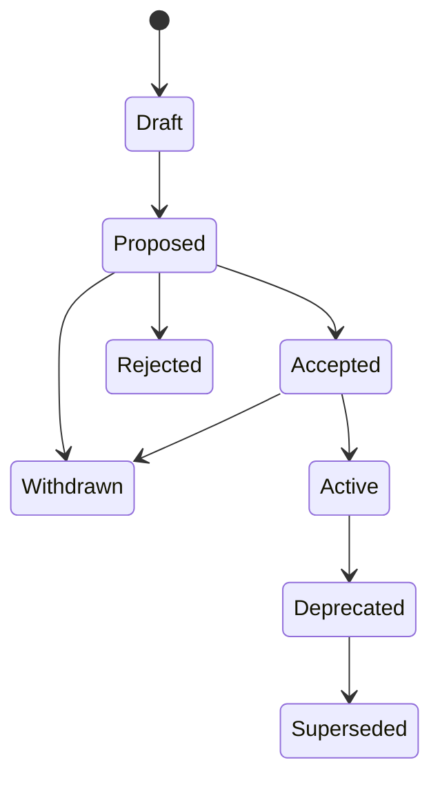

# Governance Operations

This guide is for people operating Catena 0.1.6 package gates. It covers the
offline trust root, canonical governance documents, external signing,
build/publish/activate workflows, assurance verification, rotation,
revocation, and recovery.

Read [Governance](../language/governance.md) first for the language model.
This document is operational guidance for the current bootstrap compiler, not
a replacement for organizational security policy.

## Follow the governance words through one release

The approachable vocabulary describes the operator's task; canonical records
make that task exact:


- An **owner** is the person or role responsible for the governed subject; the
  trust root represents that responsibility as principals, roles, and
  thresholds.
- A **policy** says what evidence and approvals a protected action needs.
- **Evidence** supports a technical rule; it is not permission to release.
- To **approve** is to sign permission for the exact proposal and artifact
  digests; it is not to prove the code correct.
- `build`, `publish`, and `activate` are distinct protected actions.
- To **replace** a release is to append the lifecycle path toward
  `Superseded`; it is never an in-place edit of history.

The JSON fields and cryptographic terminology in the rest of this guide are
the precise protocol encoding of those words, not a competing user model.

## Know the trust boundary

The Catena compiler:

- canonicalizes and hashes protocol values;
- emits exact domain-separated signing payload bytes;
- verifies Ed25519 signatures and distinct-principal thresholds;
- replays roots and lifecycle histories;
- evaluates policy through production and independent implementations;
- stages outputs until the gate succeeds; and
- verifies existing artifacts against assurance manifests.

It does **not**:

- generate, import, store, escrow, or rotate private keys;
- choose who should hold normal or recovery authority;
- collect human approvals;
- publish artifacts to a registry;
- provide network identity, transparency logging, or wall-clock expiry; or
- author rotation, approval, or transition records for you.

Use an organization-approved external Ed25519 key and signing system. Keep
private material outside the repository, package directory, compiler command
line, shell history, governance bundle, and assurance manifest.

## The artifact set



Keep the package manifest, governance bundle, and trust root under distinct
review. The package manifest names build inputs and outputs. The governance
bundle contains policy and decision history. The root defines who can sign.

## Canonical JSON is mandatory

Trust roots, governance bundles, and assurance manifests use RFC 8785 JSON
Canonicalization Scheme with Catena's stricter safe-integer profile. Supplied
signed documents must already be canonical: no indentation, insignificant
whitespace, duplicate object names, floats, negative zero, invalid Unicode, or
integers outside `-9007199254740991..9007199254740991`.

Maintain a readable unsigned working file if useful, then serialize the exact
document before hashing or signing. The compiler module can canonicalize a
public document without touching private keys:

```bash
asdf exec mix run -e '
input = File.read!("governance.readable.json")
{:ok, value} = JSON.decode(input)
File.write!("governance.json", Catena.CanonicalJCS.encode(value))
'
```

Never edit `governance.json` after it has been signed. Change the readable
source, regenerate canonical bytes, recompute every affected digest, and
obtain new signatures.

## Establish the initial trust root

The initial root names a package namespace, principals, roles, thresholds,
delegations, revocations, and a positive logical sequence:

```json
{
  "format": "catena-trust-root",
  "version": "0.1.6",
  "namespace": "demo",
  "initial": {
    "sequence": 1,
    "principals": [
      { "id": "release-a", "public_key": "<64 lowercase hex characters>" },
      { "id": "release-b", "public_key": "<64 lowercase hex characters>" },
      { "id": "recovery-a", "public_key": "<64 lowercase hex characters>" },
      { "id": "recovery-b", "public_key": "<64 lowercase hex characters>" }
    ],
    "roles": {
      "normal": {
        "principals": ["release-a", "release-b"],
        "threshold": 2
      },
      "recovery": {
        "principals": ["recovery-a", "recovery-b"],
        "threshold": 2
      }
    },
    "delegations": [],
    "revocations": {
      "principals": [],
      "delegations": [],
      "evidence": []
    }
  },
  "history": []
}
```

This is a readable structural example; replace placeholders and canonicalize
it before use.

### Choose thresholds deliberately

A threshold counts distinct valid principals, not signature records. Repeating
one signature never simulates a second actor.

- A threshold of one is operationally simple but allows one compromised key
  to act alone.
- A multi-principal normal threshold reduces unilateral release risk.
- Recovery principals should be operationally and custodially separate from
  normal principals.
- The initial root must predeclare recovery authority. A compromised root
  cannot introduce the authority used to rescue itself.

Record the public-key fingerprint and custody owner through your organization's
approved channel. Catena identifies principals by the IDs in this root and
validates the raw Ed25519 public-key bytes represented as 64 lowercase hex
characters.

## Define a governance bundle

A minimal build policy can require both the `build` action and compiler
conformance evidence:

```json
{
  "format": "catena-governance-bundle",
  "version": "0.1.6",
  "package": "demo",
  "profile": "static",
  "policies": [
    {
      "id": "build-policy",
      "scope": { "kind": "package", "name": "demo" },
      "requirement": {
        "op": "all",
        "requirements": [
          { "op": "action", "allowed": ["build"] },
          { "op": "evidence", "kind": "conformance", "minimum": 1 }
        ]
      }
    }
  ],
  "evidence": [],
  "approvals": [],
  "transitions": [],
  "manifest_signatures": []
}
```

This is also a readable view. Canonicalize the complete file before passing it
to `compile-package-ir`.

Policy scopes are additive. When adding module, profile, output, or action
policies, evaluate the conjunction of every match. Do not expect a specific
policy to override a broader package rule.

## Define the package manifest

The package manifest need not be signed canonical JSON, but its named paths
are security-sensitive:

```json
{
  "format": "catena-package-manifest",
  "version": "0.1.6",
  "package": "demo",
  "profile": "static",
  "companion_module": "DemoCompanion",
  "modules": [
    {
      "source": "module.json",
      "beam": "Demo.beam",
      "interface": "Demo.cati.json"
    }
  ],
  "interfaces": [],
  "roots": [],
  "output": "DemoCompanion.beam",
  "assurance": "assurance.json",
  "governance": "governance.json"
}
```

All output paths must remain inside the manifest directory. Absolute paths,
`..`, symlink escape, output collisions, and overwriting an input are rejected
as `ART001`.

## Operate a governed build

```bash
./catena compile-package-ir \
  --action build \
  package.json
```

The compiler:

1. decodes and validates every input;
2. compiles and independently verifies modules;
3. evaluates rules and compiler evidence;
4. holds candidate artifacts in memory;
5. evaluates the matching policies; and
6. commits BEAM, interface, companion, and assurance outputs only if the gate
   succeeds.

An unsigned `build` assurance manifest is allowed. A failed gate leaves no new
final output. Treat existing outputs separately: the compiler's transaction
restores prior files if commit fails, but operators should still use isolated
build directories and immutable publication storage.

## Operate two-pass publication

`publish` requires a trust root and a normal-role threshold signature over the
exact assurance payload. The compiler never signs it.

### 1. Request the payload

```bash
./catena compile-package-ir \
  --action publish \
  --trust-root trust-root.json \
  package.json \
  2> publish-request.json
```

Without the manifest signatures, this intentionally fails with `GOV003` and
writes no outputs. Its diagnostic details contain `signing_payload` and
`signing_payload_digest`.

Extract the exact binary string without adding a newline:

```bash
asdf exec mix run -e '
{:ok, response} = "publish-request.json" |> File.read!() |> JSON.decode()
details = get_in(response, ["diagnostic", "details"])
File.write!("manifest.payload", details["signing_payload"])
IO.puts(details["signing_payload_digest"])
'
```

Confirm the displayed digest through an independent approved tool before
signing. The payload already contains the domain prefix
`catena:manifest:0.1.6\n`; sign the exact bytes as emitted. Do not prepend another
domain string or sign the hexadecimal digest instead of the payload unless
your signing protocol is explicitly designed to reproduce Catena's required
signature.

### 2. Sign outside the compiler

Conceptually:

```text
approved-ed25519-signer sign \
  --key release-a \
  --input manifest.payload \
  --output manifest.signature
```

The actual command depends on your HSM, offline signer, or custody system. It
must return a raw 64-byte Ed25519 signature, represented in the governance
bundle as 128 lowercase hexadecimal characters.

Collect enough distinct valid principals to meet the root's `normal`
threshold. Insert records into `manifest_signatures`:

```json
{
  "principal": "release-a",
  "signature": "<128 lowercase hex characters>"
}
```

Regenerate the canonical governance bundle. Do not alter policies, evidence,
approvals, transitions, package inputs, or artifacts between payload creation
and the second pass. A change produces another payload and needs new
signatures.

### 3. Re-run publication admission

```bash
./catena compile-package-ir \
  --action publish \
  --trust-root trust-root.json \
  package.json
```

On success, the emitted assurance manifest embeds the exact decision and
signatures. The compiler authorizes publication but does not upload anything;
your distribution system must move only the artifact set named by that
manifest.

## Operate activation

Activation is stronger than publication. The governance bundle must contain a
valid contiguous lifecycle ending in `Accepted -> Active` at the current
logical sequence, and the final transition must bind the compiler's exact
claim, artifact, evidence, approval, policy, proposal, and explanation data.



Each transition record contains:

- `sequence` and `prior_digest`;
- `from` and `to`;
- action and subject;
- proposal, claim, artifact, and policy digests;
- exact evidence and approval bindings;
- decision and ordered explanation;
- its own canonical digest; and
- normal-role signatures over the domain-separated transition payload.

The bootstrap compiler verifies these records but does not provide a command
to author them. Use a separately reviewed transition-authoring tool that
constructs the canonical payload from the prior assurance candidate, presents
every binding to approvers, and collects external signatures. Test that tool
against the C006 transition corpus before production use.

After the valid lifecycle and manifest signatures are present:

```bash
./catena compile-package-ir \
  --action activate \
  --trust-root trust-root.json \
  package.json
```

A signed but differently bound transition fails. Never “repair” activation by
copying digests from another package or previous build.

## Verify an assurance manifest offline

Keep the assurance file beside the artifacts whose relative paths it records:

```bash
./catena verify-assurance \
  --trust-root trust-root.json \
  assurance.json
```

Verification checks:

- canonical shape and manifest signatures;
- supplied trust-root identity and history;
- artifact path containment, size, and SHA-256;
- claim and evidence binding;
- embedded governance replay and policy decision;
- lifecycle and approval bindings; and
- the erasure report.

Success means the manifest accurately describes those bytes under the supplied
root. It does not independently establish the truth of an external
attestation.

Perform verification in a read-only copy or immutable artifact store. A
symlink that escapes the manifest directory is rejected even when its target
has the expected hash.

## Delegate narrowly

A delegation identifies:

```json
{
  "id": "release-window-7",
  "principal": "delegate-a",
  "role": "normal",
  "from": 7,
  "to": 9,
  "actions": ["publish"],
  "subjects": ["demo"],
  "profiles": ["static"]
}
```

Empty scope lists mean unrestricted along that dimension. Prefer explicit
action, subject, profile, and short logical-sequence bounds. Delegated
principals must already appear in the root's principal map.

## Rotate normal authority

A normal root history event advances the sequence by exactly one and contains
the complete next root state. Its canonical payload is signed by:

1. the old root's normal threshold in `signatures`; and
2. the new root's normal threshold in `new_signatures`.

The event also cites the prior root digest and records its own digest. This
old-plus-new authorization establishes continuity: old authority agrees to the
handoff and new authority proves possession.

Operational sequence:

1. construct the complete next state, including its recovery role;
2. compute the event payload and digest canonically;
3. obtain the old normal threshold signatures;
4. obtain the new normal threshold signatures over the identical payload;
5. append the immutable event to `history`;
6. decode and replay the complete root with the compiler; and
7. verify a known assurance fixture before adopting the root operationally.

Do not replace `initial`; append history. Historical lifecycle events are
verified against the newest root state whose sequence is not later than the
event, so a later rotation neither invalidates old valid decisions nor grants
new authority retroactively.

## Revoke credentials and evidence

Revocations live in the next root state and name known principal, delegation,
or evidence IDs. They take effect at that state's logical sequence. Later
signatures or evidence no longer count; earlier valid events remain historical
facts.

Revocation normally travels through a root change, so it requires normal
old-plus-new rotation authorization unless recovery is being used. Include a
replacement authority set when removal would otherwise make a role threshold
impossible.

Version 0.1.6 has logical sequence windows only. Do not describe them as
wall-clock expiration, certificate validity dates, or online revocation.

## Use recovery only from predeclared authority

A recovery history event:

- advances the sequence by one;
- cites the prior root digest;
- contains the complete replacement root state;
- uses mode `recovery`; and
- is signed by the prior root's predeclared recovery threshold.

The replacement normal principals do not self-authorize the recovery event.
Recovery authority cannot be introduced by the same event that needs it.

Before invoking recovery:

1. preserve the suspected root and artifact evidence;
2. identify the compromised principals or delegations;
3. construct a replacement root with explicit revocations;
4. verify the recovery threshold through an independent custody channel;
5. sign one canonical payload offline;
6. replay the complete history in an isolated environment; and
7. communicate the new root digest through a separately trusted channel.

## Incident and failure checklist

When a gate fails:

1. record the diagnostic ID and exact canonical input digests;
2. confirm package, profile, action, subject, and logical sequence;
3. inspect the ordered policy explanation;
4. separate invalid, revoked, duplicate, and missing signers;
5. confirm that evidence binds the current claim and artifact digests;
6. replay trust and lifecycle history from their initial states;
7. verify that no output was committed after the failed gate; and
8. create a new payload rather than modifying signed bytes in place.

Relevant failure families are `EVD001`, `GOV001` through `GOV005`, `ART001`,
and `ERS001`. The exact protocol is the
[normative 0.1.6 specification](https://github.com/pcharbon70/catena-research/tree/main/60-specification/specifications-and-governance),
and the adversarial examples are in
[`c006_specification_governance_test.exs`](../../test/catena/c006_specification_governance_test.exs).
