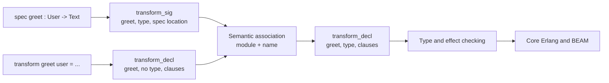

# Proposal: Separate Transform Specifications from Implementations

## Status

Draft language and compiler architecture proposal.

This document proposes a new Catena source form. It does not describe syntax
that is currently accepted by the compiler. Promotion requires an architectural
decision record, updates to the canonical compiler and language specifications,
an implementation, migration of maintained Catena examples, and conformance
evidence across parsing, semantic analysis, type checking, the REPL, and BEAM
code generation.

## Decision Summary

Catena should use two distinct keywords for the two different roles currently
introduced with `transform`:

```catena
spec greet : User -> Text

transform greet user =
  "Hello, " <> user.name
```

The proposed design has seven parts:

1. `spec` introduces the optional type-and-effect contract of a transform.
2. `transform` introduces one or more implementation clauses.
3. The parser emits specifications and implementations as independent
   declarations. It does not attach a following implementation to a
   specification.
4. Semantic analysis associates a specification with an implementation group
   by module-local transform name.
5. A transform can have at most one specification and one contiguous group of
   implementation clauses. Every clause in the group must have the same name
   and arity.
6. A transform without a `spec` remains valid and receives an inferred type.
   A `spec` without an implementation is invalid in an ordinary executable
   module.
7. After association, semantic analysis emits the existing normalized
   `{transform_decl, Name, Type, Clauses, Location}` shape. Type checking,
   interface extraction, and code generation continue to consume that shape.

The distinction is intentionally syntactic at the source boundary and
temporary at the parsed-AST boundary. It does not create two runtime entities:
the specification and implementation describe one transform.

## Relationship to the Current Architecture

Catena currently overloads `transform` for two source-level meanings:

```catena
transform greet : User -> Text
transform greet user = "Hello, " <> user.name
```

The current grammar combines these forms during parsing:

```text
transform_signature transform_clauses
    -> transform_decl
```

The parser takes the name and type from the signature and stores only the
patterns, guard, body, and location from each following implementation clause.
The name written on a clause is not retained in the clause AST.

That design has four consequences:

- the grammar must decide whether a completed signature stands alone or should
  consume following `transform` tokens;
- this decision contributes a documented shift/reduce conflict;
- the parser, rather than semantic analysis, owns part of name resolution;
- a clause name cannot reliably be compared with the signature name after the
  parser has discarded it.

For example:

```catena
transform greet : User -> Text
transform farewell user = "Goodbye"
```

can be structurally represented as a declaration named `greet` containing the
body written for `farewell`. The semantic pass describes name validation as one
of its responsibilities, but the combined parser node no longer contains the
second name needed to perform that validation.

The present semantic pass also groups consecutive untyped
`{transform_decl, ...}` nodes with the same name. Type checking then:

- adds explicitly declared transform types to the module type environment;
- infers one function type from the complete clause group;
- checks the inferred type and effects against the declared contract;
- emits a typed transform for later lowering.

This proposal preserves that downstream contract while moving all
specification/implementation association into the semantic pass.

Relevant current implementation surfaces include:

- [`catena_lexer.xrl`](../../src/compiler/lexer/catena_lexer.xrl);
- [`catena_parser.yrl`](../../src/compiler/parser/catena_parser.yrl);
- [`catena_semantic.erl`](../../src/compiler/semantic/catena_semantic.erl);
- [`catena_compile.erl`](../../src/compiler/catena_compile.erl);
- [`catena_ast_pp.erl`](../../src/compiler/ast/catena_ast_pp.erl);
- [`catena_repl.erl`](../../src/repl/catena_repl.erl);
- [the core compiler pipeline](../compiler/core_compiler_pipeline.md);
- [the type-and-effect system](../compiler/type_and_effect_system.md);
- [the REPL runtime](../runtime/repl_runtime.md).

## Why Separate Words Improve the Model

The existing spelling presents two visually identical declarations:

```catena
transform calculate : Input -> Output
transform calculate input = ...
```

The reader must inspect the punctuation after the name to discover whether a
line is a contract or executable behavior. The proposed spelling makes that
role visible at the first token:

```catena
spec calculate : Input -> Output
transform calculate input = ...
```

This distinction also matches the compiler's conceptual stages:

```text
spec       -> declared contract
transform  -> executable clauses
semantic analysis -> one checked transform
```

The source vocabulary therefore reflects a real architectural distinction
without exposing backend details.

`spec` is preferred over `function` because Catena deliberately calls
functions transforms. It is preferred over `type` because `type` already
introduces data types. It is preferred over `declare` because a specification
is not merely a forward declaration: it is a contract that the implementation
must satisfy.

## Goals

- Make a transform contract visually distinguishable from its implementation.
- Parse specifications and implementations without grammar-level attachment.
- Associate specifications and implementations explicitly and deterministically
  by name.
- Preserve optional Hindley-Milner type inference for transforms without
  specifications.
- Preserve multi-clause transforms and their source order.
- Improve diagnostics for duplicate, missing, misplaced, and incompatible
  specifications.
- Remove the signature-versus-implementation parser conflict.
- Prevent a misspelled implementation name from silently becoming a clause of
  another transform.
- Keep the normalized semantic AST stable for type checking and code
  generation.
- Preserve Catena's fail-closed backend boundary: a specification must never
  create a callable runtime function without an implementation.
- Give formatters, documentation generators, editors, and future language
  servers an explicit specification node.

## Non-Goals

- Requiring every transform to have a written specification.
- Adding function overloading by name or arity.
- Changing Catena's function type, effect-row, or constraint syntax.
- Changing trait member syntax in this proposal.
- Changing instance method syntax in this proposal.
- Adding local specifications inside `let`, `match`, or anonymous functions.
- Creating header files or a separate interface language.
- Making `spec` a runtime declaration.
- Emitting a BEAM function, export, or attribute solely because a `spec`
  exists.
- Redesigning recursive type inference beyond the changes needed to preserve
  current behavior.
- Treating foreign-function declarations as ordinary transform
  specifications. External declarations have additional linkage and trust
  requirements.

## Terminology

This proposal uses the following terms consistently:

- **Specification**: a `spec` declaration containing a transform name and its
  declared type, constraints, and effect row.
- **Implementation clause**: one `transform` declaration containing patterns,
  an optional guard, and a body.
- **Implementation group**: the contiguous clauses that define one transform.
- **Association**: the semantic operation that attaches at most one
  specification to one implementation group.
- **Normalized transform**: the existing semantic AST node containing name,
  optional declared type, clauses, and location.

“Signature” remains acceptable when discussing the type itself. `spec` is the
source keyword and “specification” is the declaration-level concept.

## Proposed Source Model

### A specified transform

```catena
spec greet : User -> Text

transform greet user =
  "Hello, " <> user.name
```

### A transform using inferred types

Specifications remain optional:

```catena
transform double value =
  value * 2
```

The compiler infers the type as it does today.

### A constrained transform

The type grammar following the colon is unchanged:

```catena
spec combine_all :
  List a -> a
  constrain Accumulator a

transform combine_all values =
  foldLeft combine empty values
```

### An effectful transform

Effects remain part of the declared type:

```catena
spec load_manifest :
  String -> Result Manifest LoadError / {FileIO}

transform load_manifest path =
  do
    text <- perform FileIO.read(path)
    pure (decode_manifest text)
  end
```

### Multiple clauses

One specification applies to the complete contiguous clause group:

```catena
spec parcel_count : List Parcel -> Natural

transform parcel_count [] = 0
transform parcel_count (_ :: rest) =
  1 + parcel_count rest
```

The clauses must have the same name and arity. A different declaration ends
the group.

### Specifications and exports

Exports continue to name the runtime transform:

```catena
module Parcel

export transform parcel_count

spec parcel_count : List Parcel -> Natural
transform parcel_count parcels = ...
```

There is no `export spec` form. Interface and documentation tooling derives the
public specification from the exported normalized transform.

## Proposed Grammar

The exact yecc rule names may change during implementation. The semantic split
should resemble:

```yecc
declaration -> transform_specification :
    '$1'.

declaration -> transform_implementation :
    '$1'.

transform_specification -> spec lower_ident colon type_expr :
    {transform_sig,
        extract_atom('$2'),
        '$4',
        extract_location('$1')}.

transform_implementation ->
    transform lower_ident pattern_list equals expr :
    {transform_decl,
        extract_atom('$2'),
        undefined,
        [{transform_clause,
            '$3',
            undefined,
            '$5',
            extract_location('$1')}],
        extract_location('$1')}.

transform_implementation ->
    transform lower_ident pattern_list 'when' guards equals expr :
    {transform_decl,
        extract_atom('$2'),
        undefined,
        [{transform_clause,
            '$3',
            '$5',
            '$7',
            extract_location('$1')}],
        extract_location('$1')}.
```

The important properties are:

- `transform_sig` is a top-level parsed declaration;
- every implementation initially retains its name in `transform_decl`;
- the parser never consumes implementation clauses as children of a
  specification;
- `transform_clause` can remain name-free after the surrounding
  `transform_decl` has preserved the name;
- the existing `type_expr` grammar continues to parse type applications,
  functions, effects, and constraints.

`spec` must be added to the terminal list and recognized by leex as a reserved
keyword. The generated `catena_lexer.erl` and `catena_parser.erl` files must
continue to be regenerated rather than edited directly.

## Parsed and Normalized AST

For:

```catena
spec greet : User -> Text
transform greet user = make_greeting user
```

the parser should produce two declarations:

```erlang
{transform_sig, greet, ParsedType, SpecLocation}

{transform_decl, greet, undefined,
    [{transform_clause, Patterns, undefined, Body, ClauseLocation}],
    DefinitionLocation}
```

Semantic analysis should produce one normalized declaration:

```erlang
{transform_decl, greet, ParsedType,
    [{transform_clause, Patterns, undefined, Body, ClauseLocation}],
    SpecLocation}
```

Using the specification location as the normalized declaration location
preserves the current convention for specified transforms. Each clause retains
its own location, so body, pattern, guard, and arity errors can still point to
the implementation.

The transient `transform_sig` shape already appears in parser helpers and
compiler utilities. It should be promoted explicitly as a parsed-AST node but
must not survive successful semantic normalization.



## Association Semantics

### Association key

Association uses the transform name within the current module:

```text
association key = current module identity + transform name
```

Arity is not part of the key. Catena does not currently define Erlang-style
name/arity overloading at the source level, and the type environment is keyed
by name. Introducing an arity key here would silently introduce an unrelated
language feature.

### Source ordering

A specification must appear before its implementation group:

```catena
spec normalize : Input -> Output
transform normalize input = ...
```

Whitespace and comments do not affect association. Immediate adjacency is the
recommended formatting, but association remains name-based so parser behavior
does not depend on layout.

A specification placed after an implementation is rejected as a misplaced
specification. This keeps the contract-before-behavior reading order and avoids
two canonical spellings for the same declaration.

### Clause grouping

Implementation clauses for a transform must be contiguous:

```catena
transform size [] = 0
transform size (_ :: rest) = 1 + size rest
```

The following is invalid:

```catena
transform size [] = 0
transform unrelated value = value
transform size (_ :: rest) = 1 + size rest
```

Semantic analysis reports a non-contiguous implementation or duplicate
implementation group. This preserves predictable clause order and prevents a
later declaration from silently extending an earlier transform.

### Specification cardinality

There may be zero or one specification per transform:

- zero specifications: infer the transform type;
- one specification: check the implementation against it;
- two or more specifications: report `duplicate_transform_spec`.

Identical duplicate specifications are still errors. Silently deduplicating
them would hide accidental copies and make source locations ambiguous.

### Implementation cardinality

An ordinary executable module must not contain a specification without an
implementation. Such a declaration has no runtime meaning and must fail before
backend lowering.

Future interface-only modules may deliberately support specification-only
entries, but that must be introduced as an explicit module or declaration kind.
This proposal does not use an incomplete executable transform as an implicit
interface feature.

An implementation without a specification remains valid and inferred.

### Arity

All clauses in an implementation group must bind the same number of source
parameters. The existing inconsistent-clause-arity validation remains in
force.

The declared function type must also agree with the implementation arity. The
type checker remains authoritative for curried types, constraints, and effects;
semantic analysis may provide an earlier arity diagnostic only when it can do
so without duplicating or weakening type-system rules.

## Semantic Normalization Algorithm

The semantic pass should operate in three explicit stages.

### Stage 1: Inventory specifications

Scan module declarations and build:

```erlang
SpecsByName = #{
    greet => #{type => ParsedType, location => SpecLocation}
}.
```

During this scan:

- reject duplicate specifications;
- record declaration order;
- reject any specification whose name already has an earlier implementation;
- leave unrelated declaration kinds unchanged.

### Stage 2: Form implementation groups

Scan implementation declarations in source order:

- start a group at the first `transform_decl`;
- append immediately following `transform_decl` nodes with the same name;
- validate that every clause has the same arity;
- reject a second non-contiguous group with the same name;
- preserve clause order exactly.

### Stage 3: Associate and normalize

For each implementation group:

1. look up a specification with the same module-local name;
2. attach its parsed type when present;
3. use `undefined` when it is absent;
4. remove the consumed `transform_sig` from the semantic declaration stream;
5. emit one normalized `transform_decl`.

After all groups are processed, report every unconsumed specification as
`missing_transform_implementation`.

This may be implemented as multiple passes or as one stateful fold, but the
observable semantics must match the staged description.

## Diagnostics

The feature should introduce source-oriented diagnostics rather than exposing
AST tuples or parser states.

### Duplicate specification

```catena
spec greet : User -> Text
spec greet : Customer -> Text
transform greet user = ...
```

Suggested diagnostic:

```text
Transform 'greet' has more than one specification.
The first specification is at line 1; the duplicate is at line 2.
Keep one contract for the complete transform.
```

### Missing implementation

```catena
spec greet : User -> Text
```

Suggested diagnostic:

```text
Specification for 'greet' has no implementation in this module.
Add `transform greet ... = ...` or remove the specification.
```

### Specification after implementation

```catena
transform greet user = ...
spec greet : User -> Text
```

Suggested diagnostic:

```text
Specification for 'greet' appears after its implementation.
Move the `spec` before the first `transform greet` clause.
```

### Misspelled implementation name

```catena
spec greet : User -> Text
transform grete user = ...
```

Suggested diagnostics:

```text
Specification for 'greet' has no implementation.
Did you mean the nearby transform 'grete'?
```

The compiler may use edit-distance suggestions, but correctness must not depend
on a heuristic match.

### Old syntax

During migration, the parser should recognize:

```catena
transform greet : User -> Text
```

well enough to issue a targeted message:

```text
Transform specifications now use `spec`.

  spec greet : User -> Text
  transform greet user = ...
```

A raw “unexpected colon” message is not sufficient for the primary migration
case.

### Type or effect mismatch

Existing type-and-effect diagnostics remain authoritative:

```catena
spec read_count : String -> Natural
transform read_count path =
  perform FileIO.read(path)
```

The error should identify the declared specification and the inferred effectful
implementation, preserving both relevant source locations.

## Type and Effect Checking

After normalization, the type checker continues to receive:

```erlang
{transform_decl, Name, DeclaredTypeOrUndefined, Clauses, Location}
```

No new runtime type representation is needed.

For a specified transform:

1. convert the parsed specification to the internal Catena type;
2. add the declared scheme to the initial module environment;
3. infer a type and effect set from the complete implementation group;
4. unify the inferred result with the declared contract;
5. report mismatched arguments, results, constraints, or effects at the
   specification and implementation locations.

For an inferred transform, existing inference remains unchanged.

Preloading declared specifications into the module environment should continue
to support self-reference, forward calls, and mutually recursive transforms
where the existing type system permits them. This proposal must not make
association depend on the sequential order in which the type checker happens
to visit normalized declarations.

## Traits, Instances, and Other Signature-Bearing Forms

This proposal is deliberately limited to ordinary transform declarations.

Trait members already have a structurally distinct context:

```catena
trait Mapper f where
  map : (a -> b) -> f a -> f b
end
```

The surrounding `trait ... where` block makes `map` visibly a required member,
so `spec map` is not needed for disambiguation.

Instance methods remain implementations:

```catena
instance Mapper Maybe where
  transform map f value = ...
end
```

Default trait methods combine a member contract with a body inside the trait
grammar and should be evaluated separately. Changing them in this proposal
would expand the migration and grammar surface without solving the top-level
association problem.

Properties, effects, handlers, external bindings, and future callback
declarations likewise retain their own declaration-specific syntax.

## Module, Import, and Export Behavior

Specifications live in the same module namespace as their transform:

- imports do not import a separate `spec` value;
- exports continue to export transforms;
- qualified names do not appear in local specifications;
- local specifications cannot attach to imported transforms;
- an imported type scheme participates in call checking but is not treated as
  a local specification;
- module interface artifacts publish the normalized transform type once.

A public `spec` without a body must be rejected before artifact generation. A
private `spec` without a body must also be rejected rather than erased as an
unused static declaration. This tightens the current signature-only behavior
and avoids compilation succeeding with a source contract that has no
implementation.

## REPL Behavior

The REPL is the main surface where independent declarations introduce state
management.

The minimum supported form should accept a specification and implementation in
one submission:

```catena
spec double : Natural -> Natural
transform double value = value * 2
```

For separate submissions:

```text
catena> spec double : Natural -> Natural
Specification recorded for double.

catena> transform double value = value * 2
Defined double : Natural -> Natural
```

the REPL must keep pending specifications in session state. A pending
specification:

- is keyed by unqualified transform name in the current REPL module;
- is replaced only through an explicit redefinition path;
- does not create a callable value;
- is consumed when a matching transform is successfully checked;
- remains available after a failed implementation so the user can correct the
  body;
- is displayed by an appropriate introspection command;
- is cleared with the surrounding REPL session unless persisted explicitly.

If persistent pending specifications are deferred, the REPL must clearly
require the `spec` and `transform` to be submitted together. It must not
silently accept and forget an isolated specification.

## Formatting and Documentation Tooling

The canonical formatter should print:

```catena
spec greet : User -> Text
transform greet user = ...
```

A blank line between the two forms may be permitted in hand-written code, but
the formatter should choose one stable style. This proposal recommends no
mandatory blank line for a short, single-line specification and an optional
visual separation after a multiline specification.

The AST pretty-printer must:

- print `spec`, not `transform`, before an attached declared type;
- print every implementation clause with `transform`;
- preserve the specification before the implementation;
- round-trip constrained and effectful types;
- never print the old overloaded form after normalization.

Documentation generation should treat the specification and implementation as
one documented symbol while retaining separate source links when possible.

Language-server support should expose:

- “go to specification” from an implementation;
- “go to implementation” from a specification;
- rename across both declarations;
- duplicate and missing-specification diagnostics;
- completion of a matching implementation name after `spec`.

## Compatibility and Migration

This is a source-breaking keyword change:

```diff
-transform greet : User -> Text
+spec greet : User -> Text
 transform greet user = ...
```

Because Catena is still in early development, the preferred migration is one
atomic repository-wide change:

1. implement the new syntax and semantic association;
2. migrate maintained `.cat` source;
3. migrate parser fixtures embedded in Erlang tests;
4. migrate guides, specifications, examples, and root documentation;
5. regenerate parser and lexer outputs through the canonical build;
6. retain a targeted old-syntax diagnostic without continuing to accept the
   old form as valid Catena.

If an external compatibility commitment exists by implementation time, a
temporary compatibility mode may accept the old spelling and normalize it to
`transform_sig`. Such a mode must:

- emit a deprecation diagnostic;
- use the new semantic association path;
- never retain the old parser-level clause attachment;
- have a documented removal milestone.

`spec` becomes a reserved keyword. Any transform, pattern binding, or field
currently named `spec` must be renamed or escaped if Catena later introduces an
identifier-escaping facility.

## Compiler Impact

### Lexer

- add `spec` to the terminal vocabulary;
- emit a dedicated `spec` token;
- add positive and boundary tests such as `specification`, which must remain an
  identifier rather than being split into a keyword prefix;
- update keyword generators used by property tests.

### Parser

- parse `transform_sig` as an independent declaration;
- remove `transform_signature transform_clauses` attachment;
- preserve implementation names until semantic grouping;
- add focused recovery for malformed `spec` declarations;
- update the documented conflict inventory;
- ensure the signature-versus-implementation conflict is removed rather than
  merely renumbered.

### AST and compiler utilities

- include `transform_sig` in the parsed declaration union;
- support its location, traversal, depth, mapping, and pretty-printing needs;
- specify that semantic normalization consumes every `transform_sig`;
- reject a leaked `transform_sig` at checked backend boundaries.

### Semantic analysis

- inventory specifications;
- group named implementation clauses;
- enforce cardinality, ordering, contiguity, and arity rules;
- attach types and preserve locations;
- emit one normalized transform per implementation group;
- provide dedicated errors and formatting.

### Type checking

- continue consuming normalized transforms;
- preserve declared-type preloading;
- retain declared-versus-inferred type and effect validation;
- improve dual-location diagnostics where necessary;
- ensure a specification never weakens inferred effect obligations.

### Name resolution and module interfaces

- resolve only normalized transforms;
- verify that parsed specifications do not become independent values;
- publish one type scheme for each exported transform;
- reject missing implementations before interface or BEAM artifact creation.

### Code generation

- require semantic normalization before lowering;
- continue erasing type specifications at runtime;
- emit the same Core Erlang function for equivalent old and new source during
  any compatibility period;
- fail closed if `transform_sig` reaches backend lowering.

### REPL and testing runtime

- support a combined `spec` plus `transform` submission;
- either retain pending specifications or reject isolated submissions
  explicitly;
- keep test-runner parsing and dynamic module compilation on the canonical
  semantic path.

### Documentation and examples

- update maintained language guides and architecture documentation;
- update code blocks in research and planning documents when they describe
  current or proposed Catena syntax;
- preserve historical syntax only when a document explicitly labels it as
  historical.

## Implementation Sequence

### Stage 1: Establish parsed-AST separation

- add the `spec` lexer token;
- add independent specification and implementation grammar productions;
- remove parser-level attachment;
- add parser tests proving that names remain distinguishable;
- update AST utilities for the transient specification node.

### Stage 2: Implement semantic association

- inventory specifications by name;
- group implementation clauses;
- merge matching declarations;
- reject duplicates, missing bodies, late specs, non-contiguous groups, and
  inconsistent arities;
- ensure successful output contains no `transform_sig` nodes.

### Stage 3: Preserve type and backend behavior

- run specified and inferred transforms through type checking;
- verify constrained and effectful specifications;
- verify recursion and module environment preloading;
- add fail-closed checks at compilation-unit and code-generation boundaries;
- compare emitted Core Erlang and BEAM behavior for equivalent programs.

### Stage 4: Update interactive and tooling surfaces

- implement the selected REPL pending-specification behavior;
- update pretty-printing and formatting;
- update parser helpers, test runners, and language-server-facing AST
  utilities;
- add source-oriented diagnostics and migration hints.

### Stage 5: Migrate the repository

- convert maintained source and embedded fixtures;
- update developer and language guides;
- update canonical compiler, runtime, and syntax specifications;
- regenerate generated parser and lexer modules through rebar3;
- remove obsolete grammar comments and tests that encode parser-level
  attachment.

### Stage 6: Promote the feature

- record the final language decision in an ADR;
- mark the canonical syntax and compiler specifications as implemented;
- publish migration guidance;
- remove any temporary compatibility mode at its scheduled milestone.

## Conformance Requirements

The proposal is not implemented merely because `spec` tokenizes. Promotion
requires executable evidence for the complete association path.

### Lexer evidence

- `spec` tokenizes as a keyword;
- identifiers beginning with `spec` remain identifiers;
- malformed keyword boundaries report correct locations;
- keyword property generators include the new token.

### Parser evidence

- a simple specification produces `transform_sig`;
- a simple implementation independently produces `transform_decl`;
- constrained and effectful specifications preserve their type AST;
- multiple implementation clauses remain separate named parsed declarations;
- a specification followed by a differently named transform does not attach to
  it;
- malformed specifications recover with focused diagnostics;
- the documented signature/implementation shift-reduce conflict is absent.

### Semantic evidence

- matching specification and implementation normalize to one transform;
- implementations without specifications remain inferable;
- multiple same-name clauses normalize in source order;
- duplicate specifications fail;
- missing implementations fail;
- late specifications fail;
- non-contiguous implementation groups fail;
- inconsistent clause arities fail;
- similarly spelled but unequal names do not associate;
- no specification node survives successful normalization.

### Type-and-effect evidence

- a matching declared type succeeds;
- an argument or result mismatch fails;
- a missing declared effect fails;
- a matching effect row succeeds;
- trait constraints survive association;
- inferred transforms retain their existing behavior;
- recursive and mutually recursive specified transforms retain current
  supported behavior.

### Module and backend evidence

- exports expose the normalized transform and its type;
- an orphan specification cannot produce an interface entry or BEAM export;
- equivalent specified and inferred implementations lower through the normal
  backend path;
- no `transform_sig` can reach Core Erlang lowering;
- BEAM output contains executable clauses but no runtime specification object.

### REPL and tooling evidence

- a combined specification and body can be defined interactively;
- isolated specification behavior matches the documented policy;
- pretty-printing emits `spec` plus `transform`;
- parse/normalize/pretty-print/parse round trips preserve meaning;
- rename and source-location utilities see both halves of the source
  declaration.

### Migration evidence

- maintained Catena source uses the new spelling;
- maintained documentation uses the new spelling for current syntax;
- old syntax receives a targeted migration diagnostic;
- the canonical compile and EUnit commands remain green;
- modified compiler modules meet the repository coverage target.

## Risks and Mitigations

### Risk: `spec` appears to be a separate runtime declaration

Mitigation: documentation consistently describes it as one half of a transform
declaration, exports remain `export transform`, and semantic normalization
removes the standalone node.

### Risk: disconnected specifications reduce readability

Mitigation: require specifications to precede implementations, require one
contiguous implementation group, and have the formatter place the forms
together.

### Risk: REPL state becomes confusing

Mitigation: display pending specifications explicitly, never make them
callable, and either consume them on successful definition or require combined
input until pending-state support is complete.

### Risk: semantic normalization becomes order-dependent

Mitigation: use explicit module-local inventories keyed by name, preserve
source-order metadata, and test permutations that should be equivalent or
invalid.

### Risk: a parser node leaks into later compiler stages

Mitigation: make successful semantic normalization an explicit compilation-unit
validation and reject `transform_sig` at type-checking and backend boundaries.

### Risk: the migration touches a large documentation surface

Mitigation: perform a mechanical syntax migration first, then review prose
where “transform” refers to the contract rather than the implementation.

### Risk: stricter orphan-spec behavior breaks implicit forward declarations

Mitigation: distinguish recursive type predeclaration from missing runtime
implementation. Normal specified transforms continue to be preloaded into the
type environment; interface-only declarations require a future explicit
surface.

## Alternatives Rejected

### Keep `transform` for both forms

This preserves the current visual ambiguity and parser-level attachment. It
does not address the lost clause-name evidence.

### Rename the keyword but keep parser-level attachment

Changing only:

```text
transform_signature -> spec name : type
```

while retaining:

```text
transform_signature transform_clauses -> transform_decl
```

would leave the parser responsible for association. A following `transform`
would still be ambiguous between an attached clause and a new declaration, and
the clause name could still be discarded before semantic validation.

### Use a bare annotation

```catena
greet : User -> Text
transform greet user = ...
```

This is compact and familiar from Elm and Haskell, but it is less consistent
with Catena's keyword-led top-level declaration syntax. `spec` is easier to
search, recover after syntax errors, document, and distinguish from expression
or property-binding syntax.

### Use `signature`

```catena
signature greet : User -> Text
```

This is explicit but verbose in specification-heavy modules. `spec` is already
widely understood as a function contract in the BEAM ecosystem and remains
readable without dominating the declaration.

### Use `declare` and `define`

This would replace Catena's established `transform` vocabulary and imply that
every specification is a forward declaration. It creates more language churn
than needed.

### Put the type and body in one syntactic block

```catena
transform greet : User -> Text where
  user = "Hello, " <> user.name
end
```

This guarantees association structurally but introduces a new block form,
changes multi-clause layout, and adds nesting for ordinary functions. It is a
larger readability trade-off than separating the keywords.

### Require specifications for every transform

Mandatory specifications would simplify some association errors but discard
one of Hindley-Milner inference's main ergonomic benefits. Catena can encourage
specifications for public APIs without requiring them for every local helper.

### Associate by name and arity

The current Catena namespace and type environment are name-based. Adding arity
to the association key would introduce source-level overloading and complicate
curried types, imports, exports, traits, and higher-order references.

### Allow non-contiguous clauses

This would make declarations open to later extension within a module and make
clause ordering harder to see. Contiguous clauses are easier for humans,
formatters, and exhaustiveness analysis to treat as one definition.

### Treat a missing implementation as an erased declaration

A specification without a body cannot satisfy a runtime call. Erasing it can
allow an invalid module interface to survive until linkage or execution,
contrary to Catena's fail-closed backend direction.

## Open Decisions Before Promotion

- Whether the migration is atomic or includes one compatibility release.
- Whether the formatter uses a blank line after multiline specifications.
- Whether the first REPL implementation stores pending specifications across
  submissions.
- Whether future interface-only modules reuse `spec` or introduce a dedicated
  interface member form.
- Whether local bindings may gain `spec` declarations in a later proposal.
- Whether a public transform without a specification should produce a warning
  while remaining legal.
- Whether documentation tools expose separate specification and implementation
  source links.
- The final diagnostic names and structured error payloads.

These decisions do not change the central architecture: parse independently,
associate semantically, and normalize before type checking.

## Prior Catena Decisions Reconciled Here

This proposal follows existing Catena principles:

- [minimal core and library-first surface](../adr/ADR-0002-minimal-core-and-library-first-surface.md):
  the change clarifies ordinary declarations without adding runtime machinery;
- [fail-closed semantics-preserving backend](../adr/ADR-0005-fail-closed-semantics-preserving-beam-backend.md):
  an orphan specification cannot become a runtime callable;
- [core compiler pipeline](../compiler/core_compiler_pipeline.md):
  parsing records syntax, semantic analysis establishes relationships, type
  checking validates contracts, and lowering consumes normalized declarations;
- [type-and-effect system](../compiler/type_and_effect_system.md):
  declared effects and constraints remain part of the transform type;
- [REPL runtime](../runtime/repl_runtime.md):
  interactive state must make pending declarations explicit.

## External References

- [Haskell 2010, Declarations and Bindings](https://www.haskell.org/onlinereport/haskell2010/haskellch4.html)
  describes type signatures and value bindings as distinct declarations.
- [Erlang Types and Function Specifications](https://www.erlang.org/doc/system/typespec.html)
  uses a distinct `-spec` attribute and requires a matching function name and
  arity in the module.
- [Elm, Reading Types](https://guide.elm-lang.org/types/reading_types)
  demonstrates the readability of placing an optional type annotation directly
  above a function definition.

These languages motivate the readability pattern, but Catena's proposal is
driven by its own parser, semantic normalization, effect system, and
keyword-led syntax.

## Recommendation

Adopt `spec` for transform type-and-effect contracts and retain `transform` for
implementation clauses. Parse the two forms independently, associate them by
module-local name during semantic analysis, and normalize them into Catena's
existing transform declaration before type checking.

Keep specifications optional, require at most one per transform, require
contiguous implementation clauses, and reject orphan specifications in
ordinary modules. Preserve the current normalized AST so the change improves
source readability and compiler correctness without introducing a new runtime
concept or redesigning the BEAM backend.

This design gives each compiler phase one clear responsibility:

```text
lexer       recognizes `spec` and `transform`
parser      records independent declarations
semantic    associates names and groups clauses
type system verifies the specification
backend     compiles only the implementation
```

That separation is both easier for a human reader and more faithful to
Catena's multi-pass architecture.
